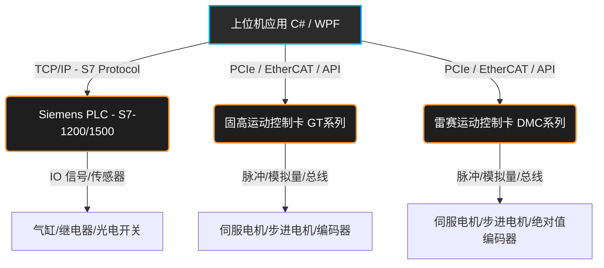

# 工业控制核心：S7.Net 与固高/雷赛运动控制卡全景实战

在现代上位机开发（特别是基于 C#/WPF 的工控机系统）中，我们往往需要同时面对两大类核心硬件：**PLC（可编程逻辑控制器）** 与 **运动控制卡**。
本文将以最为硬核和详尽的视角，深度拆解西门子 PLC 的 C# 通信库 **S7netplus**，以及国内两大运动控制巨头 **固高科技 (Googol)** 与 **雷赛智能 (Leadshine)** 运动控制卡的底层 API、参数配置及全场景实战。

## 1. 系统架构全景图

在切入代码之前，我们先理解上位机是如何同时调度 PLC 与运动控制卡的。



---

## 2. S7netplus (S7.Net) 深度实战指南

**S7netplus** 是一个完全开源、基于纯 C# 编写的西门子 S7 协议通信库。它不需要安装庞大的博图 (TIA Portal) 或 Kepware，非常适合轻量级的高速工业通讯场景。

### 2.1 核心连接参数与配置

要连接 PLC，必须清楚以下四个核心网络通信参数：
1. **CpuType**: CPU 架构型号（如 `S71200`, `S71500`, `S7300`）。
2. **IP**: PLC 在车间局域网中的 IPv4 地址。
3. **Rack (机架号)**: 通常对于绝大多数单背板系统为 `0`。
4. **Slot (插槽号)**: 针对 S7-1200/1500，CPU 通常在槽 `1`；对于 S7-300，通常在槽 `2`。

```csharp
using S7.Net;

// 1. 初始化 PLC 实例 (以 S7-1200 为例)
Plc plc = new Plc(CpuType.S71200, "192.168.0.10", 0, 1);

try
{
    // 2. 建立 Socket 通信连接
    plc.Open();
    if(plc.IsConnected)
    {
        Console.WriteLine("Siemens S7 PLC 连接成功！");
    }
}
catch (Exception ex)
{
    Console.WriteLine($"网络或配置异常导致连接失败: {ex.Message}");
}
```

> **🔥 避坑指南 (博图配置陷阱)**：
> 对于 S7-1200/1500 设备，必须在博图硬件组态中手动勾选 **“允许从远程伙伴 (PLC、HMI、OPC...) 使用 PUT/GET 通信访问”**。
> 同时，对于想要读取的 DB 块，必须在其属性中**取消勾选“优化的块访问”**，否则其内部变量没有绝对偏移地址，S7.Net 无法进行定位寻址！

### 2.2 数据读写 API 与绝对寻址规则

S7.Net 支持西门子标准的绝对地址寻址（如 `DB1.DBX0.1`, `M10.0`, `MD20`）。

#### 单一变量极简读写
```csharp
// --- 写入示例 ---
// 写入 Bool (位) -> 映射到 DB1 的第 0 个字节的第 1 位
plc.Write("DB1.DBX0.1", true);

// 写入 Int (16位有符号整数) -> 映射到 DB1 的第 2 字节开始的字 (Word)
plc.Write("DB1.DBW2", (short)100);

// 写入 Real (32位单精度浮点数) -> 映射到 DB1 的第 4 字节开始的双字 (DWord)
plc.Write("DB1.DBD4", 123.45f);

// --- 读取示例 ---
bool isStart = (bool)plc.Read("DB1.DBX0.1");
short count = (short)plc.Read("DB1.DBW2");
// 浮点数需要特殊转换，使用 S7.Net 提供的扩展方法 ConvertToFloat
float temp = ((uint)plc.Read("DB1.DBD4")).ConvertToFloat(); 
```

#### 批量读取 (工业级性能要求)
在真实产线上，千万不要用单一的 `Read` 去循环读取上百个变量，这会导致巨量的 TCP 握手开销和高达几百毫秒的延迟。**正确做法是一次性读取整块 Byte 数组，然后在 C# 的内存中进行切片解析映射。**

```csharp
// 一次性从 DB10 中读取：起点偏移量为 0，长度为 100 字节的内存块
byte[] buffer = plc.ReadBytes(DataType.DataBlock, 10, 0, 100);

// 在 C# 内存中高速解析数据 (耗时几乎为 0)
// 解析第 0 个字节的第 2 位 (布尔值)
bool valveStatus = buffer[0].SelectBit(2); 

// 解析从第 2 字节开始的 Int16 (注意端序转换，S7.Net 库内置了辅助类)
short pressure = S7.Net.Types.Int.FromByteArray(buffer.Skip(2).Take(2).ToArray());

// 解析从第 4 字节开始的 Float 浮点数
float temperature = S7.Net.Types.Real.FromByteArray(buffer.Skip(4).Take(4).ToArray());
```

### 2.3 典型应用场景：SCADA 监控墙中心
**场景描述**：通过 C# 上位机监控全厂 20 台注塑机的工作状态。
**技术流派**：在后端开启一个 `Task` 循环，每 500 毫秒并发触发一次各个设备的 `ReadBytes`，将整段字节流封装为结构体 `Struct` 反序列化（借助 `S7.Net` 的 `ReadStruct` API），利用 MVVM 模式将数据实时映射到 WPF 视图模型，驱动前端图表的重绘和设备呼吸灯闪烁。

---

## 3. 固高科技 (Googol) 运动控制卡实战

固高控制卡是国内运控领域的泰斗级产品，普遍用于 CNC 系统、高精度点胶机和激光切割设备。其核心动态链接库通常为 `gts.dll`。

### 3.1 核心初始化与硬件配置文件加载
固高卡高度依赖其工程配置文件（`.cfg`）。该文件包含了轴的映射、原点开关极性、脉冲当量等底层硬件参数，通常需要机电工程师使用固高官方配套的 MCT2008 软件事先调校好，然后在上位机程序中直接加载。

```csharp
using gts;

public void InitGtsCard()
{
    // 1. 打开板卡 (参数为板卡号，0代表连接第一张本地总线卡)
    short rtn = mc.GT_Open(0, 1);
    if (rtn != 0) throw new Exception("固高板卡打开失败，请检查驱动或PCIe槽位");

    // 2. 复位板卡，清除可能因为断电等残留的历史硬件报警
    mc.GT_Reset();

    // 3. 加载配置文件 (此文件包含了所有的伺服底层调整参数)
    mc.GT_LoadConfig("GTS800.cfg");

    // 4. 清除各轴报警状态，并向驱动器发送使能信号 (Servo On)
    for (short i = 1; i <= 4; i++) // 假设为四轴控制卡
    {
        mc.GT_ClrSts(1, i); // 清除状态寄存器
        mc.GT_AxisOn(i);    // 使轴进入强电锁定伺服状态
    }
}
```

### 3.2 陷阱：点位运动 (PTP - Trap 模式) 配置
Trap（梯形速度规划）是最常用的单轴“走到指定点”的运动模式。但如果你不配置加速度和平滑时间，伺服电机会因为瞬间提速产生可怕的撞击异响。

```csharp
public void MovePtpSmoothly(short axis, int targetPos, double velocity)
{
    // 1. 设置指定轴为“点位运动模式”
    mc.GT_PrfTrap(axis);

    // 2. 配置梯形轨迹参数 (必须严格匹配以保护机械结构)
    mc.TTrapPrm trapPrm;
    mc.GT_GetTrapPrm(axis, out trapPrm);
    
    trapPrm.acc = 0.5;       // 加速度 (Pulse/ms^2)
    trapPrm.dec = 0.5;       // 减速度 (Pulse/ms^2)
    trapPrm.smoothTime = 10; // 平滑时间(ms)：这是形成 S 型柔性曲线的关键，能极大减小机械冲击
    
    mc.GT_SetTrapPrm(axis, ref trapPrm);

    // 3. 压入目标位置与最终巡航速度
    mc.GT_SetPos(axis, targetPos);
    mc.GT_SetVel(axis, velocity);

    // 4. 发出物理起跑指令 (使用掩码触发机制，位运算：1<<0 代表轴1，1<<1 代表轴2)
    mc.GT_Update(1 << (axis - 1));
}
```

### 3.3 灵魂核心：多轴连续插补运动 (Interpolation)
这是固高卡最强大、在制造业应用最深的特性：控制多个轴同步协调运动，走完美的斜直线或弧形路径。

```csharp
// 建立二维 XY 坐标系插补缓存 (用于连续直线运动不卡顿)
mc.TCrdPrm crdPrm = new mc.TCrdPrm();
crdPrm.dimension = 2;       // 二维
crdPrm.profile[0] = 1;      // X映射为轴1
crdPrm.profile[1] = 2;      // Y映射为轴2
mc.GT_SetCrdPrm(1, ref crdPrm); // 初始化坐标系 1
mc.GT_CrdClear(1, 0);           // 灌入数据前，清除内部 FIFO 缓冲区

// 将多段连续的直线路径点压入 FIFO 缓冲
// 坐标系1, X终点10000, Y终点20000, 巡航速度100, 加速度1, 终点速度50(不停留直接过度下一段), FIFO区号0
mc.GT_LnXY(1, 10000, 20000, 100, 1, 50, 0); 
mc.GT_LnXY(1, 30000, 40000, 100, 1,  0, 0); 

// 全部压入完毕后，一键启动坐标系 1 的连贯插补运动
mc.GT_CrdStart(1, 0); 
```

### 3.4 典型应用场景：高精密自动点胶机 (Dispenser)
**场景描述**：通过 `GT_LnXY`（直线）和 `GT_ArcXYC`（圆弧）连续混编推入数百个交错的路径点阵。最关键的是需要开启固高的高阶配置——**前瞻控制 (Look-ahead)**，这样控制板卡内的 DSP 芯片会自动计算出在遇到锐角拐角时必须提前多少毫米开始减速，以保证胶水在任何形状拐角处涂抹出的粗细绝对均匀一致。

---

## 4. 雷赛智能 (Leadshine) 运动控制卡实战

雷赛在 3C 消费电子制造装备、贴片机、视觉分拣领域占有率极高，其接口极具工程化特点，底层通信库通常为 `LTDMC.dll`。

### 4.1 初始化与引脚配置
雷赛的 API 命名风格通常以 `dmc_` 为前缀，易于辨认。

```csharp
using csLTDMC;

public void InitLeadshineCard()
{
    // 1. 初始化板卡引擎，返回检测到的可用卡总数
    short cardCount = LTDMC.dmc_board_init();
    if(cardCount <= 0) throw new Exception("未检测到雷赛控制卡在位");

    ushort cardNo = 0; // 板卡标识序号
    
    for (ushort axis = 0; axis < 4; axis++)
    {
        // 2. 清除驱动器报警，配置脉冲输出方向
        LTDMC.dmc_write_sevon_pin(cardNo, axis, 1); // 发送 Servo 使能信号
        
        // 设置输出模式：1 代表“脉冲+方向(DIR)”模式，这是步进和普通伺服最常见的协议
        LTDMC.dmc_set_pulse_outmode(cardNo, axis, 1);
    }
}
```

### 4.2 极其精细的速度曲线参数字典
相较于其他卡，雷赛的 API 允许对运动剖面（Velocity Profile）进行极其微观的切片设置，彻底分离了初速度、加速时间、S段平滑时间等。

```csharp
ushort card = 0; ushort axis = 0;

// 配置梯形速度的主骨架
double startVel = 100;  // 起步初速度 (pulse/s)
double maxVel = 5000;   // 最高巡航速度 (pulse/s)
double Tacc = 0.1;      // 整体加速耗时 (秒)
double Tdec = 0.1;      // 整体减速耗时 (秒)
LTDMC.dmc_set_profile(card, axis, startVel, maxVel, Tacc, Tdec);

// 灵魂配置：在起步和刹车的瞬间叠加 S 型柔化曲线，彻底消除机台“点头”抖动
// 0 代表 S 段时间模式，0.05 代表 S 段柔化耗时为 0.05 秒
LTDMC.dmc_set_s_profile(card, axis, 0, 0.05); 
```

### 4.3 P-Move 定长运动与复杂 IO 原点回归
在完成复杂的系统标定后，最核心的就是各种基于绝对坐标系的运动。

**绝对定位运动 (P-Move Absolute)**：
```csharp
int targetPos = 50000;

// 参数 1 代表采用“绝对位置系统”，参数 0 代表采用“增量相对系统”
LTDMC.dmc_pmove(card, axis, targetPos, 1); 

// 安全轮询：阻塞业务线程直到该轴抵达目标停止
while(LTDMC.dmc_check_done(card, axis) == 0)
{
    Thread.Sleep(5); // 防止空转导致 CPU 核心爆满挂死
}
```

**原点回归 (Homing)**：雷赛内置了数十种硬接线回零模式。最稳定经典的策略是：“高速撞击原点光电感应器 -> 减速反转 -> 寻找伺服电机编码器的绝对 Z 相脉冲”。
```csharp
// 2 代表寻找原点开关及 Z 相信号模式；1 代表低速反转找 Z
LTDMC.dmc_set_homemode(card, axis, 2, 1, 0, 0);

// 回零过程属于特种运动，需要赋予独立的回零低速运行参数
LTDMC.dmc_set_home_profile(card, axis, 100, 2000, 0.1, 0.1);

// 触发硬回归指令
LTDMC.dmc_home_move(card, axis);
```

### 4.4 典型应用场景：贴片机与飞拍视觉系统 (Position Compare)
**场景描述**：在极速运行的 SMT 贴片流水线或 CCD 视觉检测站中，通常用到雷赛杀手锏级别的**飞拍功能 (Position Compare)**。
当 X 轴直线电机在 2m/s 高速飞驰到达数组里设定的特定编码器坐标时，雷赛板卡通过底层 DSP 硬件级别的纳秒级比较器，瞬间从板卡的独立 I/O 触发端口（耗时甚至低于 1 微秒），给高速工业相机发送硬件拍照触发电平脉冲。整个过程上位机 C# 代码不仅不需要参与检测（零软件通讯延迟），还彻底消除了因为 Windows 线程切换时间差导致的相机拍照画面发虚、拖尾等致命缺陷。

---

## 5. 总结与上位机开发铁律

无论你是通过 **S7netplus** 拨动大洋彼岸车间里的一台西门子变频器，还是通过 **固高/雷赛 API** 指挥面前的伺服电机阵列发出高频尖啸，在基于 C# 构建此类工业重型桌面应用时，必须永远敬畏并遵守以下三条铁律：

1. **绝对隔离 UI 线程与硬件总线通讯层**：坚决禁止在 WPF/WinForm 的 UI 回调（如 `Button_Click`）里直接撰写 `plc.Write()` 或 `dmc_pmove()`。必须通过 `Command` 将意图投递到后端的独立 `Task` 或状态机中执行，否则一个毫秒级的网络丢包就会让整个程序呈现出界面白屏假死卡挂的灾难表现。
2. **警惕致命的死循环轮询陷阱**：对于板卡轴运行状态的持续监控，应当单独开启一条优先级适当的 `Thread` 进行匀速（例如 10ms 间隔）休眠轮询，并将读取到的状态安全地抛入内存共享队列或使用 `Interlocked` 赋值给属性。切忌不加 `Thread.Sleep` 进行光速轮询，这会瞬间导致 PCIe 总线阻塞、通讯超时乃至蓝屏。
3. **软件只是辅助，安全硬急停是最后底线**：即使你运用了再复杂精巧的异常捕获与“软件一键急停”代码，工业现场永远充满电磁干扰与断电宕机意外。上位机永远只能作为指挥脑，必须在电气柜和设备外壳的物理设计上串联绝对独立的“物理硬急停按键”，用来在发生故障时瞬间强制切断电机的 220V 驱动强电。安全重于一切！
