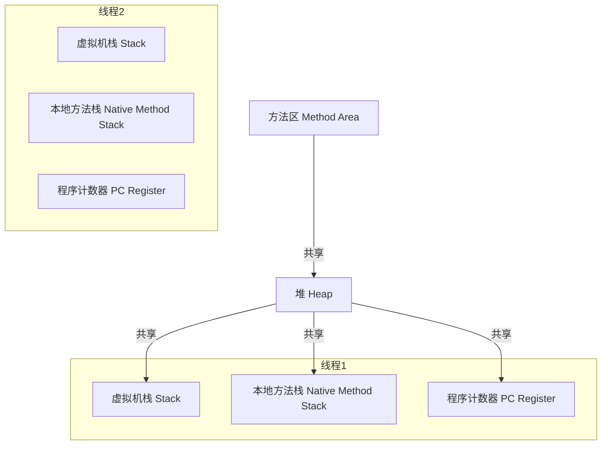

# Java全栈学习日志

## 重新学一遍Java全栈

本系列日志将记录我重新学习Java全栈开发的过程，涵盖Java基础、Web开发、数据库、Spring全家桶、前端基础、项目实战等内容。

### 学习目标
- 夯实Java基础，掌握面向对象编程思想
- 熟悉常用开发工具与环境配置
- 掌握Web开发（Servlet/JSP、Spring MVC、Spring Boot等）
- 理解数据库原理并熟练使用MySQL
- 掌握Spring、Spring Boot、Spring Cloud等主流框架
- 了解前端基础（HTML/CSS/JavaScript）及与后端的集成
- 完成至少一个全栈项目实战

### 学习计划
1. Java基础复习与进阶
2. Web开发基础与进阶
3. 数据库与持久层技术
4. Spring全家桶体系
5. 前端基础与集成
6. 项目实战与总结

---

## Java基础：JDK、JRE、JVM的关系与作用

- **JVM（Java Virtual Machine）**：Java虚拟机，负责Java字节码的加载、验证、执行和内存管理，是Java实现跨平台的核心。
- **JRE（Java Runtime Environment）**：Java运行环境，包含JVM和Java核心类库，提供运行Java程序的最小环境。
- **JDK（Java Development Kit）**：Java开发工具包，包含JRE以及编译器（javac）、调试工具等开发所需工具，是开发Java程序的完整环境。

**三者关系**：
- JDK ⊃ JRE ⊃ JVM。
- JVM是最底层的虚拟机，JRE在其基础上加上了类库，JDK则在JRE基础上再加上开发工具。

**作用总结**：
- 开发Java程序用JDK，
- 运行Java程序只需JRE，
  
  如果已经有编译好的.class字节码文件，运行时只需要JRE环境，无需JDK。JRE包含JVM和Java核心类库，能够加载和执行.class文件。
- JVM负责Java程序的跨平台运行。
  
  JVM实现跨平台的原理在于：Java源代码经过编译后生成与平台无关的字节码文件（.class），这种字节码并不能直接被操作系统识别和执行。无论在Windows、Linux还是macOS等不同操作系统上，只要安装了对应平台的JVM，JVM就能识别并执行这些字节码。JVM会根据当前操作系统和硬件环境，将字节码翻译为本地机器指令，从而实现“编写一次，到处运行”（Write Once, Run Anywhere, WORA）的目标。这也是Java语言最大的优势之一。
  
  总结：只要有.class文件，任何装有JRE的操作系统都能运行该Java程序，无需JDK参与。

---

## Java主要关键词及其作用

- **class**  
  定义一个类，是Java的基本结构单元。
- **interface**  
  定义一个接口，接口用于规范类必须实现的方法。
- **extends**  
  表示类的继承，子类通过extends继承父类。
- **implements**  
  表示类实现接口。
- **public**  
  公有访问修饰符，任何地方都可以访问。
- **private**  
  私有访问修饰符，只能在本类中访问。
- **protected**  
  受保护访问修饰符，同包或子类可访问。
- **static**  
  静态修饰符，表示属于类而不是实例。
- **final**  
  修饰类、方法、变量，表示不可更改或不可继承。
- **void**  
  表示方法无返回值。
- **new**  
  创建对象实例。
- **this**  
  当前对象的引用。
- **super**  
  父类对象的引用。
- **return**  
  方法返回语句。
- **if / else**  
  条件判断语句。
- **switch / case**  
  多分支选择语句。
- **for / while / do-while**  
  循环语句。
- **break / continue**  
  跳出循环或跳过本次循环。
- **try / catch / finally / throw / throws**  
  异常处理相关关键词。
- **import**  
  导入其他包或类。
- **package**  
  定义包名。
- **abstract**  
  抽象类或方法，不能被实例化或必须被子类实现。
- **synchronized**  
  用于多线程同步。
- **volatile**  
  声明变量易变，线程可见性。
- **transient**  
  序列化时跳过该字段。
- **instanceof**  
  判断对象是否为某个类的实例。
- **enum**  
  枚举类型。
- **default**  
  用于switch语句的默认分支，或接口的默认方法实现。


## Java中的字面量分类

Java中的字面量（Literal）是指在代码中直接表示固定值的数据。常见字面量分类如下：

- **整数型字面量**
  - 十进制：如 123
  - 八进制：以0开头，如 0123
  - 十六进制：以0x或0X开头，如 0x7B
  - 二进制：以0b或0B开头，如 0b1010

- **浮点型字面量**
  - 如 3.14、2.0e-3、1.5F、6.022E23D

- **字符型字面量**
  - 单引号括起来的单个字符，如 'A'、'中'、'\n'

- **字符串字面量**
  - 双引号括起来的字符序列，如 "Hello, Java!"

- **布尔型字面量**
  - 只有 true 和 false

- **null字面量**
  - 表示空引用，如 null

字面量是Java程序中最基本的数据表示方式，直接参与表达式和赋值。 

## Java变量定义的格式

Java中变量的定义格式如下：

```
数据类型 变量名 = 初始值;
```

- **数据类型**：如 int、double、char、String、boolean 等。
- **变量名**：自定义的标识符，需遵循命名规范。
- **初始值**：可选，变量声明时赋的初始值。

### 示例
```java
int age = 25;
double price = 19.99;
char gender = 'M';
String name = "Tom";
boolean isActive = true;
```

也可以先声明后赋值：
```java
int score;
score = 100;
```

变量名建议使用有意义的英文单词，遵循小驼峰命名法（如 studentName）。 

## Java中的键盘录入

在Java中，常用`Scanner`类实现从键盘读取用户输入。`Scanner`类位于`java.util`包中。

### 基本用法
1. 导入包：
```java
import java.util.Scanner;
```
2. 创建Scanner对象：
```java
Scanner sc = new Scanner(System.in);
```
3. 读取输入：
- 读取字符串：`String str = sc.nextLine();`
- 读取整数：`int num = sc.nextInt();`
- 读取浮点数：`double d = sc.nextDouble();`

### 示例代码
```java
import java.util.Scanner;

public class InputDemo {
    public static void main(String[] args) {
        Scanner sc = new Scanner(System.in);
        System.out.print("请输入姓名：");
        String name = sc.nextLine();
        System.out.print("请输入年龄：");
        int age = sc.nextInt();
        System.out.println("姓名：" + name + ", 年龄：" + age);
    }
}
```

> 提示：使用完Scanner后建议调用`sc.close();`关闭资源。 

## IDEA中Java项目的结构介绍

在IntelliJ IDEA中创建的标准Java项目通常包含如下目录结构：

```
project-name/
├── .idea/                # IDEA项目配置文件夹
├── src/                  # 源代码目录
│   └── main/             # 主代码目录（Maven/Gradle项目）
│       ├── java/         # Java源代码
│       └── resources/    # 资源文件（配置、图片等）
│   └── test/             # 测试代码目录
│       ├── java/         # 测试用Java代码
│       └── resources/    # 测试资源文件
├── out/                  # 编译输出目录（普通项目）
├── target/               # 构建输出目录（Maven项目）
├── build/                # 构建输出目录（Gradle项目）
├── pom.xml               # Maven项目配置文件
├── build.gradle          # Gradle项目配置文件
└── ...                   # 其他文件
```

### 主要部分说明
- **src/main/java/**：存放项目的主Java源代码。
- **src/main/resources/**：存放配置文件、图片等资源。
- **src/test/java/**：存放测试用的Java代码。
- **src/test/resources/**：存放测试相关的资源文件。
- **pom.xml**：Maven项目的依赖和构建配置文件。
- **build.gradle**：Gradle项目的依赖和构建配置文件。
- **out/**、**target/**、**build/**：编译或打包后生成的输出目录。

> 普通Java项目只有src和out，Maven/Gradle项目结构更规范，推荐使用。 

### 项目、模块、类的概念与关系

- **项目（Project）**
  - 在IDEA中，项目是开发的整体工程，包含所有代码、资源、配置和依赖管理。一个项目可以包含一个或多个模块。

- **模块（Module）**
  - 模块是项目中的功能单元，可以独立编译、运行和测试。每个模块有自己的源码、资源和依赖配置。大型项目通常会按功能或层次拆分为多个模块（如web、service、dao等）。

- **类（Class）**
  - 类是Java程序的基本代码结构，用于描述对象的属性和行为。类文件（.java）位于模块的src目录下，是实现具体功能的最小单元。

#### 三者关系
- 一个**项目**可以包含多个**模块**。
- 一个**模块**可以包含多个**类**。
- **类**是代码实现的最小单元，**模块**是功能或层次的划分，**项目**是整体工程的集合。

> 简单理解：项目 > 模块 > 类，三者层层包含，便于大型系统的分工、协作和维护。 

## Java运算符及其运算规则

### 1. 算术运算符
- `+` ：加法，两数相加。例如：a + b
- `-` ：减法，两数相减。例如：a - b
- `*` ：乘法，两数相乘。例如：a * b
- `/` ：除法，两数相除（整除/浮点）。例如：a / b
- `%` ：取余，取模，余数。例如：a % b
- `++` ：自增，变量加1（前/后缀）。例如：a++ 或 ++a
- `--` ：自减，变量减1（前/后缀）。例如：a-- 或 --a

**示例：**
```java
int a = 10, b = 3;
System.out.println(a + b); // 13
System.out.println(a - b); // 7
System.out.println(a * b); // 30
System.out.println(a / b); // 3
System.out.println(a % b); // 1
System.out.println(++a);   // 11
System.out.println(b--);   // 3（b变为2）
```

### 2. 赋值运算符
- `=` ：赋值，将右侧值赋给左侧变量。例如：a = b
- `+=` ：加后赋值，a = a + b。例如：a += b
- `-=` ：减后赋值，a = a - b。例如：a -= b
- `*=` ：乘后赋值，a = a * b。例如：a *= b
- `/=` ：除后赋值，a = a / b。例如：a /= b
- `%=` ：取余后赋值，a = a % b。例如：a %= b

**示例：**
```java
int a = 5;
a += 3; // a = 8
a -= 2; // a = 6
a *= 4; // a = 24
a /= 6; // a = 4
a %= 3; // a = 1
```

### 3. 比较（关系）运算符
- `==` ：等于，判断两值是否相等。例如：a == b
- `!=` ：不等于，判断两值是否不等。例如：a != b
- `>` ：大于。例如：a > b
- `<` ：小于。例如：a < b
- `>=` ：大于等于。例如：a >= b
- `<=` ：小于等于。例如：a <= b

**示例：**
```java
int a = 5, b = 8;
System.out.println(a == b); // false
System.out.println(a != b); // true
System.out.println(a > b);  // false
System.out.println(a < b);  // true
System.out.println(a >= 5); // true
System.out.println(b <= 8); // true
```

### 4. 逻辑运算符
- `&&` ：逻辑与，两个条件都为true时结果为true。例如：a && b
- `||` ：逻辑或，两个条件有一个为true时结果为true。例如：a || b
- `!` ：逻辑非，取反。例如：!a

**示例：**
```java
boolean x = true, y = false;
System.out.println(x && y); // false
System.out.println(x || y); // true
System.out.println(!x);     // false
```

### 5. 位运算符
- `&` ：按位与。例如：a & b
- `|` ：按位或。例如：a | b
- `^` ：按位异或。例如：a ^ b
- `~` ：按位取反。例如：~a
- `<<` ：左移。例如：a << n
- `>>` ：右移。例如：a >> n
- `>>>` ：无符号右移。例如：a >>> n

**示例：**
```java
int a = 6, b = 3; // 6: 110, 3: 011
System.out.println(a & b);  // 2  (010)
System.out.println(a | b);  // 7  (111)
System.out.println(a ^ b);  // 5  (101)
System.out.println(~a);     // -7
System.out.println(a << 1); // 12
System.out.println(a >> 1); // 3
System.out.println(a >>> 1);// 3
```

### 6. 条件（三元）运算符
- `?:` ：条件运算符，格式为 条件 ? 值1 : 值2。例如：a > b ? x : y

**示例：**
```java
int a = 10, b = 20;
int max = (a > b) ? a : b; // max = 20
System.out.println(max);
```

### 7. 字符串连接运算符
- `+` ：字符串拼接，只要有一个操作数是字符串，+ 就会拼接。例如："Hello" + name

**示例：**
```java
String name = "Java";
System.out.println("Hello, " + name); // Hello, Java
System.out.println("结果：" + 1 + 2); // 结果：12
System.out.println(1 + 2 + "结果"); // 3结果
```

### 8. instanceof 运算符
- `instanceof` ：类型判断，判断对象是否为某个类的实例。例如：obj instanceof String

**示例：**
```java
Object obj = "abc";
System.out.println(obj instanceof String); // true
System.out.println(obj instanceof Integer); // false
```

> 如需详细举例或对某类运算符深入讲解，可随时补充！ 

## Java字符串运算规则

- **字符串拼接**
  - 使用 + 运算符可以将两个字符串拼接为一个新字符串。
  - 只要有一个操作数是字符串，+ 运算符就会把另一个操作数转换为字符串后再拼接。
  - 示例：
    ```java
    String s1 = "Hello" + "World"; // 结果：HelloWorld
    String s2 = "Java" + 2025;      // 结果：Java2025
    String s3 = 1 + 2 + "abc";      // 结果：3abc（先算1+2，再拼接）
    String s4 = "abc" + 1 + 2;      // 结果：abc12（从左到右依次拼接）
    ```

- **与其他类型的运算**
  - 字符串与数字、字符、布尔等类型用 + 运算时，非字符串类型会自动转换为字符串。
  - 示例：
    ```java
    String s = "结果：" + true; // 结果：结果：true
    ```

- **不可变性**
  - 字符串在Java中是不可变对象，每次拼接都会生成新的字符串对象。
  - 多次拼接建议使用StringBuilder/StringBuffer提高效率。

- **常见注意事项**
  - 字符串比较内容要用 equals() 方法，不能用 ==。
  - 字符串拼接优先级低于算术运算，表达式中注意括号使用。

> 字符串运算是Java开发中最常见的操作之一，理解其规则有助于避免常见错误和提升性能。 

## 原码、反码与补码

在Java等计算机系统中，整数的底层存储采用二进制，负数的表示依赖于补码。理解原码、反码、补码有助于掌握位运算、溢出等底层原理。

### 1. 原码
- 原码是最直接的二进制表示，最高位为符号位（0正1负），其余为数值部分。
- 例如：
  - +7 的原码：0000 0111
  - -7 的原码：1000 0111

### 2. 反码
- 正数的反码与原码相同。
- 负数的反码：符号位不变，数值部分按位取反（0变1，1变0）。
- 例如：
  - +7 的反码：0000 0111
  - -7 的反码：1111 1000

### 3. 补码
- 正数的补码与原码相同。
- 负数的补码：反码加1。
- 例如：
  - +7 的补码：0000 0111
  - -7 的补码：1111 1001

### 4. 转换规则总结
- 正数：原码 = 反码 = 补码
- 负数：补码 = 反码 + 1
- 反码 = 补码 - 1

### 5. Java中的意义
- Java中的int、byte等整数类型，底层存储和运算都采用补码。
- 补码的好处：加减法统一、便于硬件实现、只有一个零。
- 位运算、溢出、负数右移等现象都与补码密切相关。

### 6. 示例
```java
int a = 7;      // 二进制：0000 0111
int b = -7;     // 二进制（补码）：1111 1001
System.out.println(Integer.toBinaryString(a)); // 111
System.out.println(Integer.toBinaryString(b)); // 11111111111111111111111111111001
```

> 理解补码机制有助于深入掌握Java底层运算和调试技巧。 

## Java三大程序结构

### 1. 顺序结构
- 程序从上到下依次执行每一条语句，中间没有任何判断和跳转。
- 是最简单、最常见的结构。

**示例：**
```java
int a = 10;
int b = 20;
int sum = a + b;
System.out.println("和为：" + sum);
```

### 2. 分支结构（选择结构）
- 根据条件判断，决定执行哪一部分代码。
- 常用的分支语句有：if、if-else、if-else if-else、switch。

**if语句示例：**
```java
int score = 85;
if (score >= 60) {
    System.out.println("及格");
} else {
    System.out.println("不及格");
}
```

**switch语句示例：**
```java
int day = 3;
switch (day) {
    case 1:
        System.out.println("星期一");
        break;
    case 2:
        System.out.println("星期二");
        break;
    case 3:
        System.out.println("星期三");
        // break;
    default:
        System.out.println("其他");
}
```

**case穿透（fall through）说明：**
- 如果某个case分支没有写break，程序会继续执行后续case或default中的代码，直到遇到break或switch结束。
- 这称为“case穿透”或“fall through”。

**穿透示例：**
```java
int num = 2;
switch (num) {
    case 1:
        System.out.println("A");
    case 2:
        System.out.println("B");
    case 3:
        System.out.println("C");
    default:
        System.out.println("D");
}
// 输出：B
//      C
//      D
```
> 建议每个case后都加break，除非有意为之。

**case -> 新写法（Java 14+）：**
- 从Java 14开始，switch语句支持“case ->”箭头写法，简化代码且不允许穿透。
- 每个case只能执行对应的代码块，自动break，无需手动添加。

**示例：**
```java
int day = 2;
switch (day) {
    case 1 -> System.out.println("星期一");
    case 2 -> System.out.println("星期二");
    case 3, 4, 5 -> System.out.println("工作日");
    default -> System.out.println("周末或非法");
}
```
- 也可以用于赋值：
```java
String result = switch (day) {
    case 1 -> "星期一";
    case 2 -> "星期二";
    default -> "其他";
};
System.out.println(result);
```
> 箭头写法更简洁、安全，推荐在支持的JDK版本中使用。

### 3. 循环结构
- 根据条件反复执行某段代码。
- 常用的循环语句有：for、while、do-while。

**for循环示例：**
```java
for (int i = 1; i <= 5; i++) {
    System.out.println("第" + i + "次循环");
}
```

**for循环运用场景：**
- 适用于已知循环次数的场景，如遍历数组、批量处理、计数循环等。
- 例如：遍历数组、打印1~100、批量初始化对象等。

**while循环示例：**
```java
int i = 1;
while (i <= 5) {
    System.out.println("第" + i + "次循环");
    i++;
}
```

**while循环运用场景：**
- 适用于循环次数不确定、依赖条件判断的场景，如用户输入、等待某个条件达成、读取文件等。
- 例如：用户输入密码直到正确、读取文件直到结尾、网络连接重试等。

> 总结：for循环更适合计数型、范围型循环，while循环更适合条件型、事件驱动型循环。合理选择可提升代码可读性和健壮性。

**do-while循环示例：**
```java
int i = 1;
do {
    System.out.println("第" + i + "次循环");
    i++;
} while (i <= 5);
```

> 顺序、分支、循环结构是所有程序的基础，合理组合可实现各种复杂逻辑。 

## Java中的Random库

在Java中，`Random`类用于生成伪随机数，位于`java.util`包。

### 基本用法
1. 导入包：
```java
import java.util.Random;
```
2. 创建Random对象：
```java
Random rand = new Random();
```

### 常用方法
- `nextInt()`：生成一个int范围内的随机整数。
- `nextInt(n)`：生成[0, n)范围内的随机整数。
- `nextDouble()`：生成[0.0, 1.0)范围内的随机小数。
- `nextBoolean()`：生成一个随机布尔值。
- `nextLong()`：生成一个随机long值。

### 示例代码
```java
import java.util.Random;

public class RandomDemo {
    public static void main(String[] args) {
        Random rand = new Random();
        int num = rand.nextInt(100); // 0~99的随机整数
        double d = rand.nextDouble(); // 0.0~1.0的随机小数
        boolean b = rand.nextBoolean(); // 随机布尔值
        System.out.println("随机整数：" + num);
        System.out.println("随机小数：" + d);
        System.out.println("随机布尔：" + b);
    }
}
```

> Random生成的随机数是伪随机数，种子相同则序列相同。Java 1.7+还可用`ThreadLocalRandom`和`SecureRandom`。 

## Java中的next命名规范详细解释

在Java标准库和第三方库中，许多方法以`next`开头，这是一种广泛采用的命名规范，体现了“获取序列中的下一个元素”或“生成下一个值”的设计思想。

### 1. 设计思想
- `next`强调“顺序获取”，通常用于遍历、生成、读取等需要依次处理数据的场景。
- 以`nextXxx()`命名的方法，往往每调用一次就返回序列中的下一个元素或值。
- 这种命名方式让API的用途一目了然，易于理解和记忆。

### 2. 常见场景
- **迭代器（Iterator）**：
  - `hasNext()`判断是否还有下一个元素，`next()`获取下一个元素。
  - 典型用法：
    ```java
    Iterator<String> it = list.iterator();
    while (it.hasNext()) {
        String s = it.next();
        // 处理s
    }
    ```
- **输入读取（Scanner）**：
  - `next()`读取下一个以空白分隔的字符串。
  - `nextInt()`、`nextDouble()`等读取下一个指定类型的输入。
  - 典型用法：
    ```java
    Scanner sc = new Scanner(System.in);
    int num = sc.nextInt();
    String word = sc.next();
    ```
- **随机数生成（Random）**：
  - `nextInt()`、`nextDouble()`等每次生成一个新的随机值。
- **枚举、流、生成器等**：
  - 只要是“顺序获取”或“生成下一个”，都常用next命名。

### 3. 与hasNext的配合
- 在迭代器、流等场景，通常有`hasNext()`方法判断是否还有下一个元素，配合`next()`安全遍历。
- 这样可以避免越界异常（如NoSuchElementException）。

### 4. 易混淆点
- `next()`和`nextLine()`：Scanner的`next()`读取一个单词，`nextLine()`读取一整行。
- `next()`通常不做类型转换，`nextInt()`等会尝试将输入转换为指定类型。

### 5. 实际开发建议
- 使用`nextXxx()`方法时，建议先用`hasNextXxx()`判断是否有下一个元素或输入，避免异常。
- 理解“next”语义有助于快速掌握Java集合、输入、生成器等API的用法。

> 总结：以next开头的方法体现了Java对顺序处理、流式操作的高度抽象，是高效、可读代码的重要基础。 

## Java数组基础

### 1. 数组的概念
- 数组是存储同一类型数据的有序集合，长度固定。
- 每个元素通过下标（索引）访问，下标从0开始。

### 2. 数组的声明与初始化
- 声明数组：
  ```java
  int[] arr;
  String[] names;
  ```
- 分配空间并初始化：
  ```java
  arr = new int[5]; // 长度为5，默认值为0
  String[] cities = new String[3]; // 长度为3，默认值为null
  ```
- 声明+初始化（静态初始化）：
  ```java
  int[] nums = {1, 2, 3, 4, 5};
  String[] colors = {"red", "green", "blue"};
  ```

### 3. 访问和修改数组元素
```java
int[] arr = {10, 20, 30};
System.out.println(arr[0]); // 10
arr[1] = 99;
System.out.println(arr[1]); // 99
```

### 4. 数组的遍历
- for循环遍历：
  ```java
  for (int i = 0; i < arr.length; i++) {
      System.out.println(arr[i]);
  }
  ```
- 增强for循环（for-each）：
  ```java
  for (int num : arr) {
      System.out.println(num);
  }
  ```

### 5. 数组的常用属性和特性
- `length`：数组长度属性，如arr.length。
- 数组一旦创建，长度不可变。
- 支持多维数组（如int[][] matrix = new int[3][4];）。
- 数组元素类型可以是基本类型或引用类型。

### 6. 示例：求数组元素之和
```java
int[] nums = {1, 2, 3, 4, 5};
int sum = 0;
for (int n : nums) {
    sum += n;
}
System.out.println("总和：" + sum);
```

### 7. 直接输出数组与地址格式说明
- 直接输出数组对象（如System.out.println(arr);）时，显示的不是数组内容，而是数组的类型和哈希码地址。
- 格式通常为：[类型标识@哈希码]，如：[I@6d06d69c
  - [I 表示int[]类型，@后为哈希码的十六进制。
  - 其他类型如String[]会显示为 [Ljava.lang.String;@xxxxxx

**示例：**
```java
int[] arr = {1, 2, 3};
System.out.println(arr); // 输出：[I@6d06d69c（示例）
```

- 如果要输出数组内容，需用循环或工具类：
  - for循环/增强for循环遍历输出
  - 使用Arrays.toString(arr)

**示例：**
```java
import java.util.Arrays;
int[] arr = {1, 2, 3};
System.out.println(Arrays.toString(arr)); // 输出：[1, 2, 3]
```

> 直接输出数组变量看到的是“地址信息”，不是数组元素本身。建议用Arrays.toString()等方法查看内容。

> 数组是Java中最基础的数据结构，后续可学习ArrayList等集合类实现更灵活的数据管理。 

### 8. 动态初始化时的默认值
- 使用`new`关键字动态初始化数组时，数组中的每个元素都会被自动赋予默认值。
- 不同类型的数组默认值如下：
  - 整型（int、byte、short、long）：默认值为0
  - 浮点型（float、double）：默认值为0.0
  - 字符型（char）：默认值为'\u0000'（空字符）
  - 布尔型（boolean）：默认值为false
  - 引用类型（如String、对象）：默认值为null

**示例：**
```java
int[] arr = new int[3];
System.out.println(Arrays.toString(arr)); // [0, 0, 0]

boolean[] flags = new boolean[2];
System.out.println(Arrays.toString(flags)); // [false, false]

String[] names = new String[2];
System.out.println(Arrays.toString(names)); // [null, null]
```

> 动态初始化时，数组元素的默认值由类型决定，无需手动赋值。 

## Java内存分布

Java程序运行时，JVM会将内存划分为不同的区域，每个区域负责不同类型的数据存储和管理。

### 1. 方法区（Method Area）
- 存储类的结构信息（如类的元数据、静态变量、常量、运行时常量池等）。
- 所有线程共享。

### 2. 堆（Heap）
- 存储所有对象实例和数组。
- 由垃圾回收器统一管理。
- 所有线程共享。

### 3. 虚拟机栈（Stack）
- 每个线程独有，存储方法调用时的局部变量、操作数栈、方法返回地址等。
- 局部变量包括基本类型、对象引用等。

### 4. 本地方法栈（Native Method Stack）
- 为JVM调用本地（Native）方法服务。
- 每个线程独有。

### 5. 程序计数器（Program Counter Register）
- 记录当前线程所执行字节码的行号指示器。
- 每个线程独有。

### 6. 内存分布结构图


### 7. 总结
- 堆和方法区是所有线程共享的，栈、本地方法栈、程序计数器是线程私有的。
- 对象实例存储在堆，局部变量存储在栈。
- 合理理解内存分布有助于掌握对象生命周期、垃圾回收、线程安全等核心知识。 

## Java方法基础

### 1. 方法的概念
- 方法（Method）是完成特定功能的代码块，可以重复调用。
- 方法有名称、参数列表、返回值类型和方法体。
- 方法有助于代码复用、结构清晰和模块化。

### 2. 方法的定义格式
```java
修饰符 返回值类型 方法名(参数列表) {
    // 方法体
    // 可选：return 返回值;
}
```
- 常见修饰符：public、private、static、final、abstract等。
- 返回值类型：可以是基本类型、引用类型或void（无返回值）。
- 参数列表：0个或多个参数，类型+名称，用逗号分隔。

### 3. 方法的调用
- 语法：方法名(实参列表);
- 静态方法可用类名调用：ClassName.methodName();
- 非静态方法需通过对象调用：obj.methodName();

**示例：**
```java
public static int add(int a, int b) {
    return a + b;
}

public void sayHello(String name) {
    System.out.println("Hello, " + name);
}

// 调用
int sum = add(3, 5); // 静态方法
MyClass obj = new MyClass();
obj.sayHello("Tom"); // 实例方法
```

### 4. 方法的重载（Overload）
- 同一个类中，方法名相同但参数列表不同（类型、个数、顺序不同），构成方法重载。
- 返回值类型不同不能单独构成重载。

**示例：**
```java
public int max(int a, int b) {
    return a > b ? a : b;
}
public double max(double a, double b) {
    return a > b ? a : b;
}
```

### 5. 常见修饰符说明
- `public`：公有方法，任何类都可访问。
- `private`：私有方法，仅本类可访问。
- `static`：静态方法，属于类本身。
- `final`：最终方法，不能被子类重写。
- `abstract`：抽象方法，无方法体，需子类实现。

### 6. void方法和return
- void方法无返回值，可用return;提前结束方法。
- 有返回值方法必须用return返回对应类型的值。

### 7. 参数传递
- 基本类型参数：值传递，方法内修改不影响外部变量。
- 引用类型参数：传递对象引用，方法内可修改对象内容。

### 8. 方法参数传递机制详解

Java方法参数传递采用“值传递”机制，但根据参数类型（基本类型或引用类型），在堆和栈上的表现和影响不同。

#### 1. 基本类型参数（int、double、char等）
- 传递的是变量的“值”副本。
- 方法内对参数的修改不会影响原变量。
- 存储在栈内存中。

**示例：**
```java
public static void change(int x) {
    x = 100;
}
int a = 10;
change(a);
System.out.println(a); // 输出10，a未被改变
```

#### 2. 引用类型参数（数组、对象等）
- 传递的是对象引用的“值”副本（即对象在堆中的地址）。
- 方法内通过引用可以修改堆中对象的内容，影响原对象。
- 但如果在方法内让引用指向新对象，不会影响原对象。
- 引用本身在栈内存，对象内容在堆内存。

**示例1：修改对象内容**
```java
public static void modify(int[] arr) {
    arr[0] = 99;
}
int[] nums = {1, 2, 3};
modify(nums);
System.out.println(nums[0]); // 输出99，原数组被修改
```

**示例2：引用指向新对象**
```java
public static void reassign(int[] arr) {
    arr = new int[]{7, 8, 9};
}
int[] nums = {1, 2, 3};
reassign(nums);
System.out.println(nums[0]); // 仍输出1，原数组未被替换
```

#### 3. 内存分布简图
- 基本类型参数：
  - 变量和参数都在栈，互不影响。
- 引用类型参数：
  - 引用变量在栈，实际对象在堆。
  - 传递的是“引用的副本”，可通过引用修改堆中对象内容。

> 总结：Java所有参数传递本质上都是值传递。基本类型传递值，引用类型传递引用的值（地址）。理解堆栈分布和引用机制，有助于避免参数修改的误区。 

## Java二维数组的创建与初始化

### 1. 二维数组的声明
- 语法：
  ```java
  int[][] matrix;
  String[][] table;
  ```

### 2. 二维数组的创建
- 指定行和列：
  ```java
  int[][] arr = new int[3][4]; // 3行4列，所有元素默认值为0
  ```
- 只指定行，列可后续单独分配（不规则数组）：
  ```java
  int[][] arr = new int[3][];
  arr[0] = new int[2]; // 第一行2列
  arr[1] = new int[4]; // 第二行4列
  arr[2] = new int[3]; // 第三行3列
  ```

### 3. 二维数组的静态初始化
- 声明+赋值：
  ```java
  int[][] nums = {
      {1, 2, 3},
      {4, 5, 6},
      {7, 8, 9}
  };
  ```

### 4. 访问和遍历二维数组
- 访问元素：`arr[i][j]` 表示第i行第j列元素。
- 遍历方式：
  ```java
  for (int i = 0; i < arr.length; i++) {
      for (int j = 0; j < arr[i].length; j++) {
          System.out.print(arr[i][j] + " ");
      }
      System.out.println();
  }
  ```
- 增强for循环：
  ```java
  for (int[] row : arr) {
      for (int val : row) {
          System.out.print(val + " ");
      }
      System.out.println();
  }
  ```

### 5. 特点说明
- Java二维数组本质上是“数组的数组”，每一行可以有不同的列数（不规则数组）。
- 默认值规则与一维数组一致。

> 二维数组常用于矩阵、表格、棋盘等场景，是多维数据结构的基础。 

## Java面向对象编程（OOP）基础

### 1. 类与对象
- **类（Class）**：对象的模板或蓝图，定义属性和行为。
- **对象（Object）**：类的实例，实际存在的实体。

**示例：**
```java
class Person {
    String name;
    int age;
    void sayHello() {
        System.out.println("Hello, my name is " + name);
    }
}
Person p = new Person();
p.name = "Tom";
p.age = 20;
p.sayHello();
```

### 2. 封装（Encapsulation）
- 将属性和方法封装在类内部，属性私有（private），通过公有方法（getter/setter）访问。
- 提高安全性和可维护性。

**示例：**
```java
class Student {
    private int score;
    public int getScore() { return score; }
    public void setScore(int s) { score = s; }
}
```

### 3. 继承（Inheritance）
- 子类通过`extends`继承父类，获得父类的属性和方法。
- 支持单继承。

**示例：**
```java
class Animal {
    void eat() { System.out.println("吃东西"); }
}
class Dog extends Animal {
    void bark() { System.out.println("汪汪"); }
}
Dog d = new Dog();
d.eat();
d.bark();
```

### 4. 多态（Polymorphism）
- 父类引用指向子类对象，调用方法时表现出不同形态。
- 体现为方法重写（Override）和接口实现。

**示例：**
```java
Animal a = new Dog();
a.eat(); // 调用Dog的eat方法（如果重写）
```

### 5. 构造方法（Constructor）
- 与类名相同，无返回值，用于对象初始化。
- 可重载多个构造方法。

**示例：**
```java
class Person {
    String name;
    Person() { name = "无名"; }
    Person(String n) { name = n; }
}
```

### 6. this与super关键字
- `this`：当前对象的引用，区分成员变量和局部变量，调用本类方法/构造器。
- `super`：父类对象的引用，调用父类属性、方法、构造器。

**示例：**
```java
class Parent {
    int x = 1;
}
class Child extends Parent {
    int x = 2;
    void print() {
        System.out.println(this.x); // 2
        System.out.println(super.x); // 1
    }
}
```

### 7. 方法重写（Override）与重载（Overload）
- **重写**：子类重写父类方法，方法名、参数、返回值完全一致，需加@Override注解。
- **重载**：同类中方法名相同，参数列表不同。

### 8. final与abstract
- `final`类不能被继承，final方法不能被重写，final变量为常量。
- `abstract`类不能实例化，抽象方法无方法体，子类必须实现。

### 9. 接口（Interface）
- 用`interface`定义，所有方法默认public abstract，属性默认public static final。
- 类用`implements`实现接口，可多实现。

**示例：**
```java
interface USB {
    void connect();
}
class Mouse implements USB {
    public void connect() { System.out.println("鼠标连接"); }
}
```

### 10. 静态成员（static）
- static变量/方法属于类本身，不依赖对象。
- 可用类名直接访问。

### 11. 内部类
- 类中定义的类，分为成员内部类、静态内部类、局部内部类、匿名内部类。

### 12. 对象的创建与内存分布
- new对象时，属性分配在堆，引用变量在栈。
- 构造方法初始化对象。

### 13. 常见OOP原则
- 单一职责、开闭原则、里氏替换、依赖倒置、接口隔离、迪米特法则等。

> 面向对象是Java的核心思想，掌握OOP有助于开发高内聚、低耦合、易维护的系统。 

### 面向对象的内存分布说明

- **栈内存（Stack）**：用于存储方法调用时的局部变量，包括对象引用变量（如Person p）。每个线程有自己的栈空间。
- **堆内存（Heap）**：用于存储所有new出来的对象实例和数组。对象的实际内容（属性等）都在堆中，所有线程共享。
- **方法区（Method Area）**：用于存储类的结构信息（如类的元数据、静态变量、常量、方法代码等），所有线程共享。

**对象引用与内存分布关系：**
- 当你写`Person p = new Person();`时：
  - `p`变量在栈内存，保存的是堆中Person对象的地址（引用）。
  - 堆内存中存放Person对象的实际内容。
  - 类的结构信息（如方法、静态变量）在方法区。
- 多个引用变量可以在栈中分别保存同一个对象的地址，实现对象共享。
- 对象的生命周期由是否有引用指向它决定，无引用时会被垃圾回收。

> 这种分布方式有助于实现对象的共享、封装和高效管理，是Java面向对象内存模型的基础。 

### Java对象与引用的内存分布详解

#### 1. 一个对象引用的情况
- 当你写 `Person p = new Person();` 时，发生了什么？
  1. **栈内存**：变量`p`在栈上分配空间，存储的是一个“地址”。
  2. **堆内存**：`new Person()`会在堆上开辟一块空间，存放Person对象的实际内容（属性等）。
  3. **引用关系**：`p`保存的是堆中Person对象的地址（引用），通过`p`可以访问和操作该对象。
- **影响**：如果`p`被赋值为`null`，则它不再指向任何对象，但堆中的对象如果没有其他引用指向，会被垃圾回收。

#### 2. 两个引用指向同一个对象
- 代码示例：
  ```java
  Person p1 = new Person();
  Person p2 = p1;
  ```
- 解释：
  1. `p1`和`p2`都在栈内存中，各自保存一个地址。
  2. 这两个地址其实是一样的，都指向同一个堆内存中的Person对象。
  3. 通过`p1`或`p2`修改对象的属性，另一个引用也能看到变化（因为本质上是同一个对象）。
- **影响**：只要有一个引用还指向该对象，对象就不会被回收。

#### 3. 两个引用指向不同对象
- 代码示例：
  ```java
  Person p1 = new Person();
  Person p2 = new Person();
  ```
- 解释：
  1. `p1`和`p2`都在栈内存，各自保存不同的地址。
  2. 堆内存中有两个不同的Person对象，`p1`和`p2`分别指向各自的对象。
  3. 修改`p1`指向的对象不会影响`p2`指向的对象，反之亦然。
- **影响**：每个对象的生命周期独立，只有当没有引用指向某个对象时，该对象才会被回收。

---
**总结：**
- 栈内存存放引用变量（地址），堆内存存放实际对象内容。
- 多个引用可以指向同一个对象，也可以各自指向不同对象。
- 理解这种分布有助于掌握Java对象的共享、参数传递、垃圾回收等机制。 

## Java的基本数据类型与引用数据类型

### 1. 基本数据类型（Primitive Types）
- Java共有8种基本数据类型，直接存储具体的数值，分配在栈内存。
- 包括：
  - 整型：byte（1字节）、short（2字节）、int（4字节）、long（8字节）
  - 浮点型：float（4字节）、double（8字节）
  - 字符型：char（2字节，存储单个字符）
  - 布尔型：boolean（1字节，true/false）

**示例：**
```java
int a = 10;
double d = 3.14;
char c = 'A';
boolean flag = true;
```
- 基本类型变量直接存储值，赋值和传参时是值的拷贝。

### 2. 引用数据类型（Reference Types）
- 包括：类（对象）、数组、接口、枚举、String等。
- 变量存储的是对象在堆内存的地址（引用），实际内容在堆内存。

**示例：**
```java
String s = "Hello";
int[] arr = {1, 2, 3};
Person p = new Person();
```
- 引用类型变量存储在栈，指向堆中的实际对象。
- 赋值和传参时是引用的拷贝（地址），可通过引用修改堆中对象内容。

### 3. 区别总结
- 基本类型：存储值本身，内存分配在栈，速度快，不能为null。
- 引用类型：存储地址，实际内容在堆，变量可为null，功能更丰富。
- 基本类型有对应的包装类（如int对应Integer），用于集合等只能存引用类型的场景。

> 理解两者区别有助于掌握Java的内存管理、参数传递、对象操作等核心机制。 

## this关键字的内存原理

### 1. this的本质
- this是Java中每个实例方法内部的一个隐式引用，指向当前调用该方法的对象本身。
- 本质上，this是一个指向当前对象的引用变量，存储在栈帧的局部变量表中。

### 2. 内存表现
- 当调用实例方法时，JVM会自动将当前对象的引用（即this）作为第一个参数传递给方法。
- 在方法执行期间，this指向堆内存中当前对象实例。
- 每个对象的方法调用时，this的值不同，始终指向当前操作的对象。

### 3. 作用和常见用法
- 区分成员变量和局部变量（如构造方法参数与成员变量同名时）。
- 在对象方法内部引用当前对象。
- 在构造方法中调用其他构造方法（this(...)）。
- 在链式调用中返回当前对象（如return this;）。

**示例：**
```java
class Person {
    String name;
    Person(String name) {
        this.name = name; // 区分成员变量和参数
    }
    void printName() {
        System.out.println(this.name); // this可省略
    }
    Person setName(String name) {
        this.name = name;
        return this; // 支持链式调用
    }
}
```

### 4. 注意事项
- 静态方法中不能使用this，因为没有具体对象。
- this只能在实例方法和构造方法中使用。

> 理解this的内存原理有助于掌握对象方法的调用机制、链式编程和构造方法重载等高级用法。 

## Java对象数组

### 1. 概念
- 对象数组是存放对象引用的数组，每个元素都是某个类的对象引用。
- 本质上是“引用类型数组”，数组本身在堆，元素为对象引用。

### 2. 声明与创建
- 声明：
  ```java
  Person[] people;
  ```
- 创建数组空间：
  ```java
  people = new Person[3]; // 创建长度为3的对象数组，每个元素默认值为null
  ```
- 创建并初始化对象：
  ```java
  people[0] = new Person("Tom");
  people[1] = new Person("Jerry");
  people[2] = new Person("Alice");
  ```
- 声明+静态初始化：
  ```java
  Person[] group = {
      new Person("Tom"),
      new Person("Jerry"),
      new Person("Alice")
  };
  ```

### 3. 遍历对象数组
- for循环或增强for循环：
  ```java
  for (int i = 0; i < people.length; i++) {
      if (people[i] != null) {
          people[i].sayHello();
      }
  }
  // 或
  for (Person p : group) {
      p.sayHello();
  }
  ```

### 4. 内存分布说明
- 对象数组本身在堆内存，数组元素为对象引用（地址）。
- 每个元素指向堆中的实际对象实例。
- 未初始化的元素为null。

### 5. 注意事项
- 创建对象数组时，只分配了引用空间，需逐个new对象。
- 访问未初始化的元素会抛出NullPointerException。

> 对象数组常用于批量管理同类对象，如学生列表、商品清单等，是面向对象编程的重要应用。 

## Java字符串（String）常用API

### 1. 字符串的创建
- 直接赋值：
  ```java
  String s1 = "Hello";
  ```
- 使用构造方法：
  ```java
  String s2 = new String("World");
  ```

### 2. 字符串的不可变性
- String对象一旦创建，内容不可更改，所有修改操作都会生成新字符串。
- 适合做常量、作为Map的key等。

### 3. 常用API方法
- `length()`：获取字符串长度
- `charAt(int index)`：获取指定位置字符
- `equals(String other)`：内容比较
- `equalsIgnoreCase(String other)`：忽略大小写比较
- `compareTo(String other)`：字典序比较
- `isEmpty()`：是否为空串
- `toUpperCase()/toLowerCase()`：转大/小写
- `substring(int begin, int end)`：截取子串
- `indexOf(String str)`：查找子串首次出现位置
- `lastIndexOf(String str)`：查找子串最后出现位置
- `contains(String str)`：是否包含子串
- `replace(old, new)`：替换内容
- `split(String regex)`：分割字符串
- `trim()`：去除首尾空白
- `startsWith()/endsWith()`：前缀/后缀判断
- `getBytes()`：转为字节数组
- `toCharArray()`：转为字符数组

### 4. 示例代码
```java
String str = "  Hello, Java!  ";
System.out.println(str.length()); // 15
System.out.println(str.trim()); // "Hello, Java!"
System.out.println(str.substring(2, 7)); // "Hello"
System.out.println(str.toUpperCase()); // "  HELLO, JAVA!  "
System.out.println(str.replace("Java", "World")); // "  Hello, World!  "
String[] arr = str.split(",");
System.out.println(arr[0]); // "  Hello"
```

### 5. 字符串拼接与效率
- 使用`+`拼接字符串简单但效率低，建议多次拼接时用`StringBuilder`或`StringBuffer`。

> 熟练掌握String API是Java开发的基础，能高效处理文本数据。 