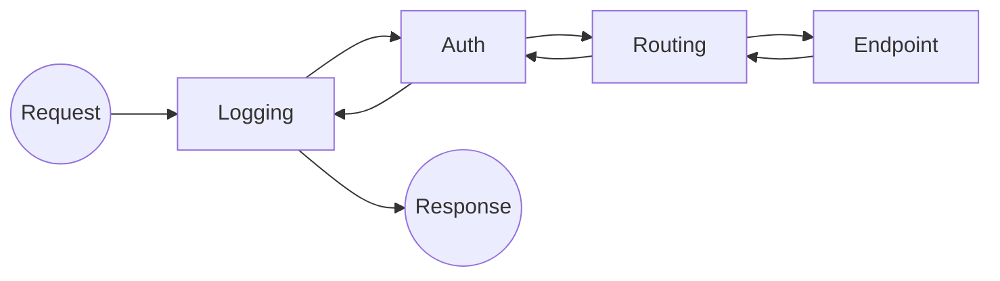

# ASP.NET Core 企业级 Web API 核心实战指南

在工业物联网（IIoT）与现代企业应用中，ASP.NET Core 已成为构建高性能、高可靠“服务端接口”的首选。它不仅支持快速轻量化的 **Minimal API**，也保留了结构严谨的 **Controller** 模式。本文将从底层架构出发，深度解析 Web API 的核心机制，并结合 **IIS 部署** 与 **HttpClient 跨端调用**，构建一套完整的生产级知识体系。

---

### 文章目录

- [一、 架构基石：启动配置与中间件管道](#一-架构基石启动配置与中间件管道)
  - [1.1 WebApplication：Builder 与 App 的职责分离](#11-webapplicationbuilder-与-app-的职责分离)
  - [1.2 依赖注入 (DI)：三大生命周期深度对比](#12-依赖注入-di三大生命周期深度对比)
  - [1.3 中间件管道 (Middleware)：洋葱模型精髓](#13-中间件管道-middleware洋葱模型精髓)
- [二、 核心进阶：Minimal API 深度解析](#二-核心进阶minimal-api-深度解析)
  - [2.1 参数绑定注解：[From...] 系列详解](#21-参数绑定注解from-系列详解)
  - [2.2 路由约束与参数：高级路径匹配技巧](#22-路由约束与参数高级路径匹配技巧)
  - [2.3 响应结果集：IResult / Results 全景参考](#23-响应结果集iresult--results-全景参考)
- [三、 工业标准：Controller API 核心规范](#三-工业标准controller-api-核心规范)
  - [3.1 [ApiController] 与属性路由](#31-apicontroller-与属性路由)
  - [3.2 ActionResult 体系：全景返回类型与文档化](#32-actionresult-体系全景返回类型与文档化)
  - [3.3 模型验证：DataAnnotations 与 ProblemDetails](#33-模型验证dataannotations-与-problemdetails)
- [四、 桥梁建设：IIS 生产级发布方案](#四-桥梁建设iis-生产级发布方案)
- [五、 跨端消费：HttpClient 高性能联动实战](#五-跨端消费httpclient-高性能联动实战)
  - [5.1 生命周期：HttpClientFactory 资源池化](#51-生命周期httpclientfactory-资源池化)
  - [5.2 异步交互模型：非阻塞 UI 开发 (WinForms)](#52-异步交互模型非阻塞-ui-开发-winforms)
  - [5.3 数据链条：响应验证与数据反序列化](#53-数据链条响应验证与数据反序列化)
  - [5.4 HttpClient 方法全攻略：参数、Body 与 Header 传递](#54-httpclient-方法全攻略参数body-与-header-传递)

---

## 一、 架构基石：启动配置与中间件管道

### 1.1 WebApplication：Builder 与 App 的职责分离
在 ASP.NET Core 的 `Program.cs` 中，整个应用的生命周期被划分为两个明显阶段：

```csharp
var builder = WebApplication.CreateBuilder(args);

// --- 阶段一：配置服务 (ServiceCollection) ---
builder.Services.AddControllers(); 
builder.Services.AddSingleton<IDeviceService, DeviceService>();

var app = builder.Build();

// --- 阶段二：配置管道 (Middleware Pipeline) ---
if (app.Environment.IsDevelopment()) {
    app.UseSwagger();
    app.UseSwaggerUI();
}
app.UseAuthorization();
app.MapControllers(); 

app.Run();
```

### 1.2 依赖注入 (DI)：三大生命周期深度对比

| 生命周期 | 关键特征 | 场景举例 |
| :--- | :--- | :--- |
| **Singleton** | 进程级唯一 | 配置中心、数据库连接池、单例网关服务 |
| **Scoped** | 请求级唯一 | 数据库上下文 (DbContext)、当前请求用户上下文 |
| **Transient** | 瞬时（每次注入都新建） | 无状态转换工具、简单的业务算法类 |

### 1.3 中间件管道 (Middleware)：洋葱模型精髓


---

## 二、 核心进阶：Minimal API 深度解析

### 2.1 参数绑定注解：[From...] 系列详解
| 注解 | 来源 | 说明 |
| :--- | :--- | :--- |
| **[FromRoute]** | 路由路径 | 如 `/devices/{id}` 中的 id |
| **[FromQuery]** | 查询字符串 | 如 `?page=1` |
| **[FromBody]** | 请求体 | 通常为 JSON 格式 |
| **[FromHeader]** | HTTP 头部 | 自定义 Header 标识 |
| **[FromServices]** | DI 容器 | 直接将已注册的服务注入参数 |

### 2.2 路由约束与参数
*   `{id:int}`：限定为整数。
*   `{id:guid}`：限定为 GUID 格式。
*   `{name:minlength(3)}`：最小长度限制。

### 2.3 响应结果集：IResult / Results 全景参考

在 Minimal API 中，使用 `IResult` 接口及其静态工厂 `Results` 来返回标准化响应：

| 方法 | 状态码 | 业务语义 |
| :--- | :--- | :--- |
| `Results.Ok(obj)` | 200 | 成功，并返回对象 |
| `Results.Created(uri, obj)` | 201 | 资源创建成功 |
| `Results.Accepted()` | 202 | 请求已接受，异步处理中 |
| `Results.NoContent()` | 204 | 成功，但无返回内容（常用于 PUT/DELETE） |
| `Results.BadRequest(msg)` | 400 | 客户端请求参数校验失败 |
| `Results.Unauthorized()` | 401 | 未认证或凭证失效 |
| `Results.Forbidden()` | 403 | 认证成功但无权访问该资源 |
| `Results.NotFound()` | 404 | 目标资源不存在 |
| `Results.Conflict()` | 409 | 业务逻辑冲突（如重名） |
| `Results.Problem(detail)` | 500 | 服务器内部错误（符合 RFC 规范） |
| `Results.File(bytes, mime)` | 200 | 返回物理文件或媒体流 |

---

## 三、 工业标准：Controller API 核心规范

### 3.1 [ApiController] 与属性路由
`[ApiController]` 开启了自动 400 校验和参数来源推断，使代码更简洁。

### 3.2 ActionResult 体系：全景返回类型与文档化

在 Controller 中，通过继承自 `ControllerBase` 的辅助方法返回结果。推荐使用 `ActionResult<T>` 以获得最佳的 Swagger 文档支持。

| 方法 | 状态码 | 对应 Minimal API |
| :--- | :--- | :--- |
| `Ok(data)` | 200 | `Results.Ok` |
| `Created(uri, data)` | 201 | `Results.Created` |
| `CreatedAtAction(...)` | 201 | 常用语返回新创建资源的详情位置 |
| `NoContent()` | 204 | `Results.NoContent` |
| `BadRequest(ModelState)` | 400 | `Results.BadRequest` |
| `Unauthorized()` | 401 | `Results.Unauthorized` |
| `Forbid()` | 403 | `Results.Forbidden` |
| `NotFound()` | 404 | `Results.NotFound` |
| `Conflict()` | 409 | `Results.Conflict` |
| `UnprocessableEntity()` | 422 | 语义错误（通常由于模型校验失败） |

---

## 四、 桥梁建设：IIS 生产级发布方案
（略：参考上文详解，重点在于 Hosting Bundle 安装与应用池无托管代码设置）

---

## 五、 跨端消费：HttpClient 高性能联动实战

### 5.1 生命周期：HttpClientFactory 资源池化
严禁手动 `using new HttpClient()`，必须使用 `AddHttpClient` 配合 `IHttpClientFactory` 管理底层处理句柄。

### 5.2 异步交互模型：非阻塞 UI 开发 (WinForms)
使用 `async/await` 确保网络 IO 时 UI 线程不卡死。

### 5.3 数据链条：响应验证与数据反序列化
标准链路：`GetAsync` -> `EnsureSuccessStatusCode` -> `ReadAsStringAsync` -> `JsonConvert.DeserializeObject`。

### 5.4 HttpClient 方法全攻略：参数、Body 与 Header 传递

上位机开发者必须掌握如何构造各种 HTTP 请求，以下是全场景方法参考：

#### 1. GET 请求：传递查询参数
GET 参数必须通过 URL 拼接。

```csharp
// 基础拼接
string url = $"http://api.com/v1/sensors?type=Temperature&limit=10";
var response = await client.GetAsync(url);
```

#### 2. POST 请求：传递 JSON 请求体
使用 `PostAsJsonAsync` 是当前最优的方案，它内部完成了对象到 JSON 的序列化和 Header 设置。

```csharp
var sensorData = new { Name = "S1", Value = 25.5 };

// 方案 A：直接发送对象（推荐）
var response = await client.PostAsJsonAsync("api/sensors", sensorData);

// 方案 B：手动构造内容
var json = JsonConvert.SerializeObject(sensorData);
var content = new StringContent(json, Encoding.UTF8, "application/json");
var response = await client.PostAsync("api/sensors", content);
```

#### 3. PUT / PATCH 请求：更新操作
*   **PUT**：替换整个资源。
*   **PATCH**：局部更新（通常需要特定的 JSON Patch 格式）。

```csharp
// 全量更新
await client.PutAsJsonAsync("api/sensors/1", sensorData);

// 局部更新（示例）
var patchDoc = new { op = "replace", path = "/value", value = 30.0 };
var response = await client.PatchAsJsonAsync("api/sensors/1", new[] { patchDoc });
```

#### 4. DELETE 请求：删除资源
```csharp
await client.DeleteAsync("api/sensors/1");
```

#### 5. 提交表单数据 (Form Data)
在某些 legacy 或特定认证系统下，需要提交 `x-www-form-urlencoded` 数据。

```csharp
var formData = new Dictionary<string, string> {
    { "username", "admin" },
    { "password", "123456" }
};
var content = new FormUrlEncodedContent(formData);
await client.PostAsync("api/auth/login", content);
```

#### 6. Header 的管理与注入
*   **全局 Header**：适用于所有请求（如 Token）。
*   **单次 Header**：仅对本次请求生效。

```csharp
// 全局设置
client.DefaultRequestHeaders.Authorization = new AuthenticationHeaderValue("Bearer", "YOUR_TOKEN");

// 单次请求设置（需使用 HttpRequestMessage）
using var request = new HttpRequestMessage(HttpMethod.Get, "api/data");
request.Headers.Add("Custom-Header", "Value");
var response = await client.SendAsync(request);
```

---

> **结语**：
> 掌握 Web API 的**“全场景返回”**与 HttpClient 的**“全谓词调用”**，是打通上位机与服务端数据链路的最后一公里。无论是 Minimal API 的灵动，还是 Controller 的严谨，最终都汇聚于稳定的 HttpClient 联动实战中。
