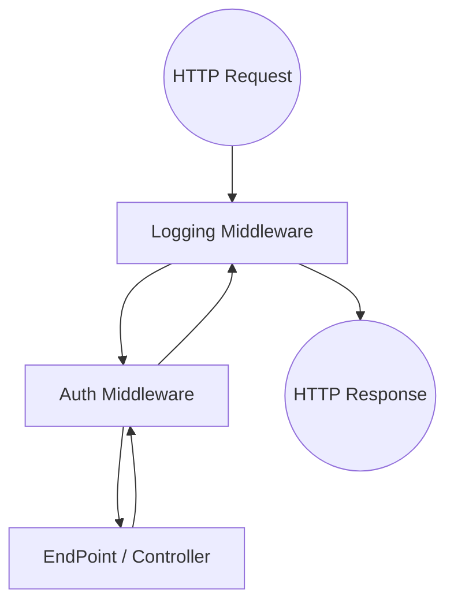

# ASP.NET Core 企业级 Web API 深度进阶指南

在 `.NET 8/9` 时代，构建 Web API 已不仅限于简单的增删改查。一个健壮的后端架构需要精准的**状态语义（IActionResult）**、严谨的**生命周期管理（DI）**、高效的**请求管道（Middleware）**以及弹性的**跨端调用（HttpClient）**。本文旨在作为一份完整的技术手册，覆盖从服务端底层机制到上位机消费服务的全过程。

---

### 文章目录

- [一、 架构基石：启动配置、DI 与管道流转](#一-架构基石启动配置di-与管道流转)
  - [1.1 启动引导：Builder 与 App 的职责分界](#11-启动引导builder-与-app-的职责分界)
  - [1.2 依赖注入 (DI)：选择合适的生命周期](#12-依赖注入-di选择合适的生命周期)
  - [1.3 洋葱模型：中间件管道的执行时序](#13-洋葱模型中间件管道的执行时序)
- [二、 返回值大辞典：IActionResult 与 IResult 全景参考](#二-返回值大辞典iactionresult-与-iresult-全景参考)
  - [2.1 成功状态 (2xx：业务已达成)](#21-成功状态-2xx业务已达成)
  - [2.2 客户端错误 (4xx：请求需修正)](#22-客户端错误-4xx请求需修正)
  - [2.3 服务器错误 (5xx：后端故障处理)](#23-服务器错误-5xx后端故障处理)
  - [2.4 特殊用途：重定向、文件流与物理路径](#24-特殊用途重定向文件流与物理路径)
- [三、 协议实战：Minimal API 与属性化路由详解](#三-协议实战minimal-api-与属性化路由详解)
  - [3.1 路由约束与高级匹配技巧](#31-路由约束与高级匹配技巧)
  - [3.2 深度绑定：从 Header、Body 到自定义绑定器](#32-深度绑定从-headerbody-到自定义绑定器)
- [四、 工业部署：IIS 托管与生产环境调优](#四-工业部署iis-托管与生产环境调优)
- [五、 跨端消费：高性能 HttpClient 联动实战](#五-跨端消费httpclient-高性能联动实战)

---

## 一、 架构基石：启动配置、DI 与管道流转

### 1.1 启动引导：Builder 与 App 的职责分界
在 .NET 6+ 的 `Program.cs` 顶级语句中，应用被拆分为“配置”与“执行”两个核心阶段：

```csharp
var builder = WebApplication.CreateBuilder(args);

// --- [服务注册阶段] ：填充容器 ---
builder.Services.AddControllers(); // 启用控制器
builder.Services.AddEndpointsApiExplorer();
builder.Services.AddSwaggerGen();

var app = builder.Build();

// --- [中间件配置阶段] ：构建管道 ---
app.UseMiddleware<IndustrialLoggingMiddleware>(); // 注入自定义工业日志
app.UseAuthentication();
app.UseAuthorization();
app.MapControllers(); // 将请求分发至控制器

app.Run();
```

### 1.2 依赖注入 (DI)：选择合适的生命周期
错误地选择生命周期会导致内存泄漏或逻辑异常（如单例捕获 Scoped 对象）。

| 生命周期 | 行为逻辑 | 典型工业应用场景 |
| :--- | :--- | :--- |
| **Singleton** | 应用启动到关闭仅存一份 | TCP 连接池、配置加载器、PLC 内存镜像缓冲区 |
| **Scoped** | 每个 HTTP 请求创建一个实例 | 数据库上下文 (DbContext)、当前请求的操作员令牌 |
| **Transient** | 每次注入都创建一个新实例 | 轻量级运算转换工具类、短生命周期的临时处理器 |

### 1.3 洋葱模型：中间件管道的执行时序
请求流经中间件就像穿过洋葱皮。每一层中间件都有机会在请求到达 EndPoint 之前（下行方向）和响应离开系统之前（上行方向）执行代码。



---

## 二、 返回值大辞典：IActionResult 与 IResult 全景参考

在 API 开发中，使用精准的 HTTP 状态码而非笼统的“200 OK + 错误码”是专业性的体现。

### 2.1 成功状态 (2xx：业务已达成)

*   **Ok (200)**：请求成功，返回数据。
    *   *Controller*: `return Ok(data);` | *Minimal*: `return Results.Ok(data);`
*   **Created (201)**：资源已创建（常用于 Post）。需带上新资源的访问地址。
    *   *Controller*: `return CreatedAtAction("Get", new { id = 1 }, entity);`
*   **Accepted (202)**：任务已接受，但尚未处理完成（常用于批处理或高能耗任务）。
    *   *Minimal*: `Results.Accepted("/api/v1/jobs/123");`
*   **NoContent (204)**：请求成功执行，但不返回内容（常用于 Update 或 Delete）。
    *   *Controller*: `return NoContent();`

### 2.2 客户端错误 (4xx：请求需修正)

*   **BadRequest (400)**：语义错误或参数校验失败（搭配 `ProblemDetails`）。
    *   *Controller*: `return BadRequest(ModelState);`
*   **Unauthorized (401)**：身份认证缺失或 Token 已过期。
*   **Forbidden (403)**：身份已知但权限不足（如非管理员尝试操作系统配置）。
*   **NotFound (404)**：资源不存在（请求了无效的设备 ID）。
*   **Conflict (409)**：资源冲突（如尝试创建一个已存在的唯一标识符，或乐观锁失败）。
    *   *Minimal*: `Results.Conflict("Device already registered.");`
*   **UnprocessableEntity (422)**：语法正确但语义错误（常用于复杂的业务逻辑校验）。

### 2.3 服务器错误 (5xx：后端故障处理)

*   **Problem (500)**：统一的服务器内部错误。按照 RFC 7807 规范，开发者应通过 `ProblemDetails` 返回详细信息而非原始堆栈。
    *   *Minimal*: `return Results.Problem(detail: ex.Message, statusCode: 500);`

### 2.4 特殊用途：重定向、文件流与物理路径

| 功能 | 方法示例 (Controller) | 实战场景 |
| :--- | :--- | :--- |
| **跨 Action 重定向** | `RedirectToAction("Details")` | 注册成功后跳转至详情页 |
| **本地文件下载** | `File(stream, "application/pdf")` | 导出工业报表 PDF 或导出 Log 文件 |
| **物理路径资源** | `PhysicalFile(@"C:\Firmwares\v1.bin")` | 远程下刷固件包给本地服务 |
| **原始 JSON** | `return Json(obj);` | 强制使用 Newtonsoft 等特定序列化器 |

---

## 三、 协议实战：Minimal API 与属性化路由详解

### 3.1 路由约束与高级匹配技巧
在 `.NET 8+` 中，利用路由约束可以在路由分发层就拦截非法流量：
```csharp
// 约束 1：必须为正整数且至少 1000
app.MapGet("/devices/{id:int:min(1000)}", (int id) => ...);

// 约束 2：正则匹配特定工业协议前缀
app.MapGet("/protocol/{type:regex(^(modbus|mqtt|opcua)$)}", ...);

// 约束 3：复合约束
app.MapGet("/v1/{guid:guid}", ...);
```

### 3.2 深度绑定：从 Header、Body 到自定义绑定器
显式声明参数来源可以显著提高代码的可读性：
*   `[FromRoute]`：URL 路径变量。
*   `[FromQuery]`：URL 问号后的查询参数（如 `?page=1`）。
*   `[FromBody]`：报文正文（通常为 JSON）。
*   `[FromHeader(Name = "X-Api-Key")]`：校验特定请求头。

---

## 四、 工业部署：IIS 托管与生产环境调优

在 Windows 生态下，IIS 作为静态托管和负载均衡层是非常稳健的选择。
1.  **Hosting Bundle**：它是 IIS 识别 .NET 程序的桥梁，包含 `AspNetCoreModuleV2`。
2.  **In-Process 模式 (推荐)**：在 `web.config` 中设置 `hostingModel="inprocess"`。这能让应用直接在 `w3wp.exe` 进程中运行，避免进程间跨域开销。
3.  **应用池隔离**：必须使用“无托管代码”模式，且池的“闲置时间（分钟）”建议设为 0，防止服务因无人访问被回收导致首发请求延迟。

---

## 五、 跨端消费：高性能 HttpClient 联动实战

上位机消费服务时，必须确保护 UI 的流畅度并防止网络阻塞。

### 5.1 异步非阻塞调用模型
```csharp
// WinForms 按钮点击事件
private async void btnSync_Click(object sender, EventArgs e) {
    try {
        // 1. 发起请求（不卡死 UI）
        var response = await _httpClient.GetAsync("https://myapi/v1/status");
        
        // 2. 严密的返回逻辑分支处理
        if (response.StatusCode == HttpStatusCode.Unauthorized) {
            MessageBox.Show("登录已失效");
            return;
        }
        
        // 3. 结果验证（基于章节二的精准状态码）
        response.EnsureSuccessStatusCode(); 
        
        // 4. 解析结果
        var result = await response.Content.ReadFromJsonAsync<DeviceStatus>();
        txtStatus.Text = result.Value;
    } catch (Exception ex) {
        // 处理 500 或连接失败
        _logger.LogError(ex, "API 调用崩溃");
    }
}
```

### 5.2 性能进阶：Stream 流式数据拉取
当下载大型固件包或处理庞大的历史数据 JSON 时，严禁使用 `ReadAsStringAsync`（会导致巨大的 String 分配）。
```csharp
using var stream = await response.Content.ReadAsStreamAsync();
using var streamReader = new StreamReader(stream);
// 直接将流传递给反序列化器，消灭中间字符串分摊压力
return await JsonSerializer.DeserializeAsync<T>(stream);
```

---

> **结语**：
> 一个卓越的 Web API 系统不仅要能承载繁重的工业业务逻辑，更要在失败时能够清晰、标准地通过 HTTP 状态码告知客户端“发生了什么”。结合 IIS 的稳定托管与 HttpClient 的弹性消费，才能构建出真正具备生产力的高性能数据链路。
