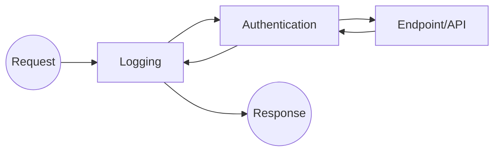

# ASP.NET Core 企业级 Web API 核心实战指南

在工业物联网（IIoT）与现代企业应用中，ASP.NET Core 已成为构建高性能、高可靠“服务端接口”的首选。它不仅支持快速轻量化的 **Minimal API**，也保留了结构严谨的 **Controller** 模式。本文将从底层架构出发，深度解析 Web API 的核心机制，并结合 **IIS 部署** 与 **HttpClient 跨端调用**，构建一套完整的生产级知识体系。

---

### 文章目录

- [一、 架构基石：启动配置与中间件管道](#一-架构基石启动配置与中间件管道)
  - [1.1 WebApplication：Builder 与 App 的职责分离](#11-webapplicationbuilder-与-app-的职责分离)
  - [1.2 依赖注入 (DI)：三大生命周期深度对比](#12-依赖注入-di三大生命周期深度对比)
  - [1.3 中间件管道 (Middleware)：洋葱模型精髓](#13-中间件管道-middleware洋葱模型精髓)
- [二、 核心进阶：Minimal API 深度解析](#二-核心进阶minimal-api-深度解析)
  - [2.1 参数绑定注解：[From...] 系列详解](#21-参数绑定注解from-系列详解)
  - [2.2 路由约束与参数：高级路径匹配技巧](#22-路由约束与参数高级路径匹配技巧)
  - [2.3 响应结果集：IResult 与 Results/TypedResults](#23-响应结果集iresult-与-resultstypedresults)
- [三、 工业标准：Controller API 核心规范](#三-工业标准controller-api-核心规范)
  - [3.1 [ApiController] 与属性路由](#31-apicontroller-与属性路由)
  - [3.2 ActionResult 体系：文档化与强类型的平衡](#32-actionresult-体系文档化与强类型的平衡)
  - [3.3 模型验证：DataAnnotations 与 ProblemDetails](#33-模型验证dataannotations-与-problemdetails)
- [四、 桥梁建设：IIS 生产级发布方案](#四-桥梁建设iis-生产级发布方案)
  - [4.1 托管环境准备与 Hosting Bundle](#41-托管环境准备与-hosting-bundle)
  - [4.2 IIS 站点配置与权限关键点](#42-iis-站点配置与权限关键点)
- [五、 跨端消费：HttpClient 高性能联动实战](#五-跨端消费httpclient-高性能联动实战)
  - [5.1 生命周期：HttpClientFactory 资源池化](#51-生命周期httpclientfactory-资源池化)
  - [5.2 异步交互模型：非阻塞 UI 开发 (WinForms)](#52-异步交互模型非阻塞-ui-开发-winforms)
  - [5.3 数据链条：响应验证与数据反序列化](#53-数据链条响应验证与数据反序列化)

---

## 一、 架构基石：启动配置与中间件管道

### 1.1 WebApplication：Builder 与 App 的职责分离
在 ASP.NET Core 的 `Program.cs` 中，整个应用的生命周期被划分为两个明显阶段：

```csharp
var builder = WebApplication.CreateBuilder(args);

// --- 阶段一：配置服务 (ServiceCollection) ---
// 此阶段用于依赖注入 (DI) 的注册。凡是需要被 app 自动创建和管理生命周期的对象，都应在此注册。
builder.Services.AddControllers(); 
builder.Services.AddSingleton<ITcpDeviceService, TcpDeviceService>();

var app = builder.Build();

// --- 阶段二：配置管道 (Middleware Pipeline) ---
// 此阶段用于定义 HTTP 请求进入应用后的处理顺序（洋葱模型）。
if (app.Environment.IsDevelopment()) {
    app.UseSwagger();
    app.UseSwaggerUI();
}

app.UseAuthorization();
app.MapControllers(); // 定义终点映射

app.Run();
```

### 1.2 依赖注入 (DI)：三大生命周期深度对比

| 生命周期 | 关键特征 | 工业级适用场景 |
| :--- | :--- | :--- |
| **Singleton** | 应用启动到关闭仅有一个实例 | 配置管理器、TCP 连接池、内存缓存映射 |
| **Scoped** | 在同一个 HTTP 请求周期内共享实例 | 数据库上下文 (DbContext)、当前用户信息、单位换算配置 |
| **Transient** | 每次注入都会创建一个新实例 | 轻量级工具类、无状态算法服务、瞬时记录器 |

> **[注意]**：禁止在单例服务中注入 Scoped 服务，这会导致“生命周期捕获”错误，可能造成内存泄漏或数据库连接无法释放。

### 1.3 中间件管道 (Middleware)：洋葱模型精髓
中间件通过 `next()` 将请求向后传递，并由于堆栈特性，在返回响应时会以相反方向再次经过这些中间件。



---

## 二、 核心进阶：Minimal API 深度解析

Minimal API 并非只是“简写”，它在高性能场景（如微服务）中通过减少反射机制提升了吞吐量。

### 2.1 参数绑定注解：[From...] 系列详解
在端点定义中，显式指定参数来源可以增加代码的可读性并减少误判：

| 注解 | 来源描述 | 示例 URL / 报文 |
| :--- | :--- | :--- |
| **[FromRoute]** | 从路径参数中提取 | `/api/v1/devices/{id}` |
| **[FromQuery]** | 从 URL 查询字符串中提取 | `/api/v1/devices?page=1&size=10` |
| **[FromBody]** | 从 HTTP Body (通常为 JSON) 中提取 | `{"name": "TempSensor"}` |
| **[FromHeader]** | 从 HTTP Header 中提取 | `X-Device-Key: 123456` |
| **[FromServices]** | 直接从 DI 容器中通过参数注入 | 服务接口注入 |

### 2.2 路由约束与参数：高级路径匹配技巧
通过路由约束，可以在分发请求前就拦截无效输入，保护后端逻辑。
*   `app.MapGet("/device/{id:int}", ...)`：仅匹配整数 ID。
*   `app.MapGet("/log/{date:datetime}", ...)`：自动解析为日期对象。
*   `app.MapGet("/config/{name:alpha}", ...)`：仅匹配由字母组成的名称。

### 2.3 响应结果集：IResult 与 Results/TypedResults
Minimal API 使用 `IResult` 接口统一各种 HTTP 响应：

```csharp
app.MapGet("/check/{id}", (int id) => {
    if (id < 0) return Results.BadRequest("ID 不能为负数"); // 400
    if (id == 0) return Results.NotFound(); // 404
    return Results.Ok(new { Id = id, Active = true }); // 200
});
```

---

## 三、 工业标准：Controller API 核心规范

虽然 Minimal API 流行，但对于拥有复杂业务、大量 API 或需要 OData 支持的大型项目，Controller 仍是架构首选。

### 3.1 [ApiController] 与属性路由
`[ApiController]` 不仅仅是一个标记，它开启了许多自动行为：
*   **自动模型验证**：如果 `ModelState` 无效，自动返回 400。
*   **推断参数来源**：自动根据约定决定参数是从 Body 还是 Query 提取。
*   **属性路由强制化**：必须通过 `[Route]` 定义路径。

```csharp
[ApiController]
[Route("api/[controller]")]
public class DeviceController : ControllerBase { ... }
```

### 3.2 ActionResult 体系：文档化与强类型的平衡
在 ActionResult 体系中，`ActionResult<T>` 是目前的最佳实践。它不仅允许返回 `Result` 对象（如 `NotFound()`），还保留了返回类型 `T` 的元数据，方便 Swagger 自动生成文档。

```csharp
[HttpGet("{id}")]
public async Task<ActionResult<DeviceDto>> Get(int id) {
    var dev = await _svc.GetByIdAsync(id);
    if (dev == null) return NotFound(); // 支持返回状态码
    return dev; // 也支持直接返回对象，系统自动包装为 Ok(dev)
}
```

### 3.3 模型验证：DataAnnotations 与 ProblemDetails
利用属性注解进行声明式校验，结合 **RFC 7807 (ProblemDetails)** 规范，返回标准化的错误格式：

```csharp
public class DeviceDto {
    [Required(ErrorMessage = "名称是必填项")]
    [StringLength(50, MinimumLength = 3)]
    public string Name { get; set; }

    [Range(0, 100)]
    public decimal Threshold { get; set; }
}
```

---

## 四、 桥梁建设：IIS 生产级发布方案

### 4.1 托管环境准备与 Hosting Bundle
在 Windows Server 环境下，ASP.NET Core 与 IIS 的关系是“反向代理”。
1.  **Hosting Bundle**：必须安装该组件，它包含 `AspNetCoreModuleV2`。
2.  **应用池设置**：必须设置为 **“无托管代码” (No Managed Code)**。

### 4.2 IIS 站点配置与权限关键点
*   **物理路径**：指向 `dotnet publish` 后的文件夹。
*   **文件夹权限**：必须赋予 `IIS AppPool\你的池名称` 对发布目录的“读取和执行”权限。

---

## 五、 跨端消费：HttpClient 高性能联动实战

### 5.1 生命周期：HttpClientFactory 资源池化
严禁每次请求都 `new HttpClient()`。
*   **问题**：会导致大量的 `TIME_WAIT` 连接，最终引发 Socket 耗尽导致应用崩溃。
*   **方案**：在 DI 中注册 `AddHttpClient()`，通过 `IHttpClientFactory` 获取实例。

### 5.2 异步交互模型：非阻塞 UI 开发 (WinForms)
在上位机（WinForms）中消费 Web API 时，必须确保护 UI 的响应性：

```csharp
// 1. 声明持久化客户端（简单场景）或使用工厂
private static readonly HttpClient client = new HttpClient();

private async void btnLoad_Click(object sender, EventArgs e) {
    // 异步等待，UI 保持流畅不卡死
    var data = await LoadDataAsync();
    dataGridView1.DataSource = data;
}
```

### 5.3 数据链条：响应验证与数据反序列化
标准化的 JSON 处理流程：

```csharp
public async Task<List<Todo>> GetTodos(int page) {
    // 1. 构造带参数的 URL
    string url = $"http://192.168.1.10/api/todo?pageIndex={page}&pageSize=20";
    
    // 2. 发起异步请求
    var response = await client.GetAsync(url);
    
    // 3. 严格验证状态码（一旦非 2xx 立即抛出异常，进入异常处理流）
    response.EnsureSuccessStatusCode();
    
    // 4. 读取为字符串或流（大数据量建议用流提高性能）
    string json = await response.Content.ReadAsStringAsync();
    
    // 5. 反序列化
    return JsonConvert.DeserializeObject<ResponseResult<List<Todo>>>(json).Data;
}
```

---

> **结语**：
> 一个现代化的、企业级的 Web API 体系，是由服务端稳健的请求处理架构（Minimal API / Controller）、可靠的部署宿主方案（IIS）以及高效的客户端通信机制（HttpClient）共同构成的。掌握这一链路，才能真正实现工业大数据的高效流转。
