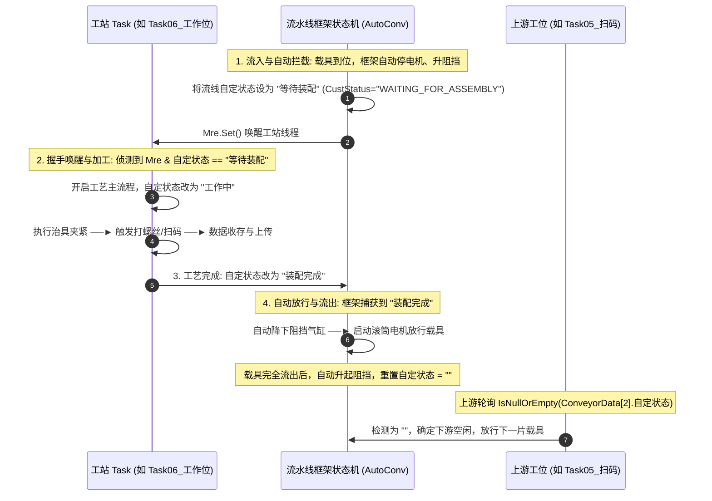
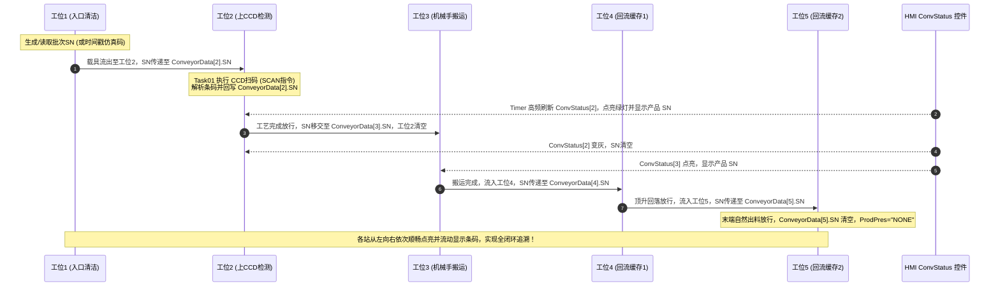

> [!IMPORTANT]
> **免责声明**：本文章内容仅用于个人学习、技术交流与笔记归档使用。

<details open class="in-post-toc-card border border-neutral-200/80 dark:border-neutral-700/80 rounded-xl p-4 my-4 bg-neutral-50/50 dark:bg-neutral-800/30">
<summary class="font-bold text-base cursor-pointer select-none text-neutral-800 dark:text-neutral-200 flex items-center justify-between outline-none">
📑 本篇目录（点击收起 / 展开）
</summary>

<div class="max-h-72 overflow-y-auto mt-3 pt-2 border-t border-neutral-200/60 dark:border-neutral-700/60 hide-scrollbar">

## 目录

- [5. 传送带 Conveyor 系统](#5-传送带-conveyor-系统)
  - [5.1 核心设计理念](#51-核心设计理念)
  - [5.2 Conveyor.xml 配置文件](#52-conveyorxml-配置文件)
  - [5.3 nConveyor 状态机（框架内部）](#53-nconveyor-状态机框架内部)
  - [5.4 ConvEvent 用户可编程事件（A0.Conveyors.cs）](#54-convevent-用户可编程事件a0conveyorscs)
  - [5.5 完整数据流示例](#55-完整数据流示例)
  - [5.6 Conveyor.xml 与 InNo/OutNo 的映射关系](#56-conveyorxml-与-innooutno-的映射关系)
  - [5.7 标准流线开发流程与代管机制](#57-标准流线开发流程与代管机制)
  - [5.8 CurStnStatus 完整状态列表](#58-curstnstatus-完整状态列表)
  - [5.9 ConveyorData 运行时属性](#59-conveyordata-运行时属性)
  - [5.10 载具 SN 码全生命周期流转与 UI 监控绑定机制](#510-载具-sn-码全生命周期流转与-ui-监控绑定机制)
  - [5.11 传送带死锁排查 SOP 与三大致命根因剖析](#511-传送带死锁排查-sop-与三大致命根因剖析)
  - [5.12 常见问题与排障 FAQ](#512-常见问题与排障-faq)

</div>
</details>


## 5. 传送带 Conveyor 系统

### 5.1 核心设计理念

在 BoTech 框架中，**传送带的 IO 控制（电机、气缸、传感器）应该配置在传送带框架中，而不是写在 Task 代码里**。

标准开发模式：

```
┌─────────────────────────────────────────────────────────┐
│                    Conveyor.xml                           │
│  配置：电机IO、气缸IO、传感器IO、速度、延时、上下游关系       │
└─────────────────────────────────────────────────────────┘
         │
         ↓
┌─────────────────────────────────────────────────────────┐
│               nConveyor 状态机（框架内部）                  │
│  自动执行：启动电机 → 等传感器 → 控制气缸 → 停止电机        │
│  自动处理：流入、到位、减速、流出、阻挡气缸伸缩               │
│  自动处理：异常检测（超时弹框）                              │
└─────────────────────────────────────────────────────────┘
         │
         ↓ CurStnStatus 状态变化
┌─────────────────────────────────────────────────────────┐
│               ConvEvent（A0.Conveyors.cs）                 │
│  ConvRun() 根据 CurStnStatus 分发到：                      │
│    → Data_Change()        数据交换                         │
│    → HandleCurrentStation() 当站处理（等工位完成）           │
│    → Start_Send()         电机启动                         │
│    → Stop_Send()          电机停止                         │
│    → Reduce_Speed()       减速                             │
│    → ReLoadCarrier()      载具重载                         │
│    → 异常处理              弹框重试/取消                     │
└─────────────────────────────────────────────────────────┘
         │
         ↓ CustStatus 握手
┌─────────────────────────────────────────────────────────┐
│               Task（5.Tasks/Task0X_xxx.cs）                │
│  只负责：                                                 │
│    1. 等待 CustStatus == "WAITING_FOR_ASSEMBLY"           │
│    2. 做工位业务（扫码/锁螺丝/出料）                        │
│    3. 设置 CustStatus = "ASSEMBLY_COMPLETED"              │
│  不负责：电机、气缸、传感器（由传送带框架自动控制）           │
└─────────────────────────────────────────────────────────┘
```

### 5.2 Conveyor.xml 配置文件

**路径说明：**
* 模板与备份路径：`BZ-Parameter/RBF/Conveyor.xml`
* **运行时实际加载路径**：系统在 `1.Setup_Load.cs` 中通过 `BZ_ExePath + "Conveyor.xml"` 动态加载当前项目运行目录下的配置文件（例如 `bin\Debug\M22-T\Conveyor.xml`）。修改配置或现场排障时，**必须确保运行时目录下的 XML 文件已同步更新**！

每个 `<Conveyor>` 节点代表一条传送带段，包含完整的 IO、运动控制以及前后机握手配置。

#### 完整字段说明

| 字段 | 对应 XML 标签 | 类型 | 说明与安全配置规范 |
|:---|:---|:---|:---|
| **IO编号** | `<IO编号>` | string | 电机IO端口编号（逗号分隔，如 `40,41,42`） |
| **IO控制** | `<IO控制>` | bool | `true`=数字IO控制电机（变频器/继电器），`false`=伺服轴控制 |
| **卡号** | `<卡号>` | int | 轴控制电机时对应的控制板卡号 |
| **轴号** | `<轴号>` | int | 轴控制电机时对应的物理轴号 |
| **工作速度** | `<工作速度>` | double | 载具平稳流入时的电机工作速度（mm/s） |
| **减速速度** | `<减速速度>` | double | 触发减速传感器后的慢速到位速度（mm/s） |
| **流出速度** | `<流出速度>` | double | 工艺完成放行时的电机流出速度（mm/s） |
| **允许同步流入** | `<允许同步流入>` | bool | 是否允许与上一站同步动作流入 |
| **同步流入延时** | `<同步流入延时>` | int | 同步流入触发后的延时时间（ms） |
| **上一段流线编号** | `<上一段流线编号>` | int | 上游传送带编号（-1=首站/无前站） |
| **下一段流线编号** | `<下一段流线编号>` | int | **下游传送带编号（-1=末站/无后站）。切勿填 0，否则流出时会因等待 0 号工位而卡死在步序 100！** |
| **阻挡气缸输出编号** | `<阻挡气缸输出编号>` | int | 阻挡气缸电磁阀输出 IO（-1=无阻挡气缸） |
| **阻挡气缸原点信号** | `<阻挡气缸原点信号>` | int | 气缸缩回/下降到位输入信号（-1=不检测） |
| **阻挡气缸动点信号** | `<阻挡气缸动点信号>` | int | 气缸伸出/上升到位输入信号（-1=不检测） |
| **起始感应信号** | `<起始感应信号>` | int | 流线入口光电传感器信号（-1=无） |
| **末端减速信号** | `<末端减速信号>` | int | 末端减速光电传感器信号（-1=无） |
| **到位感应信号** | `<到位感应信号>` | int | 载具到位光电传感器信号（-1=无） |
| **流出感应信号** | `<流出感应信号>` | int | 载具离开光电传感器信号（-1=无） |
| **马达轴编号** | `<马达轴编号>` | int | 电机轴编号（IO控制时通常为 0） |
| **马达启动信号** | `<马达启动信号>` | int | 电机启动信号（IO控制时通常为 0） |
| **顶升延时** | `<顶升延时>` | int | 顶升到位后的稳定延时（ms） |
| **到位延时** | `<到位延时>` | int | 载具触发到位感应后的刹车稳定延时（ms） |
| **方向调转** | `<方向调转>` | bool | 电机正反转方向调转 |
| **本台可接收载具** | `<NextDevRecvCarrier>` | int | **外部对接信号：本台设备可接收载具输出IO。单机内部回流末端必须设为 -1，否则会强制进入外部握手导致步序 2010 永久卡死！** |
| **接收产品OK输入** | `<CurSendProdOK>` | int | 对接前机/外部时接收产品 OK 的信号编号（-1=不检测） |
| **接收产品NG输入** | `<CurSendProdNG>` | int | 对接前机/外部时接收产品 NG 的信号编号（-1=不检测） |
| **下台可接收载具** | `<下台设备可接收载具输入编号>` | int | 对接后机时输入信号编号（-1=无后机） |
| **发送产品OK输出** | `<当前发送产品OK输出编号>` | int | 发送给下台设备的 OK 信号编号（-1=无） |
| **发送产品NG输出** | `<当前发送产品NG输出编号>` | int | 发送给下台设备的 NG 信号编号（-1=无） |

#### 典型流线配置示例（以5站循环回流线为例）

```xml
<!-- 工位3 (石墨盘搬运)：必须配置 NextFLNum=4 顺畅流入回流缓存1 -->
<Conveyor>
    <IO编号>-1</IO编号>
    <IO控制>true</IO控制>
    <卡号>0</卡号>
    <轴号>3</轴号>
    <工作速度>300</工作速度>
    <流出速度>300</流出速度>
    <减速速度>300</减速速度>
    <上一段流线编号>2</上一段流线编号>
    <下一段流线编号>4</下一段流线编号>
    <阻挡气缸输出编号>70</阻挡气缸输出编号>
    <阻挡气缸原点信号>-1</阻挡气缸原点信号>
    <阻挡气缸动点信号>97</阻挡气缸动点信号>
    <到位感应信号>88</到位感应信号>
    <NextDevRecvCarrier>-1</NextDevRecvCarrier>
</Conveyor>

<!-- 工位4 (回流缓存1)：上游是3，下游是5，绝不能配 NextFLNum=0 -->
<Conveyor>
    <IO编号>-1</IO编号>
    <IO控制>true</IO控制>
    <卡号>0</卡号>
    <轴号>4</轴号>
    <工作速度>300</工作速度>
    <流出速度>300</流出速度>
    <减速速度>300</减速速度>
    <上一段流线编号>3</上一段流线编号>
    <下一段流线编号>5</下一段流线编号>
    <阻挡气缸输出编号>42</阻挡气缸输出编号>
    <阻挡气缸动点信号>70</阻挡气缸动点信号>
    <到位感应信号>64</到位感应信号>
    <NextDevRecvCarrier>-1</NextDevRecvCarrier>
</Conveyor>

<!-- 工位5 (回流缓存2/末端出料)：必须配置 NextDevRecvCarrier=-1 -->
<Conveyor>
    <IO编号>-1</IO编号>
    <IO控制>true</IO控制>
    <卡号>0</卡号>
    <轴号>5</轴号>
    <工作速度>300</工作速度>
    <流出速度>300</流出速度>
    <减速速度>300</减速速度>
    <上一段流线编号>4</上一段流线编号>
    <下一段流线编号>-1</下一段流线编号>
    <阻挡气缸输出编号>44</阻挡气缸输出编号>
    <阻挡气缸动点信号>71</阻挡气缸动点信号>
    <到位感应信号>66</到位感应信号>
    <NextDevRecvCarrier>-1</NextDevRecvCarrier>
</Conveyor>
```

---

### 5.3 nConveyor 状态机（框架内部）

`nConveyor` 是框架提供的传送带状态机，运行在独立线程上。根据 `Conveyor.xml` 的配置自动控制电机、气缸和传感器。

#### 状态机步进

```
StepIdx=10   FlowInStart          启动电机，等待产品流入
StepIdx=20   AtPositionCheck      等待到位传感器 + 阻挡气缸
StepIdx=30   DataExchange         从前一站复制产品数据
StepIdx=40   AtPositionClassify   到位分类，停止电机
StepIdx=70   WaitProcessing       通知工位开始工作
StepIdx=80   ProcessingComplete   工位说"做完了"
StepIdx=100  FlowOutStart         启动流出电机
StepIdx=110  ObstacleRetract      阻挡气缸缩回
StepIdx=150  FlowOutEnd           等待产品流走
StepIdx=160  LoopCheck            计算CT，回到10
```

#### nConveyor 自动控制的 IO

| 步进 | 自动控制 | 依据配置 |
|------|---------|---------|
| StepIdx=10 | 启动电机 | `工作速度`、`IO编号` |
| StepIdx=20 | 等传感器 | `到位感应信号`、`阻挡气缸动点信号` |
| StepIdx=40 | 停止电机 | `Stop_Send()` 回调 |
| StepIdx=100 | 启动流出电机 | `流出速度` |
| StepIdx=110 | 缩回阻挡气缸 | `阻挡气缸输出编号`、`阻挡气缸原点信号` |
| StepIdx=150 | 停止电机 | `Stop_Send()` 回调 |

---

### 5.4 ConvEvent 用户可编程事件（A0.Conveyors.cs）

`ConvEvent` 是用户可编程的事件处理器。当 `nConveyor` 状态机的状态发生变化时，通过 `mEvent` 委托调用 `ConvRun()`。

#### ConvRun 主调度器

```csharp
public void ConvRun(short ConvID)
{
    if (CurStnStatus == "PRODUCT_ARRIVED")              → Data_Change()
    if (CurStnStatus == "CURRENT_STATION_PROCESSING")   → HandleCurrentStation()
    if (CurStnStatus == "CARRIER_RELOAD")               → ReLoadCarrier()
    if (CurStnStatus == "START_TRANSFER")               → Start_Send()
    if (CurStnStatus == "STOP_TRANSFER")                → Stop_Send()
    if (CurStnStatus == "START_DECELERATING")           → Reduce_Speed()
    if (CurStnStatus == "ObstacleRetract_ERROR")        → 异常弹框
    if (CurStnStatus == "ObstacleLifting_ERROR")        → 异常弹框
    if (CurStnStatus == "FLOWOUT_ERROR")                → 异常弹框
    if (CurStnStatus == "RECEIVING_ERROR")              → 异常弹框
    if (CurStnStatus == "FlowIn_ERROR")                 → 异常弹框
}
```

#### HandleCurrentStation — 当站处理（核心）

连接传送带框架和 Task 代码的桥梁：

```csharp
public static bool HandleCurrentStation(int StaNum)
{
    switch (StaNum)
    {
        case 1:  // 传送带1
            if (SubStepIdx == 10)
            {
                ConvData.Clear();                              // 清空旧数据
                CustStatus = "WAITING_FOR_ASSEMBLY";           // ← 通知工位
                SubStepIdx = 20;
            }
            if (CustStatus == "ASSEMBLY_COMPLETED")            // ← 工位完成
            {
                return true;                                   // 告诉框架：可以流走
            }
            break;
    }
    return false;
}
```

#### Start_Send / Stop_Send — 电机控制

```csharp
// 电机启动（框架在 StepIdx=100 时调用）
private static bool Start_Send(int ConvID) { return true; }

// 电机停止（框架在 StepIdx=40/150 时调用）
// 关键：传送带成对共用电机（1-2、3-4、5-6、7-8）
private static bool Stop_Send(int ConvID)
{
    switch (ConvID)
    {
        case 1: case 2:
            if (ConveyorData[1].MotorRun | ConveyorData[2].MotorRun)
                return true;  // 配对还在跑，不停
            return true;
        case 3: case 4:
            if (ConveyorData[3].MotorRun | ConveyorData[4].MotorRun)
                return true;
            return true;
    }
    return true;
}
```

---

### 5.5 完整数据流示例

以传送带1为例，产品从流入到流出的完整流程：

```
传送带框架（nConveyor）           ConvEvent                    Task01
    │                              │                           │
    │ StepIdx=10: 启动电机          │                           │
    │ 等待产品流入                   │                           │
    │                              │                           │
    │ 产品到达 → 到位传感器亮        │                           │
    │ StepIdx=20: 等到位+气缸       │                           │
    │                              │                           │
    │ StepIdx=30: 数据交换          │                           │
    │ CurStnStatus="PRODUCT_ARRIVED"│                           │
    │                              │→ ConvRun → Data_Change()  │
    │                              │  清空前站数据               │
    │                              │                           │
    │ StepIdx=40: 停止电机          │                           │
    │ CurStnStatus="CURRENT_STATION"│                           │
    │       _PROCESSING             │                           │
    │                              │→ ConvRun →                │
    │                              │  HandleCurrentStation()   │
    │                              │  CustStatus=              │
    │                              │  "WAITING_FOR_ASSEMBLY"  ─│─→ 检测到信号
    │                              │                           │  开始扫码
    │                              │                           │  做工作...
    │                              │                           │  完成
    │                              │                           │  CustStatus=
    │                              │  检测到 CustStatus  ←─────│─  "ASSEMBLY_COMPLETED"
    │                              │  == "ASSEMBLY_COMPLETED"  │
    │                              │  return true              │
    │                              │                           │
    │ StepIdx=100: 启动流出电机     │                           │
    │ CurStnStatus="START_TRANSFER"│                           │
    │                              │→ ConvRun → Start_Send()   │
    │                              │                           │
    │ StepIdx=110: 气缸缩回         │                           │
    │ 产品流出                      │                           │
    │                              │                           │
    │ StepIdx=150: 停止电机         │                           │
    │ CurStnStatus="STOP_TRANSFER" │                           │
    │                              │→ ConvRun → Stop_Send()    │
    │                              │                           │
    │ StepIdx=160: 回到 StepIdx=10  │                           │
    │                              │                           │
    │ 等待下一个产品...              │                           │
```

---

### 5.6 Conveyor.xml 与 InNo/OutNo 的映射关系

Conveyor.xml 中的信号编号**直接对应** `EnumName.cs` 中的 `InNo` 和 `OutNo` 枚举值。

#### 各传送带映射

| 传送带 | `阻挡气缸输出编号` | `阻挡气缸动点信号` | `到位感应信号` | `上一站` | `下一站` |
|--------|-------------------|-------------------|---------------|---------|---------|
| 1 | 62 | 73 | 74 | -1 | 2 |
| 2 | 64 | 77 | 78 | 1 | 3 |
| 3 | -1 | -1 | 83 | 2 | -1 |

---

### 5.7 标准流线开发流程与代管机制

> [!TIP]
> **关于练习/仿真项目的架构说明**：
> 在部分学习性质的仿真练习项目中，开发者有时会通过在 Task 代码中直接控制电机与气缸来进行底层 IO 顺序控制练习。但在**工程量产与标准项目**中，必须遵循**标准流线代管机制**：将阻挡气缸升降、滚筒电机启停及载具过站完全委托给框架底层状态机（`AutoConv`），工站 Task 仅需专注于核心工艺逻辑并通过 `CustStatus`（自定状态）进行消息同步。

#### 5.7.1 框架三层代管职责架构

标准流水线开发模式遵循高度解耦的**分层代管职责**：

| 架构层级 | 配置文件 / 模块 | 核心职责 |
| :--- | :--- | :--- |
| **配置解耦层** | `Conveyor.xml` | 参数化配置物理 IO（电机 DO、阻挡/顶升气缸 DO/DI、到位/流入传感器 DI）、运转速度、延时参数以及流水线上下游节点关系。 |
| **底层状态代管层** | `AutoConv.dll` / `A0.Conveyors.cs` / `A2.流线控制.cs` | 运行于高频独立扫描线程。负责轮询传感器、自动控制电机启停、自动伸缩阻挡气缸、自动完成跨站数据克隆与重置，并维护 `CustStatus` 初始推送。 |
| **业务逻辑工站层** | `Task` 工站代码（如 `Task06_工作位`） | **绝对不直接控制流线电机和流线阻挡气缸**。仅监听 `ConveyorData[MainConvId].自定状态`，执行工站专用的治具夹紧与组装工艺（如打螺丝、扫码），完成后将状态修改为 `"装配完成"` 即可。 |

**标准代管模式优势**：
- **逻辑高内聚**：Task 代码极度精简，避免了在 Task 循环中高频轮询 IO 导致的日志刷屏和 UI 卡顿。
- **物理重构零代码变动**：修改流线电磁阀或传感器 Pin 脚时，仅需更新 `Conveyor.xml`，无需触动任何 Task 业务代码。
- **防止机械碰撞**：阻挡气缸升降与电机延时防撞逻辑在框架底层统一锁存，避免多 Task 并发竞争导致载具撞板。

---

#### 5.7.2 标准流线代管协同四步法

在标准螺丝机项目（如 **SPK-17**）中，流水线框架与工站 Task 之间通过 `自定状态`（即 `CustStatus`）进行“非阻塞”握手，整体生命周期包含以下四个步骤：



1. **流入与自动拦截 (Inflow & Auto-Block)**：
   载具在流线滚筒上滑动，当触发流线到位感应器时，`AutoConv` 框架状态机自动切入当站处理流程，自动伸出阻挡气缸并停止电机运转。
2. **握手唤醒 (Handshake & Wakeup)**：
   流线框架将当前段的自定义状态 `ConveyorData[MainConvId].自定状态` 修改为 `"等待装配"`（或英文 `"WAITING_FOR_ASSEMBLY"`），同时发送线程唤醒信号 `Mre.Set()`。
3. **工艺加工 (Task Execution)**：
   工站 Task 的 `AutoRun()` 接收到 `Mre` 唤醒并确认 `自定状态 == "等待装配"` 后，将状态置为 `"工作中"`，开始执行顶升盖板、夹紧治具、触发机械手打螺丝、SFC 数据上传等本站工艺。
4. **自动放行与流出 (Auto-Release & Outflow)**：
   工站 Task 完成所有工艺后，**仅需将 `自定状态` 更新为 `"装配完成"`**（或英文 `"ASSEMBLY_COMPLETED"`）。底层流线状态机轮询捕获到该状态后，会自动降下阻挡气缸、开启滚筒电机送走载具。当载具离开到位感应器后，框架自动恢复阻挡气缸并重置 `自定状态 = ""`，供上游判断下游空闲。

---

#### 5.7.3 标准工站 Task 最佳实践代码

在标准模式下，工站 Task 代码非常干净，完全不直接干预流线电机的 DO 或流线阻挡气缸的 DO：

```csharp
// Task06_工作位.cs 标准流程代码片断
public override void AutoRun()
{
    switch (StaInfo.步序号)
    {
        case (int)WorkStep.流程开始:
            // 1. 监听流线框架推送的状态，等待被 Mre 唤醒
            if (mFunction.流水线[MainConvId].自定状态 == "等待装配")
            {
                Mre.WaitOne();
                Mre.Reset();
                isWork = true;
                SetStep((int)WorkStep.载具顶升上升);
            }
            break;

        case (int)WorkStep.载具顶升上升:
            // 仅控制本工站专属的治具/盖板气缸，非流线阻挡气缸
            双控电磁阀(OutNo.流线2_工作位锁螺丝盖板顶升, OutNo.流线2_工作位锁螺丝盖板缩回, ...);
            SetStep((int)WorkStep.载具夹紧);
            break;

        case (int)WorkStep.等待锁螺丝完成:
            // ... 阻塞等待双机械轴锁螺丝完成并转移扭矩/角度数据 ...
            SetStep((int)WorkStep.SFC数据上传);
            break;

        case (int)WorkStep.通知流线锁螺丝完成:
            AddLog("产品工作完成流出, SN: " + SN, LogsType.Auto, StaInfo.步序号, true);
            isWork = false;
            
            // 2. 仅更新自定状态为"装配完成"，底层的 AutoConv 框架收到后会自动降阻挡、开电机送走载具
            mFunction.流水线[MainConvId].自定状态 = "装配完成";
            SetStep((int)WorkStep.流程开始);
            break;
    }
}
```

---

### 5.8 CurStnStatus 完整状态列表

| 状态字符串 | 中文 | 设置者 | 说明 |
|-----------|------|--------|------|
| `"PRODUCT_ARRIVED"` | 产品到位 | nConveyor | 产品到达工位 |
| `"SWAP_COMPLETED"` | 交换完成 | ConvEvent | 数据交换完成 |
| `"CURRENT_STATION_PROCESSING"` | 当站处理 | nConveyor | 通知 ConvEvent 开始处理 |
| `"PROCESSING_COMPLETED"` | 处理完成 | ConvEvent | 工位完成 |
| `"CARRIER_RELOAD"` | 载具重载 | nConveyor | 需要载具重载 |
| `"RELOAD_COMPLETED"` | 重载完成 | ConvEvent | 重载完成 |
| `"START_TRANSFER"` | 开始传送 | nConveyor | 通知启动电机 |
| `"STOP_TRANSFER"` | 停止传送 | nConveyor | 通知停止电机 |
| `"START_DECELERATING"` | 开始减速 | nConveyor | 通知减速 |
| `"DONE"` | 完成 | nConveyor | 流程完成 |
| `"RESTART"` | 重新开始 | HandleCurrentStation | 流线复位 |
| `"ObstacleRetract_ERROR"` | 阻挡缩回异常 | nConveyor | 气缸缩回超时 |
| `"ObstacleLifting_ERROR"` | 阻挡伸出异常 | nConveyor | 气缸伸出超时 |
| `"FLOWOUT_ERROR"` | 流出异常 | nConveyor | 流出超时 |
| `"RECEIVING_ERROR"` | 接收异常 | nConveyor | 接收超时 |
| `"FlowIn_ERROR"` | 流入异常 | nConveyor | 流入超时 |

---

### 5.9 ConveyorData 运行时属性

`mFunction.ConveyorData[i]` 的核心运行时属性：

| 属性 | 类型 | 说明与应用规范 |
|:---|:---|:---|
| `StepIdx` | int | 状态机当前步进（0=停, 10=流入, 40=到位停止, 70=等待工位, 100=流出, 110=缩阻挡, 160=循环） |
| `SubStepIdx` | int | 子步进（专供 `HandleCurrentStation` 当站处理进行分阶段逻辑调度） |
| `CurStnStatus` | string | 当前工位底层状态（框架 `AutoConv` 设置，如 `"PRODUCT_ARRIVED"`, `"START_TRANSFER"` 等） |
| `CustStatus` | string | 自定义业务握手状态（工位与流线间通信，如 `"WAITING_FOR_ASSEMBLY"`, `"ASSEMBLY_COMPLETED"`） |
| **`SN`** | string | **当前工位载具上的产品条码**。工位扫码成功后直接赋值，随载具过站流动自动向后传递，驱动 UI 界面条码实时显示 |
| **`StartTime`** | int | 当前步序起始时间戳（毫秒，由 `GetTickCount()` 驱动，用于非阻塞超时判定 `OverTime`） |
| `ProdPres` | string | 产品在位标志：`"HAS"`（有物料/载具） / `"NONE"` 或 `"无"`（空站） |
| `ProdStatus` | string | 产品良率判定：`"OK"` / `"NG"` |
| `MotorRun` | bool | 滚筒输送电机当前运转状态（true=正在运转） |
| `PrevFLNum` | short | 上游前站编号（-1=首站/无前站） |
| `NextFLNum` | short | 下游后站编号（-1=末站/无后站，**绝不能误填为 0**） |
| `IOControl` | bool | 是否启用数字 IO 控制电机模式 |
| `BlockCylOutputNum` | int | 阻挡气缸电磁阀输出 IO 逻辑编号 |
| `PosSensorSig` | int | 载具到位光电传感器输入 IO 逻辑编号 |

---

### 5.10 载具 SN 码全生命周期流转与 UI 监控绑定机制

在自动化生产流水线中，**物料条码（SN）必须与物理载具严格绑定并随站位流动实时同步**，以实现上位机 UI 可视化监控与全流程 MES 追溯。



#### 1. 条码传递机制
1. **入料生成**：工位1接收到物料后，通过扫描或生成时间戳初始化 `mFunction.ConveyorData[1].SN`；
2. **检测站绑定**：载具流入工位2后，`Task01_上CCD检测站` 触发相机扫码，并将解析出的干净有效条码直接写入：
   ```csharp
   mFunction.ConveyorData[2].SN = parsedSN; // 统一绑定到流线工位数据中
   ```
3. **段间顺移**：载具从工位2流向工位3时，`A0.Conveyors.cs` 或底层状态机在触发 `Data_Change` 时将 `ConveyorData[上游].SN` 自动拷贝至 `ConveyorData[下游].SN`，并重置上游条码；
4. **末端清空**：回流线末端出料后，将 `SN` 复位为空字符串，产品在位状态设为 `"NONE"`。

#### 2. UI 控件 `ConvStatus` 的数据绑定
主界面上的流线状态控件 `ConvStatus`（如 `mConv_Num`、`Conv_CurStatus`、`Lab_SN`）通过内部的高频定时器（Timer）对 `mFunction.ConveyorData[mConv_Num]` 进行轮询刷新：
* **`mConv_Num`**：控件所绑定的物理流水线段编号（1至5）；
* **步序与状态指示**：实时显示当前站的 `StepIdx` 和 `CurStnStatus`（例如处于 10、70 或 100）；
* **条码实时显示**：`Lab_SN.Text = mFunction.ConveyorData[mConv_Num].SN`，只要 Task 成功赋值，界面立即高亮呈现对应载具条码，直观反映工艺进度。

---

### 5.11 传送带死锁排查 SOP 与三大致命根因剖析

在实际调试中，流水线常常出现“载具卡在某一站不动”、“一个站卡在 100，后一个站卡在 10”、“或者末端卡在 2010”等假死现象。这些死锁并非硬件故障，而是**拓扑配置或状态机握手链条断裂**导致的经典问题。

#### 致命根因一：拓扑链条断裂或下游编号误配为 0（卡死步序 100 / 10）

* **故障现象**：工位4一直卡在步序 100（`FlowOutStart`），工位5一直卡在步序 10（`FlowInStart`），整个流水线彻底停滞。
* **底层死锁机理**：
  在底层引擎 `AutoConv.cs` 的流出开始阶段（步序 100）：
  ```csharp
  // 底层源码条件：必须确认下游工位已经进入流入准备步序(10)才允许放行！
  if (mFunction.ConveyorData[NextFLNum].StepIdx == 10)
  {
      // 允许流出并跳转至 110 缩阻挡
  }
  ```
  如果开发者在 `Conveyor.xml` 中将工位4的 `<NextFLNum>` 错误配成了 `0`（或者 `-1`）：
  * 工位4会去检查虚拟的 0 号工位（`ConveyorData[0].StepIdx`），而 0 号工位未启用，步序永远不可能为 10；
  * **工位4因此永久死锁在步序 100！**
  * 而下游工位5配置的上游是工位4（`PrevFLNum=4`），工位5在步序 10 等待工位4放行，因工位4卡死在 100，**工位5也连锁卡死在步序 10！**
* **排查与修正规范**：
  检查所有工位的上一段与下一段编号，确保编号连续闭环：
  ```xml
  <!-- 工位3 下游必须为 4 -->
  <NextFLNum>4</NextFLNum>
  <!-- 工位4 上游必须为 3，下游必须为 5 (绝不能填0！) -->
  <PrevFLNum>3</PrevFLNum>
  <NextFLNum>5</NextFLNum>
  <!-- 工位5 上游必须为 4，末端无后站填 -1 -->
  <PrevFLNum>4</PrevFLNum>
  <NextFLNum>-1</NextFLNum>
  ```

#### 致命根因二：单机回流末端误配外部对接信号（卡死步序 2010）

* **故障现象**：工位5出料放行后，步序直接卡在 **2010 (`AsyncFlowOutConfirm`)**，不报错也不超时，整线无法开始下一个循环。
* **底层死锁机理**：
  在底层 `AutoConv.cs` 步序 100 中：
  ```csharp
  if (mFunction.ConveyorData[mStaNum].NextDevRecvCarrier != -1) // 若配置了后机信号
  {
      // 强行尝试等待外部后机响应，跳转至 110 并进一步进入 2010
  }
  ```
  如果单机设备在工位5的配置中误填了 `<NextDevRecvCarrier>22</NextDevRecvCarrier>`：
  * 进入步序 2010 后，底层在缺少外部 PLC 硬件输入信号时，每一轮循环扫描都会执行 `StartTime = GetTickCount()`，**导致超时时间被高频无限重置，超时判定永远无法达成**！
  * **工位5因此永久卡死在步序 2010！**
* **排查与修正规范**：
  单机回流线末端工位无外部连线时，**`<NextDevRecvCarrier>` 必须严格设为 `-1`**，由框架自然出料复位。

#### 致命根因三：`A0.Conveyors.cs` 中的外部流线编号定义错配

* **故障现象**：回流线状态来回跳动，或者末端出料时触发非预期的外部握手超时。
* **底层死锁机理**：
  在 `A0.Conveyors.cs` 顶部通常定义了外部物理交接的流线索引：
  ```csharp
  static int 对接前机内流线编号 = 1;
  static int 对接后机内流线编号 = 4; // 注意：若设备内部只有4号工位对接外部，切勿设为5！
  ```
  如果将后机对接编号误设为内部回流出料的 5 号工位，会导致 5 号工位被强行绑定外部 PLC/EIP 握手委托，引发逻辑冲突。
* **排查与修正规范**：
  核对设备实际物理交接点，确保 `A0.Conveyors.cs` 中的常量与设备工艺图纸严格对齐。

---

### 5.12 常见问题与排障 FAQ

**Q1: 为什么流水线启动后，后两个流线一个卡在 100，一个卡在 10？**  
**A**: 这是典型的流线拓扑断裂问题。请立即检查 `Conveyor.xml` 中卡在 100 的工位（如工位4）的 `<NextFLNum>` 是否被误填为了 `0` 或 `-1`。必须将其修正为实际下游工位编号（如 `5`），打通握手链条。

**Q2: 为什么末端出料工位会一直卡在步序 2010？**  
**A**: 步序 2010 代表 `AsyncFlowOutConfirm`（异步流出确认）。请检查该工位的 `<NextDevRecvCarrier>` 是否配置了有效信号。单机设备无后机时必须配为 `-1`，否则会因缺少硬件信号且内部计时器被每周期重置而永久卡死。

**Q3: 为什么 Task 里的电机控制不生效？**  
**A**: 如果 `Conveyor.xml` 中配置了 `IO控制=true`，滚筒电机的启停由底层 `AutoConv` 框架全权代管。Task 中自行调用 `mDoSet`/`mDoReset` 会被框架高频覆盖。标准模式下 Task 仅需操作 `CustStatus` 状态。

**Q4: 传送带1和2为什么会同时停？**  
**A**: 在标准流线调度逻辑（`Stop_Send`）中，相邻工位（如 1-2、3-4）通常设计为成对共用一台物理滚筒电机。当停止其中一条流线时，系统会检查配对流线是否仍处于 `MotorRun` 状态；若在运行则维持电机运转，避免物料中途悬停。

**Q5: Conveyor.xml 中的数字和 InNo/OutNo 枚举值不一样？**  
**A**: `Conveyor.xml` 中配置的是运动控制卡/扩展模块的**物理绝对端口号**，而 `EnumName.cs` 中的 `InNo`/`OutNo` 是**逻辑枚举索引**。二者通过 `ParInput.xml` / `ParOutput.xml` 实现底层动态映射。

**Q6: 界面上的流线状态控件不显示 SN 码或者一直在乱跳是什么原因？**  
**A**: 
1. 检查扫码 Task 是否在扫码成功后将条码赋值给了 `mFunction.ConveyorData[StaNum].SN`；
2. 检查 UI 上的 `ConvStatus` 控件的 `mConv_Num` 属性是否正确绑定到了对应的工位编号；
3. 检查流线状态机是否存在卡死导致步序无法推进，从而使得条码未能顺畅流转。

---

---
