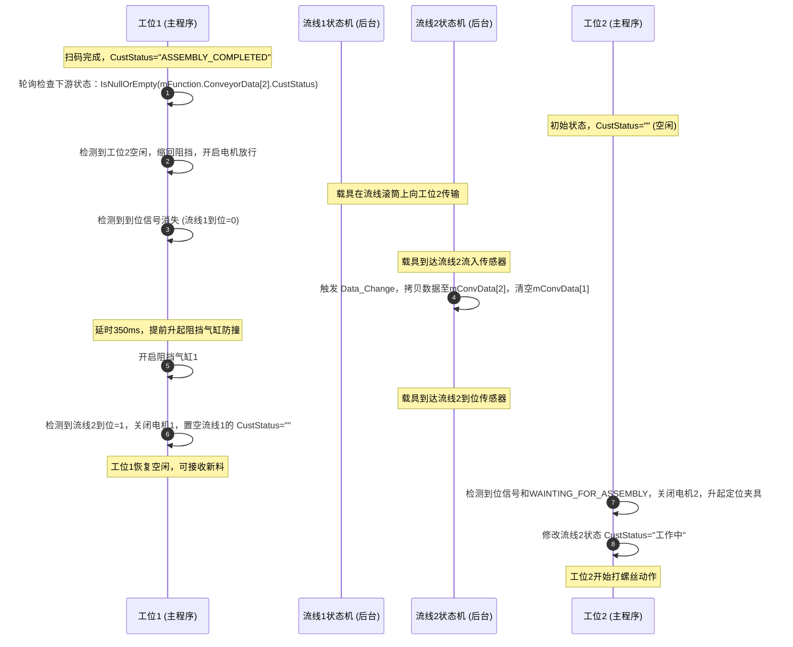
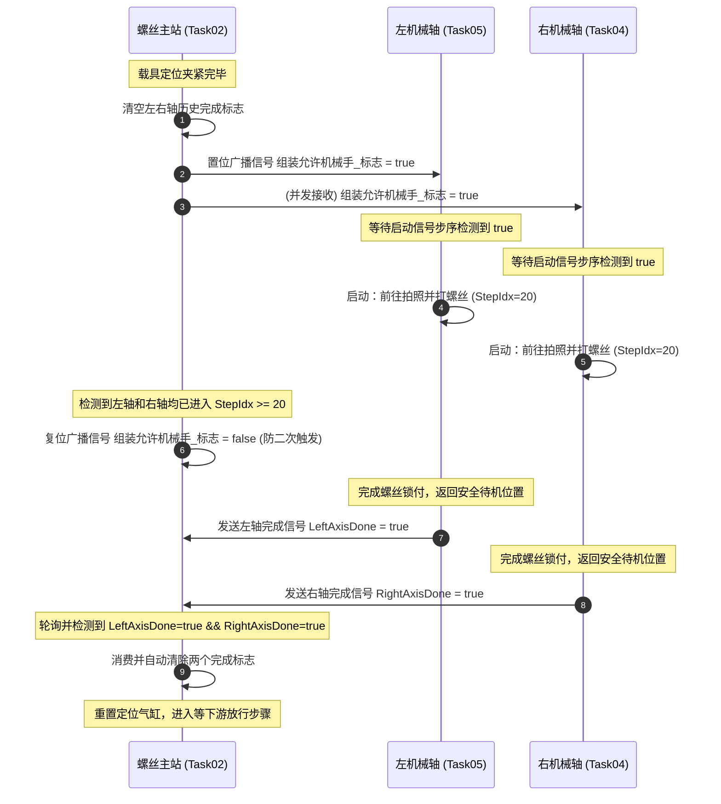

> [!IMPORTANT]
> **免责声明**：本文章内容仅用于个人学习、技术交流与笔记归档使用。

<details open class="in-post-toc-card border border-neutral-200/80 dark:border-neutral-700/80 rounded-xl p-4 my-4 bg-neutral-50/50 dark:bg-neutral-800/30">
<summary class="font-bold text-base cursor-pointer select-none text-neutral-800 dark:text-neutral-200 flex items-center justify-between outline-none">
📑 本篇目录（点击收起 / 展开）
</summary>

<div class="max-h-72 overflow-y-auto mt-3 pt-2 border-t border-neutral-200/60 dark:border-neutral-700/60 hide-scrollbar">

## 目录

- [6. 自动化流程开发 SOP](#6-自动化流程开发-sop)
  - [6.1 继承关系与生命周期函数](#61-继承关系与生命周期函数)
  - [6.2 自动运行状态机开发模板](#62-自动运行状态机开发模板)
  - [6.3 步序控制与更新机制 (SetStep)](#63-步序控制与更新机制-setstep)
  - [6.4 超时计时器重置与防虚警防呆逻辑](#64-超时计时器重置与防虚警防呆逻辑)
  - [6.5 流水线（Conveyor）与工站绑定逻辑](#65-流水线conveyor与工站绑定逻辑)
  - [6.6 工站间与工站同轴（任务）间的通信与顺序控制逻辑](#66-工站间与工站同轴任务间的通信与顺序控制逻辑)
  - [6.7 典型工序异常处理与故障模拟设计（以扫码与打螺丝为例）](#67-典型工序异常处理与故障模拟设计以扫码与打螺丝为例)
    - [6.7.4 工业级 CCD 视觉扫码（SCAN）与拍照（PHOTO）通信标准开发 SOP](#674-工业级-ccd-视觉扫码scan与拍照photo通信标准开发-sop)
  - [6.8 脱机空跑（虚拟仿真）实现 SOP](#68-脱机空跑虚拟仿真实现-sop)

</div>
</details>


## 6. 自动化流程开发 SOP

所有工站控制类必须遵循本节定义的生命周期函数与状态机规范进行开发。

```
[系统装载] --> Initialize() 注册绑定 -> [复位就绪] --> Homing() 机械初始化 -> Ready() 状态检查 
                                                                             |
[循环执行] <--------------------------------- State = RUNNING <---------------+
   |
   +--> AutoRun() 状态机流控制 (StepIdx) -> SetStep() 转换状态 -> 出现异常 --> State = ALARM
```

### 6.1 继承关系与生命周期函数

每个独立工站必须继承自 `mWorkShare`。框架在启动及运行过程中，会依次调用以下生命周期函数：

1. **`Initialize()` (初始化阶段)**：
   * 在程序启动装载参数后执行一次。
   * **职责**：设置 `TaskID`、向工作管理器 `WkManager` 注册当前工站、绑定关联的流水线段、绑定 HMI 状态显示控件、指定涉及的控制轴与关键 I/O 输出映射。
2. **`Homing()` (复位阶段)**：
   * 在用户点击 UI “Reset” 时，系统创建新线程并发调用所有工站的 `Homing` 方法。
   * **职责**：关闭当前工站关联的临时 DO（如真空、气缸触发），设置气缸指示灯及电批安全回缩，检查轴状态是否满足安全位置，最终将 `StaHomeOK` 标志设为 `true`。
3. **`Ready()` (运行前检查)**：
   * 当用户在复位完成后点击 “Start” 启动自动运行时执行。
   * **职责**：确认没有急停或报警，确认轴已回零 OK，并最终返回 `true`，系统才会将状态机置为 `RUNNING`。
4. **`AutoRun()` (循环运行阶段)**：
   * **核心执行体**。当 `State == State.RUNNING` 时，后台调度引擎在后台线程中以无延迟的高频 `while(true)` 循环调用此方法。
   * **职责**：通过状态机选择结构，判定物理信号与网络指令，驱动硬件动作并流转步序。

---

### 6.2 自动运行状态机开发模板

一个标准的工站逻辑开发结构如下所示：

```csharp
using CoreFunction;
using System;
using System.Threading;
using static CoreFunction.mFunction;
using static ParName.EnumName;

namespace BoTech
{
    public class Task01_DemoStation : mWorkShare
    {
        // 1. 定义工站独立的步骤枚举
        private enum 步序 : int
        {
            启动电机 = 10,
            等到位信号 = 20,
            气缸动作等待 = 30,
            做交互工作 = 40,
            放行退出 = 50,
            异常 = 9000,
        }

        private static Task01_DemoStation mInstance;
        public static Task01_DemoStation Instance => mInstance ?? (mInstance = new Task01_DemoStation());

        public override void Initialize()
        {
            TaskID = 99; // 唯一ID
            WkManager.BindStation(TaskID, "DemoStation", this);
            this.BindConv(1, null); // 绑定流水线1
            this.BindStationRun(Frm_Task.Instance.stationRun00); // 绑定界面指示块
            this.SetOutputMaps(new ValueType[] { OutNo.流线1阻挡气缸 }); // 绑定需要监控的输出
            
            _Logs = new LogsHelper.cLogs(TaskName, TaskID);
            base.Initialize();
        }

        public override void Homing()
        {
            base.Homing();
            // 复位物理信号
            mGlobal.mDoSet(OutNo.流线1阻挡气缸);
            StaHomeOK = true;
        }

        public override void AutoRun()
        {
            // 2. 状态机 Step 选择器
            switch (StaInfo.StepIdx)
            {
                case (int)步序.启动电机:
                    // 系统停止或急停时，重置输出，退回等待运行状态
                    if (mFunction.IsSysStop || State == mFunction.State.STOPED)
                    {
                        mGlobal.mDoReset(OutNo.流线1_扫码滚筒电机M0);
                        State = State.WAITRUN;
                        SetStep(ref StaInfo, 0, true);
                        break;
                    }
                    mGlobal.mDoSet(OutNo.流线1_扫码滚筒电机M0);
                    AddLog("启动电机，等待物料", LogsType.Auto, (int)步序.启动电机, true);
                    SetStep(ref StaInfo, (int)步序.等到位信号, true);
                    break;

                case (int)步序.等到位信号:
                    if (mGlobal.ReadDi_Bool(InNo.流线1到位信号))
                    {
                        mGlobal.mDoReset(OutNo.流线1_扫码滚筒电机M0);
                        SetStep(ref StaInfo, (int)步序.气缸动作等待, true);
                    }
                    break;

                case (int)步序.气缸动作等待:
                    // 3. 阻塞式动作到位黄金 API
                    mDoDiWaitDone(OutNo.流线1阻挡气缸, 0, InNo.流线1阻挡缩回信号, 1, 10, 3000, true);
                    SetStep(ref StaInfo, (int)步序.做交互工作, true);
                    break;

                case (int)步序.做交互工作:
                    // 重置超时起始时间
                    mFunction.ConveyorData[MainConvId].StartTime = mFunction.GetTickCount();
                    SetTasksInteractionTrue(TasksInteraction.组装允许机械手_标志);
                    
                    // 等待软握手
                    if (WaitTaskInteractionTrue(TasksInteraction.右轴螺丝工作完成_标志, 5000, true, true))
                    {
                        SetStep(ref StaInfo, (int)步序.放行退出, true);
                    }
                    else
                    {
                        SetStep(ref StaInfo, (int)步序.异常, true); // 超时去异常
                    }
                    break;

                case (int)步序.放行退出:
                    mGlobal.mDoSet(OutNo.流线1阻挡气缸);
                    SetStep(ref StaInfo, (int)步序.启动电机, true);
                    break;

                case (int)步序.异常:
                    AddLog("工站异常发生！", LogsType.ErrorCode, 9000, true);
                    mGlobal.mDoReset(OutNo.流线1_扫码滚筒电机M0);
                    SetStep(ref StaInfo, 0, true);
                    State = State.ALARM; // 抛出系统报警，红灯亮起，蜂鸣器鸣叫
                    break;
            }
        }
    }
}
```

---

### 6.3 步序控制与更新机制 (`SetStep`)

* **方法原型**：`protected void SetStep(ref StationInfo StaInfo, int NextStepIdx, bool IsLog = true)`
* **机制**：
  * 该方法接收当前工站的 `StaInfo` 引用，将其内部的 `StepIdx` 重置为 `NextStepIdx`。
  * `IsLog` 如果为 `true`，系统会自动将跳转步序记录到日志流中。
  * **必须注意**：`SetStep` 改变步序后，线程会等下一次 `AutoRun` 循环触发才进入对应 Case，因此如果有在当前 tick 必须立刻退出的语句，需在其后紧跟 `break;` 或 `return;`。

---

### 6.4 超时计时器重置与防虚警防呆逻辑

许多误报警都是由于工位等待过程中的耗时与动作时间重叠造成的。
* **错误模式**：载具一流入工站就设定了 `ConveyorData[MainConvId].StartTime`，随后进行侧夹、侧推等一系列动作，等真正打螺丝或扫码开始时，计时器已累积了十几秒，极易在随后的阻塞等待中触发超时（例如扫码设定的 3 秒或螺丝打孔设定的 60 秒限制）。
* **标准重构规范**：在进入容易发生长延时的步骤（如发送 Socket 扫码指令、发送机械手启动信号）的**前一刻**，显式重置计时起点：
  ```csharp
  mFunction.ConveyorData[MainConvId].StartTime = mFunction.GetTickCount();
  ```
  这样可以确保超时判定时间（如 `OverTime`）纯粹计算该硬件动作本身的响应时间，彻底消除由于物流积压或辅助夹具动作缓慢引起的虚警。

### 6.5 流水线（Conveyor）与工站绑定逻辑

BoTech 框架在多工站流线型设备开发中，采用了流水线段（Conveyor Segment）与工站任务（Task）松耦合绑定的设计模式：

1. **流水线配置装载**：
   * 软件启动时，`Setup_Load.cs` 会通过 `mFunction.ReadXml` 读取 `bin\Debug\RBF\Conveyor.xml` 配置文件，将其装载到全局流水线对象数组 `mFunction.ConveyorData` 中。
   * 流水线按照物理分段（段1、段2、段3等）进行逻辑编号管理。
2. **工站的流线段绑定**：
   * 每个继承自 `mWorkShare` 的工站（如 `Task01_入料扫码站`、`Task02_螺丝站`）在 `Initialize` 方法中，都会显式调用绑定流线函数：
     ```csharp
     this.BindConv(short ConvID, short[] StateConvIds);
     ```
     例如，螺丝工位调用 `this.BindConv(2, null)`，表示该工站主动作序列被绑定至 **流线段2** 上。
   * 绑定后，工站可以通过继承获得的 `MainConvId`（此处为 `2`）直观地索引全局流线 `mFunction.ConveyorData[MainConvId]` 并管理其状态。
3. **流线动作线程与当站处理交互**：
   * 每一段流水线的马达启停、气缸阻挡以及产品流入到位，都由 `A0.Conveyors.cs` 中的 `nConvEvent` 独立状态机在后台高频轮询控制。
   * **物料流入与锁定**：当产品流入到位后，流水线状态机将该段流线的自定义状态 `CustStatus` 修改为 `"WAITING_FOR_ASSEMBLY"`（等待装配/工作开始），并在此阻塞等待。
   * **工站唤醒与交付**：工站自身的 `AutoRun()` 状态机在检测到位信号和 `"WAITING_FOR_ASSEMBLY"` 后，将状态机切入工作流程，将 `CustStatus` 设为 `"工作中"` 或 `"处理中"`。工作完成后，工站将 `CustStatus` 修改为 `"ASSEMBLY_COMPLETED"`（装配完成/工作完毕）。
   * **流出与放行**：流水线状态机捕获到 `"ASSEMBLY_COMPLETED"` 后，自动执行降顶升、缩阻挡动作，并开启滚筒电机将产品放行输送至下一段。

#### 6.5.1 流线气缸的去代码化与参数化配置实现

在 BoTech 框架中，流水线段的阻挡气缸、顶升气缸等气缸控制，在具体的工站任务中完全实现了**去代码化**。工位任务不需要直接编写操作气缸的代码（如直接调用 `DoSet` 或 `DoReset`），而是将这些控制完全委托给**后台流水线状态机**，并通过 Excel 参数文件进行物理通道的映射绑定。

##### 1. 配置映射关系 (以 Conveyor.xlsx 为主)

在 `ParXlsx\Conveyor.xlsx` 配置中，每一段流水线（Conveyor Segment）都定义了其关联的物理 I/O 通道参数：
* **阻挡气缸输出编号**：控制流线阻挡气缸电磁阀的全局 DO 索引（在 XML 中序列化为 `<阻挡气缸输出编号>`）。
* **阻挡气缸动点/原点信号**：阻挡气缸反馈感应器的全局 DI 索引（在 XML 中序列化为 `<阻挡气缸动点信号>` / `<阻挡气缸原点信号>`）。
* **到位感应信号 / 流出感应信号**：载具到位与流出的全局 DI 索引。
* **本台设备可接收载具 / 下台设备可接收载具**：用于与前/后机或前后段进行握手通信的 I/O 索引。

软件启动时，`Conveyor.xlsx` 经转换后生成 `Conveyor.xml`，并由框架反序列化装载到全局的流水线内存数组中（框架基类使用 `mFunction.ConveyorData[]`，部分项目中本地化为 `mFunction.流水线[]`）。

##### 2. 后台状态机自动驱动流程

后台的流线控制引擎（`AutoConv` 状态机类，运行于独立高频扫描线程中）会根据流线的状态步骤（`StaStep`）自动进行硬件层面的气缸和电机控制：

* **载具流入与锁定**：
  状态机处于 `流入开始` 或 `到位判断` 时，后台状态机根据配置自动开启输送电机并升起阻挡气缸：
  ```csharp
  DoSet(mFunction.ConveyorData[mStaNum].阻挡气缸输出编号); // 自动动作
  ```
  载具撞上阻挡并触发配置的 `到位感应信号` 后，状态机自动将流线状态切为 `"当站处理"`，并触发绑定的流线事件委托（触发 `A0.Conveyors.cs` 中的 `当站处理` 回调）。

* **工站任务与流线状态握手**：
  1. 后台状态机通过 `当站处理` 回调，将当前流水线段的自定义状态属性 `CustStatus` (部分项目中为 `自定状态`) 修改为 `"WAITING_FOR_ASSEMBLY"` (等待装配)。
  2. 具体的工位任务进程（如打螺丝站）在其自动运行循环中侦测到流线段的 `CustStatus == "WAITING_FOR_ASSEMBLY"` 且到位信号满足时，启动本工位的装配流程，并将该状态置为 `"工作中"` (或 `"处理中"`)。
  3. 工站任务完成本工位的所有工艺（如打螺丝、相机拍照等）后，**不直接操作流线阻挡气缸**，而是直接修改流线的属性状态：
     ```csharp
     // 告诉流线状态机：本站工作已完毕，可以放行
     mFunction.ConveyorData[MainConvId].CustStatus = "ASSEMBLY_COMPLETED"; // (或 自定状态 = "装配完成")
     ```

* **放行与复位流出**：
  状态机捕获到 `"ASSEMBLY_COMPLETED"` 后，流线状态机切入 `流出开始` 步骤，并自动操纵配置 of 阻挡气缸缩回：
  ```csharp
  DoReset(mFunction.ConveyorData[mStaNum].阻挡气缸输出编号); // 自动降阻挡放行
  ```
  待载具完全流出（流出感应信号变红，或下游接收完成）后，后台状态机再次自动将阻挡气缸升起（`DoSet`），并清空该流水线段的状态，进入下一个循环。

##### 3. 设计优势

* **高内聚低耦合**：具体的工位任务只关心“工艺什么时候开始（状态被置为等待）”以及“工艺什么时候结束（写入完成状态）”，流线控制细节（气缸反馈、电机速度、防撞控制）完全对工站屏蔽。
* **强安全性与防呆**：阻挡气缸动作、到位反馈超时检测、马达起停时序均在底层状态机中统一调度，避免了由于每个工站自行编写气缸动作可能导致的时序冲突、气缸误动作或卡载具问题。
* **物理重构免代码修改**：修改流线段对应的硬件接线（如换个气缸控制阀的 DO 口），仅需在 `Conveyor.xlsx` 中修改通道编号即可，无需触动任何逻辑代码。

### 6.6 工站间与工站同轴（任务）间的通信与顺序控制逻辑

在自动运行过程中，工站之间的物料移交以及工站与机械轴之间的工作调度，依靠 **流线状态监听** 与 **任务交互标志（TasksInteraction）** 来实现有序控制：

#### 6.6.1 上下游工站之间的通信与顺序流转（如何判定下游好没好）

上游工位在完成本工位的作业后，不能直接放行，必须首先确认**下游工位处于空闲状态**。以“扫码站（工位1）”与“螺丝站（工位2）”为例，流转和判定顺序如下：

1. **下游空闲判定**：上游工位1通过直接检查下游工位2流线状态的自定义属性 `CustStatus` 来进行通信。若为空值或 `null`，代表工位2目前无料且空闲，允许放行：
   ```csharp
   // 检查工位2的状态属性是否为空，若为空说明工位2目前无料且空闲
   if (string.IsNullOrEmpty(mFunction.ConveyorData[2].CustStatus))
   {
       // 下游空闲，允许放行！工位1阻挡气缸缩回，电机起转，将载具送出
       SetStep(ref StaInfo, (int)步序.气缸缩回, true);
   }
   ```
2. **放行物理动作**：
   * 缩回工位1阻挡气缸：`mDoDiWaitDone(OutNo.流线1阻挡气缸, 0, InNo.流线1阻挡缩回信号, 1, 10, 3000, true)`
   * 开启工位1电机送走产品：`mGlobal.mDoSet(OutNo.流线1_扫码滚筒电机M0); mGlobal.mDoSet(OutNo.流线1_扫码滚筒电机M3);`
   * 等待工位1到位信号消失（载具离开）：`if (!mGlobal.ReadDi_Bool(InNo.流线1到位信号))`
3. **流入状态交接与条码传递**：
   * 当载具完全流出工位1且触发工位2的流入传感器（`InNo.流线2流入信号`）时，`A0.Conveyors.cs` 中的 `ConvEvent.Data_Change` 会被后台线程触发，执行段间数据交接。
   * 此时，工位1在内存中的条码、测量数据、扫码判定结果等物理信息被自动克隆/移交至工位2的内存缓冲数据结构（`mConvData[2]`）中，同时清空工位1的遗留数据（`mConvData[1].Clear()`）。
4. **提前防撞与提前阻挡**：
   * 在工位1的 `等产品到达工位2` 步序中，当检测到产品触发 `InNo.流线2流入信号` 且工位1阻挡气缸处于缩回状态时，延迟微调时间（如 350ms）后，工位1**提前升起阻挡气缸**，确保后续载具不会撞板：
     ```csharp
     if (mGlobal.ReadDi_Bool(InNo.流线2流入信号) && MotionDll.ReadDo((short)OutNo.流线1阻挡气缸) == 0)
     {
         Thread.Sleep(350); 
         mGlobal.mDoSet(OutNo.流线1阻挡气缸); // 提前伸出阻挡气缸！
     }
     ```
5. **到位唤醒下游**：
   * 载具继续前行至工位2的到位传感器（`InNo.流线2到位信号`）时，工位2的主控任务检测到到位信号为 `true`。
   * 工位1检测到工位2到位信号为 `true` 之后，确信产品已成功交接：
     * 关闭工位1的所有传送电机：`mGlobal.mDoReset(OutNo.流线1_扫码滚筒电机M0);`
     * 复位工位1流线状态为置空释放：`mFunction.ConveyorData[MainConvId].CustStatus = "";`
     * 返回第一步等待下一次放料循环。
   * 工位2主控任务将 `ConveyorData[2].CustStatus` 修改为 `"工作中"`（表示占位），并关闭滚筒电机、升起顶升和夹具定位产品，随后转入工艺工作（打螺丝）。

下面是**工站间物料流转与状态握手时序图**：



#### 6.6.2 工站与机械轴之间的通信（任务协程）

对于打螺丝、CCD拍照等包含运动轴组的工站，主工站（如 `Task02_螺丝站`）与机械轴（如 `Task04_右机械轴`、`Task05_左机械轴`）属于独立的两个任务线程，它们通过 `TasksInteraction` 全局握手标志位实现同步：

1. **主工站触发机械手工作**：
   * 当载具夹紧定位完毕后，主工站清空历史完成状态，并向机械手广播“允许工作”的标志位：
     ```csharp
     GetTasksInteraction(TasksInteraction.右轴螺丝工作完成_标志, true); // 清空历史
     GetTasksInteraction(TasksInteraction.左轴螺丝工作完成_标志, true); // 清空历史
     SetTasksInteractionTrue(TasksInteraction.组装允许机械手_标志);
     ```
2. **机械手任务响应并锁存**：
   * 机械轴类（继承自 `Task_机械轴基类`）在自己的自动循环中配置了 `启动触发标志`（即 `TasksInteraction.组装允许机械手_标志`）。
   * 检测到该标志为 `true` 后，两轴的任务线程被同步唤醒，脱离等待，前往吸取螺丝或执行视觉纠偏与锁付。
3. **防重复触发拦截（清除触发标志）**：
   * 为了防止多轴机械手在完成动作返回时二次触发，主工站检测到左右两轴都已经脱离初始等待步骤（例如 `StepIdx >= 20`）且处于工作状态后，会立即将触发标志抹除：
     ```csharp
     if (!已经清除启动信号 && 右轴已经启动 && 左轴已经启动)
     {
         SetTasksInteractionFalse(TasksInteraction.组装允许机械手_标志);
         已经清除启动信号 = true;
     }
     ```
4. **工作完成反馈**：
   * 机械轴执行完锁付动作，并在XY轴和Z轴完全退回到避让待机位置（确信物理上完全避让载具和顶升气缸）之后，各自将自己的完成标志置为 `true`：
     ```csharp
     // 右轴任务在其结束步序置位：SetTasksInteractionTrue(TasksInteraction.右轴螺丝工作完成_标志);
     // 左轴任务同理置位：SetTasksInteractionTrue(TasksInteraction.左轴螺丝工作完成_标志);
     ```
5. **主工站汇合与确认**：
   * 主工站以非阻塞形式轮询判断两轴的完成标志。同时开启最大 90 秒打螺丝超时保护监控，防止卡死报警：
     ```csharp
     if (GetTasksInteraction(TasksInteraction.右轴螺丝工作完成_标志, false) == true &&
         GetTasksInteraction(TasksInteraction.左轴螺丝工作完成_标志, false) == true)
     {
         // 自动清除该完成标志位，表示双轴作业顺利结束
         GetTasksInteraction(TasksInteraction.右轴螺丝工作完成_标志, true);
         GetTasksInteraction(TasksInteraction.左轴螺丝工作完成_标志, true);
         // 工位进入等下游空闲放料状态
         SetStep(ref StaInfo, (int)步序.等工位3空闲, true);
     }
     else if (mFunction.OverTime(mFunction.ConveyorData[MainConvId].StartTime, 90000))
     {
         // 超时处理，去异常页报警
         SetStep(ref StaInfo, (int)步序.异常, true);
     }
     ```

下面是**工位与机械轴多线程协同握手时序图**：



### 6.7 典型工序异常处理与故障模拟设计（以扫码与打螺丝为例）

在大型工控系统中，**异步网络通信与高风险执行单元（如相机纠偏、电批拧紧）是异常和报警最高发的区域**。为了保证整机连调的流畅性，并对生产制造中的各项 NG（不良）流程进行验证，BoTech 框架推荐采用**通讯与逻辑解耦、全局仿真注入与全面异常隔离**的设计模式。

#### 6.7.1 扫码枪异步通讯与全局仿真
在物理扫码枪未连接或调试阶段，传统逻辑往往会因连接超时而陷入阻塞或直接触发停机，极大地定拖慢了现场调试效率。

##### 1. 旧数据残留漏洞与解决规范
早期的 C# 扫码流程常常采用 `有新数据` 等全局静态标志进行读写同步。在高速运行或逻辑跳转复杂的场景中，若未在发送指令前对标志及接收缓冲区进行强制清理，极易发生**“在下一工序开始时，误读取了上一轮遗留的旧条码（Stale Data）”**的严重 bug。

**推荐的数据同步与清理时序模式**：
- **触发前重置**：在向扫码枪发送 `ReadCode` 指令前，强制清空接收字符串缓冲区：
  ```csharp
  接收的数据 = ""; // 显式清除历史接收缓存
  ```
- **读取即消费**：在轮询检测到 `接收的数据` 变为非空后，**立即锁存并抹除**：
  ```csharp
  if (!string.IsNullOrEmpty(接收的数据))
  {
      string resp = 接收的数据;
      接收的数据 = ""; // 毁灭性重置，防止下一轮循环二次读取旧数据
      // 开始解析并校验 resp ...
  }
  ```

##### 2. 全局仿真注入（脱机连调支持）
如果在自动流程处于在线运行状态，而物理扫码枪断开，BoTech 框架会根据计时器与仿真标志自动切入**全局仿真逻辑**：
- 如果当前处于虚拟运行（`OffLine_VirtualRunMode`）或者**距离发送扫码指令过了 1000ms 物理网口仍无任何返回**时，软件会自动启动随机条码生成器。
- 生成器以 **50% 的权重模拟成功与失败（Scan NG）**，用以测试整机的缺陷品剔除与气缸分流剔废流程。

---

#### 6.7.2 电批拧紧失败概率模拟与连续故障防护
电批拧紧作为核心组装工序，如果气压不稳、螺丝规格不符或螺牙磨损，容易发生滑牙或拧紧 NG。

##### 1. 模拟拧紧 NG 与破真空释放
在 `步序.启动拧紧` 阶段，电批启动信号输出并延时 1.5 秒（模拟螺丝拧紧过程）。完成后，软件会执行 **15% 概率的电批拧紧失败模拟**。
拧紧失败后，需按照以下防呆时序释放异常螺丝，防止在后续位置发生二次卡料或机械撞击：
```csharp
mGlobal.mDoReset(电批吸真空信号); // 关闭吸真空
mGlobal.mDoSet(电批破真空信号);   // 开启破真空脉冲吹气以放开螺丝
Thread.Sleep(150);
mGlobal.mDoReset(电批破真空信号); // 关闭吹气
已持料 = false;                    // 强制复位内部持料状态
```

##### 2. 连续失败次数超限与原生 TipsDialog 交互
- **故障限额参数**：软件通过类型安全强转读取 `(int)mFunction.GetParValue<double>(UserPar.电批执行失败次数)` 参数来确定允许的最高连续 NG 次数上限。
- **超限提示交互**：当 `当前电批失败次数` 达到该上限时，自动弹出原生对话框 `TipsDiglogForm` 提示：
  - **选择“Yes” (重试)**：重置 `当前电批失败次数 = 0`，并命令机械轴退回 `移至取料位置` 步骤，重新去供料器吸取新螺丝进行锁付。
  - **选择“No” (停止)**：自动调用整机急停逻辑 `Machine.Machine.Instance.Stop(true)`，并将当前轴状态机切换到 `State.ALARM` 中断运行，由人工介入排查。

---

#### 6.7.3 网络通信与坐标转换的 try-catch 异常安全防护规范
任何与外部硬件（相机、扫码枪、电批控制器）发生套接字（Socket）通信的接口，均存在网线松动、防火墙拦截等引发进程级 Exception 的隐患。此外，转换外部传来的 ASCII 报文（如 `double.Parse(parts[2])`）也是高风险操作。

**BoTech 异常安全编码规范三剑客**：
1. **网络交互层 Try-Catch**：
   对于所有 `SocketDataSend` 和 `mSend.WaitDone` 等网口 I/O 动作，必须使用 `try-catch` 隔离：
   ```csharp
   try
   {
       isOk = mSend.WaitDone((int)相机端口, 1, 相机发送指令, 0, "", 5000, true, false);
   }
   catch (Exception ex)
   {
       AddLog($"网络通信发生崩溃异常: {ex.Message}", LogsType.ErrorCode, StaInfo.StepIdx, true, Color.Red);
       isOk = false; // 降级为网络失败，等待模拟器或重试机制介入
   }
   ```
2. **数据解析与转换 Try-Catch**：
   在解析 `Split` 数据并转换浮点坐标时，极易因相机传输了乱码或空报文导致崩溃：
   ```csharp
   try
   {
       string[] parts = resp.Split(',');
       double offsetX = double.Parse(parts[2]);
       double offsetY = double.Parse(parts[3]);
       // 判定坐标偏移上限并存入纠偏偏差值...
   }
   catch (Exception ex)
   {
       AddLog($"解析相机纠偏报文或校验偏移上限异常: {ex.Message}", LogsType.ErrorCode, StaInfo.StepIdx, true, Color.Red);
       SetStep(ref StaInfo, (int)步序.拍照重试判定, true); // 优雅重试而绝不发生系统级闪退
   }
   ```
3. **动作执行与移动 Try-Catch**：
   伺服轴移动（包含 XY 轴纠偏坐标转换相加）动作，均应封装在带有 `try-catch` 保护的 `安全移动至`（`SafeMoveTo`）方法内。如果 Z 轴未在安全高度、硬件限位触发或计算溢出，软件会捕获异常并返回 `false` 以终止后续动作，确保设备人身安全。

---

#### 6.7.4 工业级 CCD 视觉扫码（SCAN）与拍照（PHOTO）通信标准开发 SOP

在现代工控设备中，工位检测通常由工业智能相机或视觉上位机软件（如 VisionPro、Halcon 等）通过 TCP/IP 网络协同完成。为了保证指令格式规范、通讯稳定不超时、光源硬件安全以及数据能够与流水线无缝闭环，推荐严格遵循以下标准化开发 SOP：

##### 1. 通信协议与指令规范
* **扫码指令**：统一使用 `"SCAN\r\n"`（常量定义 `const string CMD_SCAN = "SCAN";`）
* **拍照指令**：统一使用 `"PHOTO\r\n"`（常量定义 `const string CMD_PHOTO = "PHOTO";`）
* **通讯端口**：在 `TCPIP_Port` 枚举中独立分配逻辑端口（如 `上CCD1=2`, `下CCD1=3`, `上CCD2=4`），避免并发读取竞争。

##### 2. 光源时序与硬件断电安全保障（try-finally 强制关灯）
工业频闪光源或补光灯发热量大，若通信超时或发生网络异常时未能及时关灯，极易烧毁光源或损坏光学镜头。因此必须在 `try...finally` 块中强制关闭光源：
```csharp
try
{
    // 1. 打开工站对应光源
    mGlobal.mDoSet(OutNo.上CCD1光源);
    // 2. 曝光与亮度稳定延时 (至少 50ms)
    int lightDelay = Math.Max(50, mGlobal.ParInt(UserPar.光源延时));
    Thread.Sleep(lightDelay);

    // 3. 发送指令并等待接收，注意第5个参数(被检查数据)传入 ""
    mSend.WaitDone(port, 1, sendStr, 0, "", 5000, true, true);
}
finally
{
    // 4. 无论通信是否超时或发生异常，必定在 finally 块中强制断电关灯！
    mGlobal.mDoReset(OutNo.上CCD1光源);
}
```

##### 3. `mSend.WaitDone` 参数设计原则
* **被检查数据（参数 4）置空**：调用 `mSend.WaitDone(port, 1, sendStr, 0, "", 5000, true, true)` 时，**参数 4 必须传空字符串 `""`**。
  * *原因*：如果传入 `"SCAN"` 或 `"PHOTO"`，底层网络控件会强制要求相机返回报文中必须包含该字符串；而实际工业相机通常直接返回 `"OK,SN123456"` 或 `"OK"`，并不包含指令头，从而导致 `WaitDone` 误判为超时阻塞！传入 `""` 可使 `WaitDone` 收到任意有效报文即刻返回，将校验交给专用解析方法。

##### 4. 极简且健壮的报文解析准则
根据工业实际要求，摒弃冗长复杂的正则过滤，遵循最清晰、最高效的解析规范：

###### (1) 扫码数据解析 (`解析扫码数据`)
* **规则**：验证是否以 `OK` 或 `NG` 开头，用逗号 `,` 分割，获取第 2 个元素（`parts[1].Trim()`）作为条码；若成功提取，自动写入 `mFunction.ConveyorData[StaNum].SN` 同步流线与 UI。
```csharp
public static string 解析扫码数据(string rawData, out string errMsg)
{
    errMsg = "";
    if (string.IsNullOrEmpty(rawData))
    {
        errMsg = "扫码数据为空";
        return "";
    }

    string data = rawData.Trim();
    if (data.StartsWith("OK", StringComparison.OrdinalIgnoreCase))
    {
        string[] parts = data.Split(',');
        if (parts.Length > 1)
        {
            return parts[1].Trim();
        }
        errMsg = "未获取到SN码";
        return "";
    }
    else if (data.StartsWith("NG", StringComparison.OrdinalIgnoreCase))
    {
        errMsg = "扫码NG";
        return "";
    }

    errMsg = "数据格式错误(非OK或NG开头)";
    return "";
}
```

###### (2) 拍照数据解析 (`解析拍照数据`)
* **规则**：严格仅判断是否等于 `"OK"`（不区分大小写），是则合格，否则一律判定为 NG。
```csharp
public static bool 解析拍照数据(string rawData, out string detailMsg)
{
    detailMsg = rawData?.Trim() ?? "";
    return string.Equals(detailMsg, "OK", StringComparison.OrdinalIgnoreCase);
}
```

##### 5. 仿真与实机平滑无缝切换（DryRun / VirtualMode）
在脱机或空跑模式（`mGlobal.OffLine_VirtualRunMode || MotionDll.VirtualMode || mGlobal.DryRunMode`）下：
* **扫码方法**：自动生成 `$"OK,SN{DateTime.Now:yyyyMMddHHmmss}"`，与实际返回报文完全对齐，并同步写入流线，使得 HMI 上的 `ConvStatus` 控件能顺畅轮转呈现条码；
* **拍照方法**：自动模拟生成合格结果（或按可控概率模拟 NG），使自动化步序无需依赖实体硬件即可闭环演练。

---

### 6.8 脱机空跑（虚拟仿真）实现 SOP

> 脱机空跑（Offline Dry-Run / Virtual Simulation）是指硬件尚未到场、无法实际接线与触发传感器时，通过程序内置的虚拟模式标志位将整条产线 / 工站流程完整跑通的调试手段，用于提前验证 Task 生命周期、流线数据交换、步序逻辑与异常处理，缩短硬件到场后的联调周期。

---

#### 6.8.1 简介

设备实现空跑需要配置好程序运行的各项必要参数，并正确编写设备的 Task 和流线相关处理。本 SOP 按**系统参数配置 → 程序代码实现 → 脱机切换与验证**三大阶段逐步讲解。

---

#### 6.8.2 系统参数配置

实现脱机空跑需首先确保控制卡、伺服轴、I/O 映射以及系统变量参数正确配置。具体的 Excel 参数填写、XML 转换映射与 C# 枚举（`EnumName.cs`）同步规则，请直接参考 **[第 2 章 硬件参数与系统配置](/posts/framework-01-architecture-and-hardware/#2-硬件参数与系统配置)**：
* 控制卡与伺服轴配置请参阅 [2.1 Excel 参数配置](/posts/framework-01-architecture-and-hardware/#21-硬件参数与系统参数的-excel-配置-开发第一步)；
* 数字 I/O 与系统变量映射请参阅 [2.3 XML 数据库转换映射规则](/posts/framework-01-architecture-and-hardware/#23-excel-参数配置与-xml-数据库转换映射规则)；
* 枚举绑定与代码映射请参阅 [2.2 C# 枚举同步 SOP](/posts/framework-01-architecture-and-hardware/#22-c-枚举-enumnamecs-绑定关系与手动同步-sop)。

---

#### 6.8.3 程序配置实现

##### 3.1 Task 工站配置（7 大生命周期方法）

每一个工站对应一个继承 `mWorkShare`（或框架内部 TaskBase / IWorkShare 基类）的子类，**必须按顺序重写以下 7 个生命周期方法**：

```text
                    ┌──────────────┐
  程序启动 ───────► │ Initialize() │  绑定工站 / 日志 / 事件 & 实例化私有字段
                    └──────┬───────┘
                           ▼
  点击"运行" ─────► ┌──────────────┐
   (整机复位)       │   Homing()   │  机械手复位 + 轴回零 + IO/参变量清零
                    └──────┬───────┘
                           ▼  AllHomeOK → 背景变黄 WAITRUN
  再次点击"运行"     ┌──────────────┐
  (开始自动运行) ──► │   Ready()    │  判断运行前置条件；返回 true/false
                    └──────┬───────┘
                     false │  true
                           ▼
                    ┌──────────────┐
                    │  AutoRun()   │  多线程并发，各站独立主业务
                    └──────┬───────┘
            异常触发 mAction │
                           ▼
                    ┌──────────────┐      ┌──────────────┐
                    │    Err()     │ ───► │ ManualMode() │  手动调试 / 标定
                    └──────────────┘      └──────────────┘
```

**(1) Task 建立**：在项目工站目录下新建对应的 Task 类文件，继承框架指定的 `mWorkShare` 基类。

**(2) `Initialize()` — 工站初始化**
- 调用 `WkManager.BindStation(TaskID, TaskName, this)` 将 Task 绑定到工站：
  - `TaskID` = 工站索引（从 0 开始或按 `StationDefine` 枚举）
  - `TaskName` = 工站 UI 显示名
  - `this` = 当前工站类实例；绑定成功后可在状态栏 / `StaStats` 控件看到各工站运行状态
- 实例化工站日志：`_Logs = new cLogs(TaskName, TaskID)`，后续调用 `AddLog(...)` 即可按工站自动落盘日志。
- 按需实例化视觉对象（`ComCCD`）、气缸逻辑、工站私有字段；并为 `mDoDi.mAction`、`mSend.mAction` 等 WorkShare 事件绑定处理方法。
- 在 `A0.工位加载.cs` 的 `TaskLoad()` 入口中**按依赖顺序依次调用所有工站的 `Initialize()`**。

**(3) `Homing()` — 整机复位 / 回零**
- 设备停止时点击"运行"会弹出"是否整机复位"确认 → OK 后框架依次调用各绑定站的 `Homing()`。
- `Homing()` 内建议按如下顺序：机械手回安全点 → 伺服轴执行回零 → 关键输出（真空 / 电磁阀）复位 → 工站参变量 / 步序状态置零 → 软交互信号量 `TasksInteraction` 复位。
- 本站复位 / 回零完成后将 `StaHomeOk = true`。
- 当 `XStation.WkManager.AllHomeOK()` 为真时，主界面背景变为**黄色**，系统状态切为 **WAITRUN（待运行）**。

**(4) `Err()` — 异常处理**
- 挂到 `mDoDi.mAction` / `mSend.mAction` 等失败回调上；方法签名内通过 `CtrName`（触发对象名）+ `ErrInfo` 做分支：报警信息上报告警中心、触发声光三色灯、调用重试逻辑或直接 `SetStep` 跳到异常分支步序。

**(5) `Ready()` — 自动运行前置条件判断**
- WAITRUN 状态下点击"运行" → 弹"开始自动运行？" → OK 后 `WkManager.Ready()` 逐工站调用各站的 `Ready()`。
- `Ready()` 内判断本站是否满足运行条件（关键轴已回零、气源压力 OK、视觉连通 / 参数载入、关键参数阈值合理、急停未触发、安全门关等），可顺带做本步运行前的变量初始化；满足返回 `true`，否则返回 `false` 并在 UI 给出明确提示。
- 全部通过时 `WkManager.Ready()` 返回 0；有任一工站未通过则返回非 0，整体流程停止等待用户处理。

**(6) `AutoRun()` — 自动运行主循环（步序机）**
- `Ready()` 通过后调用 `WkManager.Start()`，框架内部开启**多线程并发**运行各工站 `AutoRun()`。
- `AutoRun()` 内写工站业务（扫码、取料、装配、检测、下料等）。推荐配合流线控制采用**"步序机 + 流线自定状态"双驱动**模式：

```text
 AutoConv.cs (流线内部)        流线控制.cs (用户代码)           Task工站.AutoRun()
 ─────────────────────        ────────────────────────        ───────────────────
 载具到位 & 数据交换 OK
          │
          ▼
 进入"等待处理" ─────────► 子步序10：初始化
                                │
                                ▼
                       自定状态 = "等待装配"   ◄──────── 轮询到此状态
                                │                  │        开始执行业务步序
                                │                  │        (扫码/取料/装配..)
                                │                  │
                                └──────────────────┘        处理完毕
                                     业务完成                 │
                                     自定状态 = "装配完成"    │
                                          │                   │
                                          ▼                   ▼
                                   返回 true → 流线放行 → 载具流出到下一工站
```

**(7) `ManualMode()` — 手动 / 标定调试**
- 两种 UI 控件可触发：
  - **XTaskBtn**：配置 `TaskId`（路由到对应工站）+ `Text`（方法内 switch 分支键），框架按 `TaskId` 找工站后进入 `ManualMode()`，再按 `Text` 分支执行对应代码段；用于回原点、单个气缸动作、取放标定等。
  - **ManualTestModule**：配置 `TaskId` + `SelectItems` 下拉项（如 "1-九针标定" / "2-相机拍照点标定"），多用于复杂标定流程（多步序 / 参数回写 `ParList.xlsx`）。

##### 3.2 流线 Conveyor 配置

**(1) 控件搭建**
- 主界面按作业需求拖拽对应数量的 `ConvStatus` 控件。
- 对每个控件配置**流水线编号 ConvId**、刷新频率、是否显示节拍 CT、是否显示载具图标。
- 框架会自动把 `ConvStatus` 控件与 `mFunction.流水线[ConvId]` 运行时对象进行双向绑定。

**(2) 流线初始化**
- 在"整机复位判断"逻辑内重写流线复位代码（每段：清空缓存数据、步序回初始 10、自定状态置空、载具在位标志清除、顶升机构回落）。
- 冷启动与热复位时各调用一次。

**(3) 流线数据交换（上站 → 本站）**

载具到位后先触发 `数据交换()`。交换原则：
1. 确认当站状态后，将**上一站**的 `AutoConv.mConvData[UpStreamId]` 深拷贝到本站数据结构（避免浅拷贝引发的引用共享问题）；
2. 随后清空上一站的数据，并返回 `true`；
3. 内部 `mEvent()` 指向 `流线控制.cs` 的 `ConvRun()`，再按当站状态继续调度。
- 返回 true 后 `ConvRun()` 将当站状态置为"交换完成"，`RunFun()` 进入"到位分类"。

**(4) 流线等待处理（交接给 Task 工站）**
- 到位分类结束后进入"等待处理" → `AutoConv.WhenStationProcess()` → 经 `mEvent()` → `ConvRun()` → `ConvEvent()` 的当站处理分支，正式交由工站 `AutoRun()` 接手（见 3.1 (6) 的步序图）。

**(5) 流线载具重载（顶升站专用）**
- 顶升站载具需要"二次下落"（例：顶升后底部还需额外过板）时，`RunFun()` 当检测到当站状态为"等待载具重载"即进入重载流程：
  1. `载具重载()` → `mEvent()` → `ConvRun()` → 用户代码的 `载具重载()` 方法；
  2. 用户代码内执行：顶升站 ↔ 底部站 数据交换 → 清空顶升站缓存 + 复位顶升站状态 → 返回 `true`；
  3. `ConvRun()` 收到 true → 自定状态 = "重载完成" → 流线步序跳到"处理完成"，载具流出。

---

#### 6.8.4 脱机空跑切换与运行处理

##### 4.1 模式切换

1. 参数 / Task / 流线全部配置完善后，在 HMI 顶部 **运行模式** 下拉选择 **"脱机空跑"** → 点击 **保存**（写回配置文件，下次启动仍沿用）。
2. 点击"运行"后框架入口 `RunClick()` 中检测到模式为"脱机空跑"即执行：
```csharp
MotionDll.VirtualMode  = true;   // 运动控制虚拟模式：屏蔽对运动控制卡的硬件读写
MotionDll.ConvVitMode  = true;   // 流线虚拟模式：仿真载具自动流入、到位、流出
```

##### 4.2 脱机空跑业务代码模式（分类化处理）

虚拟模式下没有真实传感器 / 轴到位 / 扫码结果触发，因此工站 `AutoRun()` 要按**"实际运行分支 ↔ 脱机空跑分支"**做分类：

```text
流线步序 → 等待处理  →  自定状态 = "等待装配"
                               │
                  ┌────────────┴────────────┐
                  │                         │
           （实际运行分支）           （脱机空跑分支）
        调 CCD / 扫码 / 伺服移动         Thread.Sleep(仿真节拍)
        调气缸 / 真空 / 读 IO             填默认 OK 的数据
                  │                         │
                  └────────────┬────────────┘
                               ▼
           if (MotionDll.VirtualMode && MotionDll.ConvVitMode)
                 跳过硬件反馈等待，步序直接推进到"处理完成"
                               │
                               ▼
                 自定状态 = "装配完成" → 载具放行 → 载具流出到下一站
                                                                 ↓
                                                          下一站重复上述循环
```

脱机分支示例代码骨架：
```csharp
if (MotionDll.VirtualMode && MotionDll.ConvVitMode)
{
    // 1) 模拟本工站典型节拍耗时
    int ctMs = ParD[参数I.本工站CT_ms].I() > 0 ? ParD[参数I.本工站CT_ms].I() : 2000;
    Thread.Sleep(ctMs);

    // 2) 填"正常完成"的默认值（让后续流线 / MES / 数据追溯继续流转）
    StaInfo.Barcode      = "VIRTUAL_" + DateTime.Now.ToString("HHmmssfff");
    StaInfo.CCD_OffsetX  = 0.0;
    StaInfo.CCD_OffsetY  = 0.0;
    StaInfo.CCD_OffsetR  = 0.0;
    StaInfo.AssembleOK   = true;
    StaInfo.InspectNG    = false;

    // 3) 推进步序 / 流线自定状态
    mFunction.SetStep(ref StaInfo, (int)步序.完成);
}
```

##### 4.3 脱机空跑验收清单（建议至少连续 20 个循环）

- **模式切换**：选择脱机空跑 → 保存 → 点整机复位，所有站点 `AllHomeOK` 通过，背景变黄进入 WAITRUN；
- **Ready 前置检查**：再次点击"运行" → 所有工站 Ready 全通过，状态栏各站进入 RUN 状态；
- **流线仿真**：`ConvStatus` 上有载具图标按节拍逐段流动，CT 统计（平均 / 当前 / 最大）正常累计；
- **稳定性**：连续跑 ≥ 20 循环无死锁、无崩溃、无 `TasksInteraction` 信号量卡住，软干涉区无错误碰撞报警；
- **日志 / 数据追溯**：所有工站日志按 TaskID 正确落盘，步序级异常可追溯；MES / CSV / DB 追溯记录正常写入虚拟数据。

---
