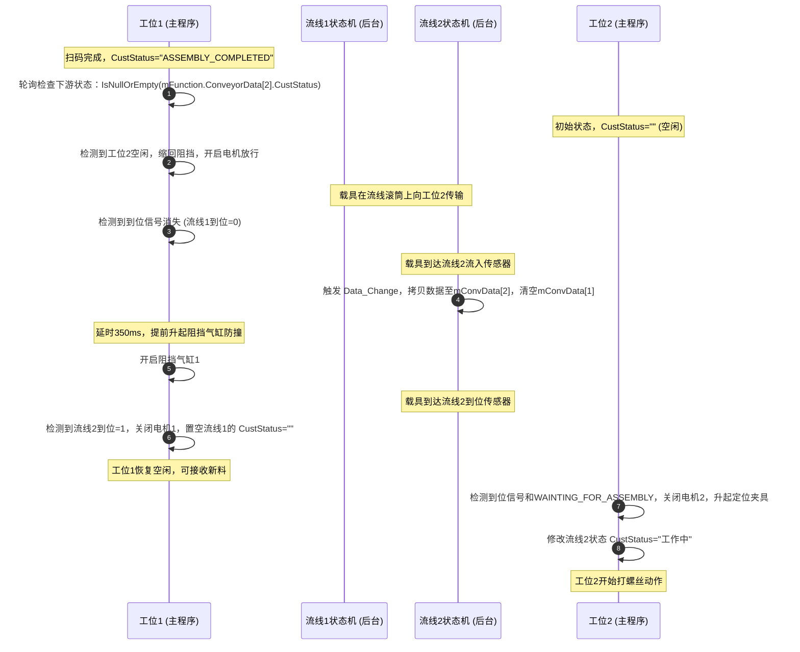
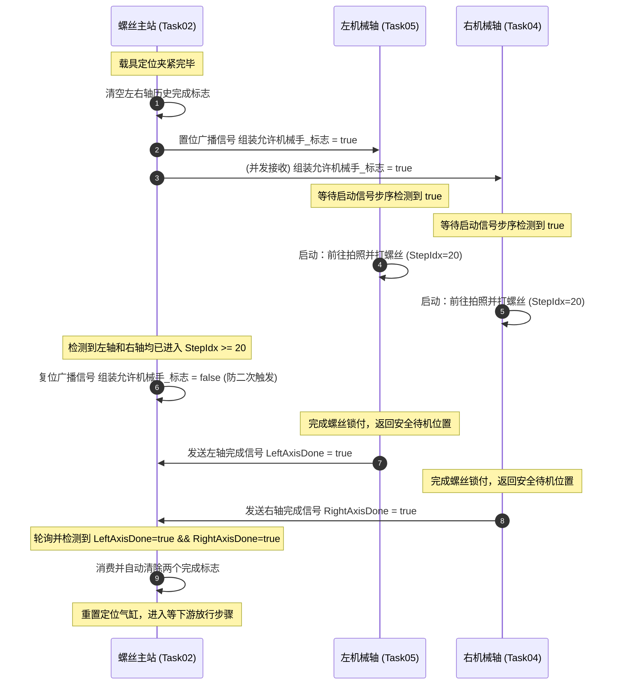

# BoTech 工业自动化软件框架开发手册与核心架构指南


---

## 目录

1. [软件框架设计概述](#1-软件框架设计概述)

2. [硬件参数与系统配置](#2-硬件参数与系统配置)
   - [硬件参数与系统参数的 Excel 配置 (开发第一步)](#硬件参数与系统参数的-Excel-配置-(开发第一步))
   - [C# 枚举 (`EnumName.cs`) 绑定关系与手动同步 SOP](#C#-枚举-(`EnumName.cs`)-绑定关系与手动同步-SOP)
   - [Excel 参数配置与 XML 数据库转换映射规则](#Excel-参数配置与-XML-数据库转换映射规则)
   - [UI 界面参数标签页 (TabPage) 绑定关系](#UI-界面参数标签页-(TabPage)-绑定关系)
   - [HMI UI 诊断监控与 I/O 硬件的交互联系](#HMI-UI-诊断监控与-I/O-硬件的交互联系)
   - [输入限制与合法性校验逻辑](#输入限制与合法性校验逻辑)
   - [功能使能复选框在业务代码中的跳步与屏蔽机制](#功能使能复选框在业务代码中的跳步与屏蔽机制)

3. [核心与运动控制 API](#3-核心与运动控制-API)
   - [运动控制类 (Motion Control)](#运动控制类-(Motion-Control))
   - [系统、超时与日志 (System/Utility/Logs)](#系统、超时与日志-(System/Utility/Logs))
   - [文件读写 (File Operations)](#文件读写-(File-Operations))
   - [网口与串口通讯 (Communications)](#网口与串口通讯-(Communications))
   - [软交互信号量与干涉区防撞 (Synchronization & Concurrency)](#软交互信号量与干涉区防撞-(Synchronization-&-Concurrency))
   - [mFunction 核心工具类与系统状态变量说明](#mFunction-核心工具类与系统状态变量说明)

4. [WorkShare 子对象 API](#4-WorkShare-子对象-API)
   - [mHome — 单轴回零](#mHome-—-单轴回零)
   - [dHome — 多轴同时回零](#dHome-—-多轴同时回零)
   - [pMove — 位置运动](#pMove-—-位置运动)
   - [sMove — 单轴运动（非阻塞）](#sMove-—-单轴运动（非阻塞）)
   - [mMove — 多轴运动（非阻塞）](#mMove-—-多轴运动（非阻塞）)
   - [mDoDi — 数字IO等待](#mDoDi-—-数字IO等待)
   - [mDoDiS — 简化版数字IO](#mDoDiS-—-简化版数字IO)
   - [mSend — TCP 发送等待](#mSend-—-TCP-发送等待)

5. [传送带 Conveyor 系统](#5-传送带-Conveyor-系统)
   - [核心设计理念](#核心设计理念)
   - [Conveyor.xml 配置文件](#Conveyor.xml-配置文件)
   - [nConveyor 状态机（框架内部）](#nConveyor-状态机（框架内部）)
   - [ConvEvent 用户可编程事件（A0.Conveyors.cs）](#ConvEvent-用户可编程事件（A0.Conveyors.cs）)
   - [完整数据流示例](#完整数据流示例)
   - [Conveyor.xml 与 InNo/OutNo 的映射关系](#Conveyor.xml-与-InNo/OutNo-的映射关系)
   - [标准开发模式 vs 当前项目](#标准开发模式-vs-当前项目)
   - [CurStnStatus 完整状态列表](#CurStnStatus-完整状态列表)

6. [自动化流程开发 SOP](#6-自动化流程开发-SOP)
   - [继承关系与生命周期函数](#继承关系与生命周期函数)
   - [自动运行状态机开发模板](#自动运行状态机开发模板)
   - [步序控制与更新机制 (`SetStep`)](#步序控制与更新机制-(`SetStep`))
   - [超时计时器重置与防虚警防呆逻辑](#超时计时器重置与防虚警防呆逻辑)
   - [流水线（Conveyor）与工站绑定逻辑](#流水线（Conveyor）与工站绑定逻辑)
   - [工站间与工站同轴（任务）间的通信与顺序控制逻辑](#工站间与工站同轴（任务）间的通信与顺序控制逻辑)
   - [典型工序异常处理与故障模拟设计（以扫码与打螺丝为例）](#典型工序异常处理与故障模拟设计（以扫码与打螺丝为例）)

7. [ZCM968SOP 控件与方法说明](#7-ZCM968SOP-控件与方法说明)
   - [📄 控件说明书下载](#-控件说明书下载)

8. [Setup_Load.cs 程序启动初始化](#8-Setup_Load.cs-程序启动初始化)
   - [执行流程](#执行流程)
   - [初始化顺序重要性](#初始化顺序重要性)

9. [机械臂基类开发最佳实践](#9-机械臂基类开发最佳实践)
   - [线程安全的安全移动方法设计 (`SafeMoveTo`)](#线程安全的安全移动方法设计-(`SafeMoveTo`))
   - [框架底层原生运动控制 API 详解](#框架底层原生运动控制-API-详解)
   - [为什么封装 `SafeMoveTo` 自定义安全移动函数](#为什么封装-`SafeMoveTo`-自定义安全移动函数)

10. [辅助类 API](#10-辅助类-API)
   - [Zcm.Dialog — 对话框类](#Zcm.Dialog-—-对话框类)
   - [Zcm.DoAndDi — IO 操作类](#Zcm.DoAndDi-—-IO-操作类)
   - [Zcm.LanguageHelper — 语言切换](#Zcm.LanguageHelper-—-语言切换)

11. [核心 API 常见问题与技巧](#11-核心-API-常见问题与技巧)
   - [TasksInteraction 跨线程通信详解](#TasksInteraction-跨线程通信详解)
   - [mSend.WaitDone 通信详解](#mSend.WaitDone-通信详解)
   - [MainConvId 详解](#MainConvId-详解)
   - [TipsDiglogForm 弹框详解](#TipsDiglogForm-弹框详解)
   - [mDoDiWaitDone 详解](#mDoDiWaitDone-详解)
   - [mFunction.OverTime 超时判断](#mFunction.OverTime-超时判断)
   - [机械轴屏蔽模式详解](#机械轴屏蔽模式详解)
   - [扫码使能检查重复的原因](#扫码使能检查重复的原因)

12. [API 速查表](#12-API-速查表)
   - [Motion & mFunction](#Motion-&-mFunction)
   - [MotionDll](#MotionDll)
   - [TaskBase IMotion](#TaskBase-IMotion)
   - [WkManager](#WkManager)
   - [WorkShare 子对象](#WorkShare-子对象)

---

## 1. 软件框架设计概述

BoTech 框架是一款基于多线程并发、状态机流控制和点位/参数示教的模块化工业控制系统。其核心架构由以下三层构成：

1. **界面层 (Form/UI)**：提供以主界面、手动调试界面、参数配置页面和示教界面为核心的 HMI。
2. **逻辑控制层 (Tasks)**：每个独立的物理机构或工位继承自 `mWorkShare` 基类，在独立的线程中以状态机形式运行。各工站通过高内聚、低耦合的设计实现协作。
3. **硬件抽象与辅助层 (Assist/DLLs)**：封装运动控制卡（如固高卡等）、数字 I/O 读写、TCP/IP/串口网络通讯、数据库读写、文件存储、日志追踪以及多工站防撞干涉区管理。

---

---

## 2. 硬件参数与系统配置

在搭建新项目或导入新硬件方案时，**参数配置是绝对的第一步工作**。此时设备刚完成物理接线，尚未编写业务逻辑，必须先通过 Excel 写入所有硬件元数据，并在 C# 源码中同步对应的枚举字段，以此构建整个工控软件的数据字典与软硬件映射通道。

### 2.1 硬件参数与系统参数的 Excel 配置 (开发第一步)

开发人员需要在 `D:\BZ-Parameter\RBF\ParXlsx\` 目录下配置以下五个核心 Excel 表格。这些表格定义了整台设备的卡、轴、I/O 以及系统规格。

#### 2.1.1 控制卡配置 (`CardPar.xlsx`)
定义系统中所安装的物理运动控制卡（如固高 GTS 卡等）及扩展板卡的型号与物理地址。
* **主要列定义**：
  * **编号**：逻辑 ID（从 0 开始自增），用于软件内存数组分配。
  * **卡号**：物理板卡上拨码开关设定的物理卡号（对应驱动中的 Card ID）。
  * **卡名称**：如 `DECAT` (固高主卡)、`GENEX` 等。
  * **供应商**：板卡制造厂商，如 `固高` 等。
  * **起始序号** 与 **数量**：该板卡控制的总轴数或 I/O 引脚的起始逻辑地址。
  * **主卡**：布尔值（True/False），设定为主卡后，软件系统启动时将作为主控卡加载。
  * **参数路径**：控制卡底层核心配置文件的相对路径（如 `+GTS_Config/gtn_core1.cfg`）。系统初始化时，驱动会自动读取该 CFG 文件进行底层初始化。

#### 2.1.2 伺服轴配置 (`AxisPar.xlsx`)
将 C# 中的逻辑轴映射到控制卡的物理通道上，并进行脉冲当量和加减速规划。
* **主要列定义**：
  * **编号**：轴逻辑 ID。**必须与 C# 源码 `EnumName.cs` 中 `mAxis` 枚举的声明顺序完全保持一致**。
  * **名称**：轴中文名（如 `左X`）。
  * **卡号** / **轴号**：该轴接在 `CardPar.xlsx` 中配置的哪张板卡（卡号）以及哪一个物理轴通道（轴号，通常为 1~8）。
  * **脉冲当量计算参数**（`每圈脉冲`、`减速比`、`导程(mm/°)`）:
    用于进行物理单位与脉冲数的自动转换。转换公式为:
    $$\text{Pulse Ratio} = \frac{\text{每圈脉冲} \times \text{减速比}}{\text{导程}}$$
    示例：伺服电机每圈脉冲为 10000，直连无减速比，丝杠导程为 10 mm，则脉冲比例为 1000 Pulse/mm。当代码调用 `MotionAbsMove(轴X, 50, -1)` 移动 50 mm 时，底层驱动会自动发送 50000 脉冲，实现对开发者的物理单位黑盒化。
  * **速度规划参数**（`加速度`、`减速度`、`回零速度(mm/s)`）：
    定义轴在执行运动指令时的默认加减速斜率以及回零寻找 Index 信号时的物理速度，保证轴在起停时的平稳度。

#### 2.1.3 数字 I/O 映射配置 (`Input.xlsx` 与 `Output.xlsx`)
配置物理传感器（光电开关、安全门、磁簧开关）和物理输出动作（电磁阀、继电器、指示灯）。
* **输入/输出列定义**：
  * **编号**：逻辑 ID（从 0 开始自增），必须与 C# `EnumName.cs` 中的 `InNo` 和 `OutNo` 枚举排序完全一致。
  * **名称Cn** / **名称En**：在中英文界面上显示的信号名称。
  * **模块编号** / **序号**：指明该 I/O 信号压接在第几张板卡（模块编号）以及哪一个物理引脚（引脚序号，如 Pin 0~15）上。
  * **初始状态**：系统复位上电时控制卡输出的默认电平（通常为 0）。
  * **原点序号** / **动点序号**（`Output.xlsx` 独有）：仅针对双控气缸，用于绑定对应的缩回和伸出物理限位信号（`InNo`）。
    *当调用气缸动作 API `mDoDiWaitDone` 时，软件框架根据此映射自动等待对应的传感器信号，如果超时则自动判断为动作未到位报错。*

#### 2.1.4 系统参数配置 (`SysPar.xlsx`)
设定整台设备的物理规模限制，用于系统启动时的内存初始化和边界保护。
* **主要参数项**：
  * **卡数量**：系统中控制卡及模块的总数。
  * **轴数量**：设备拥有的轴总数。
  * **输入点数量** / **输出点数量**：数字量 I/O 的最大物理数量规格限制。
  * **设置参数数量**：参数列表 `mParList` 的最大容量上限（如 280 个）。
  * **急停编号**：急停按钮所接的 `InNo` 输入引脚索引，系统底层急停监控线程将根据此引脚进行高频读取，一旦触发立即拉停所有轴。

#### 2.1.5 全局参数表 (`ParList.xlsx`)
包含用于微调和控制的所有非硬件参数（如微调补偿量、速度、使能复选框开关等）。
* 索引 0 ~ 99、150~179 映射为浮点数/字符串形式的用户参数，对应 `UserPar` 枚举。
* 索引 100~131 映射为功能使能复选框（布尔开关），对应 `FuncChk` 枚举。

---

### 2.2 C# 枚举 (`EnumName.cs`) 绑定关系与手动同步 SOP

在 C# 流程开发中，我们绝不能使用裸的物理通道号（如 0, 1, 2）或硬编码变量，而是使用 `EnumName.cs` 里的枚举。

> [!IMPORTANT]
> **关于自动“枚举生成”的澄清与同步规范**：
> 1. **没有“一键枚举生成”按钮**：当前 BoTech 框架中，**设置页面没有任何一键“枚举生成”的自动化机制**。每次对 Excel 配置表（`Input.xlsx`, `Output.xlsx`, `AxisPar.xlsx`, `ParList.xlsx`）做出新增、删除或顺序调整时，**必须由开发人员手动修改 C# 源码中的 `EnumName.cs`**。
> 2. **索引严格一致性**：C# 源码中的枚举值在底层执行时会直接强转为 `short` 索引（如 `(short)InNo.流线1到位信号`），以去 XML 数据库解析对应的卡号和物理通道。因此，**C# 中的枚举项顺序必须与 Excel 中的“编号”顺序保持 100% 绝对一致**。如果出现偏离，编译器不会报错，但在自动运行时将直接控制或读取错误的物理引脚，极易引发机械撞击事故！

#### 2.2.1 详细映射对应关系

Excel 与 `EnumName.cs` 内枚举项的精确映射如下：

| Excel 配置表 | 映射 C# 枚举 | 声明规则与示例 |
| :--- | :--- | :--- |
| **`Input.xlsx`** | `InNo` | 按照 `Input.xlsx` 编号 0、1、2 顺序依次声明。<br>如 `急停信号 = 0`，首个成员必须是它。 |
| **`Output.xlsx`** | `OutNo` | 按照 `Output.xlsx` 编号 0、1、2 顺序依次声明。<br>如 `五色灯红色 = 0`。 |
| **`AxisPar.xlsx`** | `mAxis` | 逻辑轴配置。由于底层运动卡通道绑定，首项显式指定为 1：<br>`右X = 1`, `右Y`, `右Z` 等。 |
| **`ParList.xlsx` (100~131)** | `FuncChk` | 仅映射 Excel 索引 100~131 处的布尔复选框开关。首项显式声明：<br>`Enable_Security_ = 100`。 |
| **`ParList.xlsx` (0~99, 150+)** | `UserPar` | 映射所有常规数值参数。首项显式声明：<br>`扫码失败次数 = 0`；并在 150 后显式声明：<br>`Machine_runMode = 150`。 |

#### 2.2.2 硬件配置与枚举修改的手动同步 SOP 流程

在需要添加或修改系统参数时，请务必执行以下规范流程：

```
[步骤1: 修改 Excel] 在 D:\BZ-Parameter\RBF\ParXlsx 修改对应的配置文件 (如 Input.xlsx)
       │
       ▼
[步骤2: 修改 C# 枚举] 打开 C# 项目，修改 AncillaryProject/ParName/ParName/EnumName.cs 对应枚举项
       │
       ▼
[步骤3: 编译类库] 在 VS 中编译 ParName 项目，生成最新的 ParName.dll，并重新编译主程序以更新项目引用
       │
       ▼
[步骤4: 生成/更新 XML] 系统读取 Excel 元数据并写入 ParInput/ParOutput/ParMachine/ParData/SysPar.xml
       │
       ▼
[步骤5: 重启软件生效] 关闭并重新启动软件，底层 DLL 读取新的 XML 数据，此时软硬件完全对应生效！
```
#### 2.2.3 多种参数获取方式

框架提供了 **三类** 常用的全局参数读取方式，适用于不同的开发场景。

##### 1. 泛型获取 `GetParValue<T>`
```csharp
// 读取整数参数
int maxRetry = mFunction.GetParValue<int>(UserPar.扫码失败次数);
// 读取字符串参数
string mode = mFunction.GetParValue<string>(UserPar.Machine_runMode);
// 读取浮点参数
double speed = mFunction.GetParValue<double>(UserPar.RobotSpeed);
// 读取 Bool 参数（功能开关）
bool safety = mFunction.GetParValue<bool>(FuncChk.Enable_Security_);
```
* **适用场景**：一次性读取，类型安全，由框架自动完成类型转换。
* **特性**：编译期间检查返回类型，防止类型错误。

##### 2. 快捷读取 `mGlobal` 包装属性
```csharp
double robotSpeed = mGlobal.ParDbl(UserPar.RobotSpeed);
int delayMs = mGlobal.ParInt(UserPar.电批吸料稳定延时);
string modeStr = mGlobal.ParStr(UserPar.Machine_runMode);
bool enableScan = mGlobal.FuncCheck(FuncChk.启用扫码);  // Bool 快捷读取
```
* **适用场景**：直接访问全局数组 `mParList`，效率最高。
* **最佳实践**：适合在自动运行循环（AutoRun）或高频轮询的实时控制参数中调用。

##### 3. 直接访问全局数组 `mParList[]`
```csharp
// 读取数值
double speed = mParList[(short)UserPar.RobotSpeed].DataDbl;
// 读取 Bool 状态
bool enabled = mParList[(short)FuncChk.Enable_Security_].CheckSts;
// 读取上下限信息（用于 UI 限制）
double up = mParList[(short)UserPar.RobotSpeed].LimitUp;
double down = mParList[(short)UserPar.RobotSpeed].LimitDown;
```
* **适用场景**：仅在需要访问元数据（如上下限 `LimitUp`/`LimitDown`、物理单位 `Unit`、中文备注 `Remark` 等）的场景下使用。

---

##### 4. Bool 类型参数（FuncChk）读取详解

`FuncChk` 枚举定义了所有功能开关（复选框），对应 Excel 配置表中的"功能使能"列。读取 Bool 参数有三种方式：

* **方式1：`mGlobal.FuncCheck`（推荐，最简洁）**
  ```csharp
  // 源码：return mParList[(short)func].CheckSts;
  bool enableScan = mGlobal.FuncCheck(FuncChk.启用扫码);
  bool enableCCD = mGlobal.FuncCheck(FuncChk.启用CCD);
  bool enablePDCA = mGlobal.FuncCheck(FuncChk.启用_PDCA);
  bool blockLeft = mGlobal.FuncCheck(FuncChk.屏蔽左轴);
  ```

* **方式2：`mFunction.GetParValue<bool>`（泛型，类型安全）**
  ```csharp
  bool enableScan = mFunction.GetParValue<bool>(FuncChk.启用扫码);
  bool blockLeft = mFunction.GetParValue<bool>(FuncChk.屏蔽左轴);
  ```

* **方式3：`mParList[].CheckSts`（直接数组访问，最快）**
  ```csharp
  // 带安全检查的写法（推荐用于属性初始化器或字段声明中）
  protected override bool 是否屏蔽 =>
      mParList != null
      && mParList.Length > (int)FuncChk.屏蔽右轴
      && mParList[(int)FuncChk.屏蔽右轴].CheckSts;

  // 不带安全检查的写法（用于方法内部，确保 mParList 已初始化）
  bool enableScan = mParList[(int)FuncChk.启用扫码].CheckSts;
  ```

---

> [!WARNING]
> **参数类型不匹配导致的读取残留值漏洞 (Data vs DataInt)**
>
> 在 Excel (如 `UserPar.xlsx`) 中定义参数时，列 `Category` 如果被指定为 `D` (即 Double 浮点型)，则用户配置的参数值会存储在 XML 数据库 of `<Data>` 节点中。此时，`<DataInt>` 节点在 XML 中不会更新，而是保留其默认的初始/残留值 (例如 `333` 或 `200` 等)。
>
> 如果在 C# 代码中错误地使用 `mFunction.GetParValue<int>(UserPar.某参数)` 去读取该参数，系统会因为泛型类型是 `int` 而直接返回 `<DataInt>` 中的残留默认值，而不是经过正确四舍五入或截断的 `<Data>` 值。这会导致读取出来的参数与界面设置完全不符（例如设置了 10 却获取到 7，或者设置了 5 却获取到 333）。
>
> **正确做法**：
> * **如果 Excel 中参数类型是 `D` (Double)**：必须使用 `(int)mFunction.GetParValue<double>(UserPar.某参数)` 先读取为 double，然后再强转为 int。
> * **如果 Excel 中参数类型是 `I` (Int)**：可以直接使用 `mFunction.GetParValue<int>(UserPar.某参数)`。
> * 在编写代码前，必须仔细核对 Excel 配置文件中参数的类型定义（`Category` 或 `<ChkCategory>` 的值）。

##### 5. `mParList` 内存数据结构

`mParList[index]` 的每个元素包含以下核心字段：

| 字段 | 类型 | 说明 |
| :--- | :--- | :--- |
| `DataDbl` | double | 数值参数值 |
| `DataInt` | int | 整数参数值 |
| `DataStr` | string | 字符串参数值 |
| `CheckSts` | bool | 功能开关状态（对应 FuncChk） |
| `LimitUp` | double | 参数上限 |
| `LimitDown` | double | 参数下限 |
| `Unit` | string | 单位 |
| `Remark` | string | 备注 |

---

### 2.3 Excel 参数配置与 XML 数据库转换映射规则

参数定义的元数据源头位于 Excel 文件，而运行库在运行时会以 XML 文件作为直接持久化数据库（保证无 Office 环境下也能读写）。

#### 2.3.1 Excel 参数模板列定义 (`ParList.xlsx`)

| 列号 | 字段名称 | 对应 XML 元素 | 作用说明 |
| :--- | :--- | :--- | :--- |
| **A** | `Index` / `ParNo` | 节点索引 | 参数在全局数组 `mParList` 中的唯一整型索引 |
| **B** | `NameCh` | `<RemarkCn>` | 在界面 PropertyGrid 显示的中文参数名称 |
| **C** | `NameEn` | `<RemarkEn>` | 界面切换至英文版时显示的英文参数名称 |
| **D** | `Category` | `<Category>` | 属性分组名称，PropertyGrid 会依此折叠分类 |
| **E** | `LimitUp` | `<LimitUp>` | 参数输入的上限值（浮点数） |
| **F** | `LimitDown` | `<LimitDown>` | 参数输入的下限值（浮点数） |
| **G** | `Unit` | `<Unit>` | 参数物理单位（如 mm, ms, pcs） |
| **H-K**| `ChkRemark` 等 | `<ChkRemarkCn>` 等 | 用于定义复选框的中文名、英文名及复选框分组类别 `B` |

#### 2.3.2 自动同步生成逻辑 (`AutoSetup`)
当在参数维护页面执行“AutoSetup”（自动建库）时，框架会读取 `ParList.xlsx`，并将每行数据转换为 `ParData.xml` 中的结构。如果 XML 中已有数据，则会无损重写元数据，并保持原有参数的当前值（`<Data>`）不变。

```xml
<!-- ParData.xml 单个参数节点结构示例 -->
<mNewPar>
  <RemarkCn>右轴取料X补偿</RemarkCn>
  <RemarkEn>Right Axis Pick X Offset</RemarkEn>
  <Category>右机械手参数</Category>
  <LimitUp>5</LimitUp>
  <LimitDown>-5</LimitDown>
  <Unit>mm</Unit>
  <Data>0.125</Data>      <!-- 当前浮点值，代码通过 Data 或 GetParValue 获取 -->
  <DataInt>0</DataInt>    <!-- 整型值 -->
  <DataStr />             <!-- 字符串值 -->
  <CheckSts>false</CheckSts> <!-- 复选框状态，仅在 100+ 索引使能参数中生效 -->
  <ChkRemarkCn>备用使能</ChkRemarkCn>
</mNewPar>
```

---

### 2.4 UI 界面参数标签页 (TabPage) 绑定关系

参数配置窗口 `Frm_Par` 包含多个 TabPage，它们展示和修改底层同一个全局参数数据源 `mFunction.mParList`：

```text
  【数据源头】
  Excel 模板 (ParList.xlsx等) 
         │
         │ AutoSetup 自动建库同步
         ▼
  【持久化数据库】
  XML 配置文件 (ParData.xml等)
         ▲
         │ 系统启动读取 / 运行时保存
         ▼
  【内存数据源】
  全局参数数组 (mFunction.mParList等)
         │
         ├─────── 映射 0-49, 150-179 ───────► TabPage 1: PropertyGrid 属性网格
         │
         ├─────── 映射 0-55 ────────────────► TabPage 2: TextBox 文本框组
         │
         └─────── 映射 100-131 ─────────────► TabPage 4: Checkbox 使能页
```

#### 2.4.1 TabPage 1: 属性网格配置 (PropertyGrid)
* **绑定控件**：由两个 `Zcm.PropertyParS` 构成：
  * `propertyParS2`：`StartIndex = 0`，`ParNumber = 50`。绑定内存数组 `mParList` 的 **0~49 号参数**。
  * `propertyParS1`：`StartIndex = 150`，`ParNumber = 30`。绑定内存数组 `mParList` 的 **150~179 号参数**。
* **特性**：该控件提供类似于 PropertyGrid 的界面，自动读取 XML 里的参数分类（Category）将参数折叠展示，并提供中文描述（RemarkCn）、单位（Unit）及当前数值（Data）。
* **权限保护**：受系统登录机制保护。在未插入读卡器或未通过 `Frm_Login` 进行管理员/工程师登录时，`Panel_ParList.Enabled` 设为 `false`，防止未授权修改。

#### 2.4.2 TabPage 2: 文本框组参数配置
* **绑定控件**：由 7 个 `Zcm.UserParS` 控件构成（`userParS1` 到 `userParS7`），每个控件内部包含 8 个 TextBox 和对应的描述 Label。
* **映射索引**：
  * `userParS1` (0~7), `userParS2` (8~15), `userParS3` (16~23), `userParS4` (24~31), `userParS5` (32~39), `userParS6` (40~47), `userParS7` (48~55)。
  * 覆盖 **0~55 号参数**，与 TabPage 1 的前 56 个参数完全对应，但展现形式为 TextBox。

#### 2.4.3 TabPage 4: Check Tab (功能使能复选框页)
* **绑定控件**：由 4 个 `Zcm.UserChk` 控件构成（`userChk1` 到 `userChk4`），每个控件包含 8 个 CheckBox 复选框。
* **映射索引**：
  * `userChk1` (100~107), `userChk2` (108~115), `userChk3` (116~123), `userChk4` (124~131)。
  * 代表布尔开关，在程序中通过 `mParList[Index].CheckSts` 读取状态（`true`/`false`），对应 `FuncChk` 枚举。

---

### 2.5 HMI UI 诊断监控与 I/O 硬件的交互联系

配置完毕的 I/O 映射在软件 UI 界面上有极佳的关联性：
1. **监控界面动态渲染**：
   当进入软件“IO监控”页面时，系统会读取 `ParInput.xml` 和 `ParOutput.xml`。如果有项的 `Name` 不为空，UI 会动态绘制出一个按钮或圆形指示灯。这免去了在界面上手动添加控件的工作。
2. **点动控制 (DO 手动调试)**：
   在“手动调试”或“IO监控”界面点击某个输出按钮时，系统会截获该按钮绑定的 `OutNo` 逻辑编号。在手动模式下，系统执行 `WriteDo(编号, 1)`（底层硬件操作是在配置卡号和序号对应的引脚输出高电平），且按钮变绿。
3. **输入反馈 (DI 实时点亮)**：
   系统会在后台开启一个 10ms 级别的扫描线程，高频读取 `ParInput.xml` 里配置的所有卡号 and 引脚状态。一旦传感器触发（引脚变高电平），UI 监控上对应的指示灯会点亮成绿色；离开后熄灭。这为电气调试和故障排查提供了极其便捷的可视化支持。

---

### 2.6 输入限制与合法性校验逻辑

在参数页面输入新数值时，UI 控件（如 PropertyGrid 或 TextBox）会自动拦截非法输入：
1. **类型校验**：仅允许输入与参数类型兼容的数值字符，输入字母会自动过滤或恢复旧值。
2. **上下限拦截**：当输入的值 $V > LimitUp$ 或 $V < LimitDown$ 时，界面会弹出警告对话框，或直接在失去焦点时将数值限制在边界值，拒绝写入 XML，保证设备动作的绝对安全。即：**系统会在输入时硬性进行拦截校验，完全禁止且无法输入超过设定的上下限范围的数值。**

---

### 2.7 功能使能复选框在业务代码中的跳步与屏蔽机制

在 Check Tab 中配置的布尔开关（`FuncChk`）直接参与 `Tasks` 中的时序控制。典型的屏蔽策略如下：

#### 2.7.1 扫码功能屏蔽 (`Enable_scanning_code` 索引 102)
在入料扫码站中，若未勾选此功能，则不触发扫码指令，程序自动跳过等待结果状态。
```csharp
case (int)步序.等到位信号:
    if (mGlobal.ReadDi_Bool(InNo.流线1到位信号))
    {
        if (mParList[(int)FuncChk.Enable_scanning_code].CheckSts)
        {
            SetStep(ref StaInfo, (int)步序.电机停扫码, true); // 正常走扫码流程
        }
        else
        {
            AddLog("扫码使能关闭，跳过扫码，直接进入放行准备", LogsType.Auto, 20, true);
            SetStep(ref StaInfo, (int)步序.关光源, true); // 跳步
        }
    }
    break;
```

#### 2.7.2 机械手关闭屏蔽 (`Block_leftRobot` 索引 116 / `Block_rightRobot` 索引 117)
在机械手基类的 `AutoRun()` 起始位置进行拦截。若被屏蔽，则将所有输出复位，当检测到工作启动交互信号后，立刻返回工作完成标志，既不发生任何物理运动，也不阻塞流水线生产。
```csharp
public override void AutoRun()
{
    if (是否屏蔽) // 从 Block_leftRobot 或 Block_rightRobot 的 CheckSts 获取
    {
        // 1. 安全复位所有物理 DO 输出
        mGlobal.mDoReset(CCD光源触发信号);
        mGlobal.mDoReset(电批吸真空信号);
        mGlobal.mDoReset(电批破真空信号);
        mGlobal.mDoReset(电批启动信号);

        // 2. 检测到握手信号时，直接模拟完成，不执行动作
        if (GetTasksInteraction(启动触发标志, false) == true)
        {
            AddLog("机械手已屏蔽，跳过拧紧流程，直接发送完成标志", LogsType.Auto, StaInfo.StepIdx, true);
            SetTasksInteractionTrue(完成标志); // 提前置位工作完成
        }
        SetStep(ref StaInfo, (int)步序.等待启动信号, false);
        return;
    }
    // ... 正常流程 ...
}
```

#### 2.7.3 相机跳步逻辑 (`Enable_CCD` 索引 104 - 启用相机功能)
用于屏蔽视觉定位，直接以零偏差移至打螺丝点。
```csharp
case (int)步序.等待启动信号:
    if (GetTasksInteraction(启动触发标志, false) == true)
    {
        if (是否启用相机) // 由 Enable_CCD 启用相机复选框控制
        {
            SetStep(ref StaInfo, (int)步序.移至拍照位置, true);
        }
        else
        {
            AddLog("相机功能被关闭，跳过拍照，直接使用0偏差移至工作点", LogsType.Auto, 12, true);
            纠偏X = 0 + 补偿X;
            纠偏Y = 0 + 补偿Y;
            纠偏R = 补偿R;
            SetStep(ref StaInfo, (int)步序.移动至电批工作点, true); // 直接去执行拧螺丝
        }
    }
    break;
```

---

---

## 3. 核心与运动控制 API

### 3.1 运动控制类 (Motion Control)

#### 3.1.1 `MotionGetDi`
* **功能**：读取控制卡指定的数字输入（DI）通道电平状态。
* **原型**：`protected bool MotionGetDi(int DiIndex)`
* **参数**：`DiIndex`：控制卡输入通道的全局索引。
* **返回值**：当该通道有电平输入时返回 `true`，无电平输入时返回 `false`。

#### 3.1.2 `MotionGetDo`
* **功能**：读取当前输出（DO）通道的硬件置位状态。
* **原型**：`protected bool MotionGetDo(int DoIndex)`
* **参数**：`DoIndex`：全局 DO 输出索引。
* **返回值**：已输出置位时返回 `true`，复位状态返回 `false`。

#### 3.1.3 `MotionSetDo`
* **功能**：写入一个或多个输出通道状态。
* **原型**：
  * `protected void MotionSetDo(int DoIndex, bool sts)`
  * `protected void MotionSetDo(int[] DoIndex, bool sts)`
* **参数**：`DoIndex`：单个通道索引或通道索引数组；`sts`：目标电平状态（`true` 或 `false`）。
* **代码示例**：
  ```csharp
  MotionSetDo((int)OutNo.蜂鸣器, true); // 开启蜂鸣
  MotionSetDo(new int[] { (int)OutNo.五色灯红色, (int)OutNo.五色灯绿色 }, false); // 并发关闭红绿灯
  ```

#### 3.1.4 `MotionAbsMove` / `MotionRelMove`
* **功能**：驱动单轴或多轴以绝对坐标或相对位移开始运动。该方法是**非阻塞的**，启动指令下发后立即返回。
* **原型**：
  * `protected bool MotionAbsMove(int AxisID, double Position, double Vel)`
  * `protected bool MotionAbsMove(int[] AxisID, double[] Position, double[] Vel)`
  * `protected bool MotionRelMove(int AxisID, double Dist, double Vel)`
* **参数**：
  * `AxisID`：目标轴号（单个或数组）。
  * `Position` / `Dist`：目标绝对坐标（mm）或移动距离（mm）。
  * `Vel`：运动速度（mm/s），输入 `-1` 则采用系统配置的默认运行速度。
* **返回值**：指令发送成功返回 `true`，驱动报错返回 `false`。

#### 3.1.5 `MotionWaitMoveDone`
* **功能**：阻塞当前线程，等待指定的一个或多个轴到达目标坐标或运动静止，直到超时。
* **原型**：
  * `protected bool MotionWaitMoveDone(int AxisId, int timeout = -1)`
  * `protected bool MotionWaitMoveDone(int[] AxisId, double[] targetpos, int timeout = -1)`
* **参数**：
  * `AxisId`：等待的轴号。
  * `targetpos`：目标坐标对比数组（若不传入此参数，则判定轴停止运行即完成）。
  * `timeout`：最大等待毫秒数，`-1` 为无限等待。
* **返回值**：到达或静止返回 `true`；超时返回 `false`。

#### 3.1.6 `MotionAbsMoveAndDone` / `MotionRelMoveAndDone`
* **功能**：单轴或多轴运动并阻塞等待其到位，是 `MotionAbsMove` 与 `MotionWaitMoveDone` 的高度封装。
* **原型**：`protected bool MotionAbsMoveAndDone(int AxisID, double Position, double Vel, int timeout = -1)`
* **返回值**：在超时范围内成功运动并到位返回 `true`，任意轴超时或失败返回 `false`。
* **代码示例**：
  ```csharp
  // 抬升 Z 轴至 0.0 安全高度，设定 5000ms 超时
  if (!MotionAbsMoveAndDone((short)mAxis.左Z, 0.0, -1, 5000))
  {
      AddLog("Z轴安全抬升失败，紧急停机！", LogsType.ErrorCode, StaInfo.StepIdx, true);
      SetStep(ref StaInfo, (int)步序.异常, true);
  }
  ```

#### 3.1.7 `MotionWaitDi` / `MotionWaitDo`
* **功能**：阻塞线程并等待特定的输入（DI）或输出（DO）状态转为设定状态。
* **原型**：`protected bool MotionWaitDi(int diId, bool isOn, int timeout = -1, bool TimeoutToBeContinue = false)`
* **参数**：
  * `diId`：待检测的 I/O 全局索引。
  * `isOn`：期待的目标状态（`true`/`false`）。
  * `timeout`：等待超时时间（ms）。
  * `TimeoutToBeContinue`：**关键参数**。
    * 设为 `false` 时：若超时，系统将**弹出带有“重试(Retry)”和“取消(Cancel)”的对话框**。用户点击重试会再次等待，点击取消则返回 `false` 触发报警。
    * 设为 `true` 时：若超时，程序**不弹窗，直接返回 `false` 并执行下一行代码**，交由程序员在代码中做流转决策。

#### 3.1.8 `MotionGoHomeAndDone`
* **功能**：驱动指定轴回零，并阻塞等待直至回零成功或超时。
* **原型**：`protected bool MotionGoHomeAndDone(int AxisId, int timeout = -1)`
* **返回值**：回零成功返回 `true`，超时或报错返回 `false`。

#### 3.1.9 `mDoDiWaitDone`
* **功能**：框架中最常用的**气缸一体化动作等待方法**，将“写输出”与“等反馈”合并。
* **原型**：
  * `public void mDoDiWaitDone(OutNo OutNum, short state, InNo InNum, short state1, short DelayTime, short Timeout, bool Pop_up_message = false)`
  * `public void mDoDiWaitDone(InNo InNum, short state1, short DelayTime, short Timeout, bool Pop_up_message = false)`
* **参数**：
  * `OutNum`：要驱动的电磁阀 DO。
  * `state`：电磁阀输出电平（`1` 伸出，`0` 缩回）。
  * `InNum`：气缸到位磁簧开关 DI。
  * `state1`：期待的磁簧开关状态（`1` 触发到位，`0` 离开到位）。
  * `DelayTime`：到位后的额外稳定延时（ms）。
  * `Timeout`：最大等待时间（ms）。
  * `Pop_up_message`：若为 `true`，超时后会在界面弹出“Retry/Cancel”重试对话框；若为 `false` 且超时，则直接抛出异常终止程序。
* **代码示例**：
  ```csharp
  // 将流线1阻挡气缸复位为 0，并同步等待阻挡缩回信号变为 1。如果超过 3000ms 未到位，弹窗提示用户
  mDoDiWaitDone(OutNo.流线1阻挡气缸, 0, InNo.流线1阻挡缩回信号, 1, 10, 3000, true);
  ```

---

### 3.2 系统、超时与日志 (System/Utility/Logs)

#### 3.2.1 `mFunction.GetTickCount()`
* **功能**：获取高精度系统计时器当前的 Tick 数值（自系统启动以来的毫秒数，常用于精确超时和节拍测算）。
* **原型**：`public static long GetTickCount()`
* **返回值**：`long` 类型的毫秒时间戳。

#### 3.2.2 `mFunction.OverTime`
* **功能**：判定给定时间戳是否已超出限定时长。
* **原型**：`public static bool OverTime(long StartTime, int SleepTime)`
* **参数**：`StartTime`：起始 Tick 值；`SleepTime`：限定的超时时间（ms）。
* **返回值**：已超时返回 `true`，未超时返回 `false`。
* **代码示例**：
  ```csharp
  long myTimer = mFunction.GetTickCount();
  // ... 执行某操作 ...
  if (mFunction.OverTime(myTimer, 5000))
  {
      // 耗时超过 5 秒，进行超时处理
  }
  ```

#### 3.2.3 `mFunction.Sleep`
* **功能**：让当前工作线程进入休眠状态，以释放 CPU 资源。
* **原型**：`public static bool Sleep(int DT)`
* **参数**：`DT`：挂起的毫秒数。

#### 3.2.4 `AddLog`
* **功能**：在日志系统中记录事件。支持写入本地硬盘、显示在运行界面的动态日志窗口。
* **原型**：`public string AddLog(string MsgStr, LogsType model = LogsType.Logs, int StepNo = 0, bool dn_UI_Show = false, Color _color = default(Color))`
* **参数**：
  * `MsgStr`：日志记录的内容字符串。
  * `model`：日志类别枚举（`LogsType`），如 `LogsType.Auto`（自动流程日志）、`LogsType.CCD`（相机通讯）、`LogsType.Barcode`（扫码枪数据）、`LogsType.Home`（回零复位日志）等。
  * `StepNo`：当前状态机步骤，便于在日志中定位逻辑步骤。
  * `dn_UI_Show`：为 `true` 时，该条日志会同步推送到主画面的日志 ListBox，使用户直观可见。
  * `_color`：指定该行在主界面显示的文本颜色。
* **返回值**：格式化后的完整日志行字符串。
* **代码示例**：
  ```csharp
  AddLog("螺丝站：两轴已全部启动，清除触发信号", LogsType.Auto, StaInfo.StepIdx, true, Color.ForestGreen);
  ```

#### 3.2.5 `AddAlarmCenter` / `AddTipCentert`
* **功能**：中断运行并在主界面中心弹出一个阻塞的交互窗口。
* **原型**：
  * `public AlarmCenter.mDialogResult AddAlarmCenter(string MsgStr, bool isWaitOne = true, string btnOKText = "Continue", string btnCancelText = "Cancel", string btnIgnoreText = "", bool isBuzzer = true)`
  * `public AlarmCenter.mDialogResult AddTipCentert(string MsgStr, string changeWithoutTran = "", bool isWaitOne = true, string btnOKText = "Continue", string btnCancelText = "Cancel", bool isBuzzer = false)`
* **参数说明**：
  * `MsgStr`：弹窗内展示的异常报警信息。
  * `isWaitOne`：为 `true` 时将彻底阻塞当前工站线程，直至用户做出按钮点击反馈。
  * `btnOKText` / `btnCancelText`：两个响应按钮的自定义文言（通常为 Continue 与 Cancel）。
  * `isBuzzer`：是否同步亮红灯并启动物理蜂鸣器。
* **返回值**：`AlarmCenter.mDialogResult.OK` (对应 Continue) 或 `AlarmCenter.mDialogResult.Cancel` (对应 Cancel)。

---

### 3.3 文件读写 (File Operations)

#### 3.3.1 INI 配置文件读写
* **原型**：
  * `public static void SetIniS(string SectionName, string KeyWord, string ValStr, string FileName)`
  * `public static void SetIniN(string SectionName, string KeyWord, double ValInt, string FileName)`
  * `public static string GetIniS(string SectionName, string KeyWord, string DefString, string FileName)`
* **说明**：向路径 `FileName` 写入或读取标准 `[Section]` 下的键值。读取时，若键不存在则返回默认值 `DefString`。

#### 3.3.2 XML 数据读写
* **原型**：
  * `public static void ReadXml<T>(string XmlFileName, ref T ReadData)`
  * `public static void WriteXml<T>(string XmlFileName, ref T WriteData)`
  * `public static void Read2DXml<T>(string XmlFileName, ref T[,] mDataTmp)`
* **说明**：利用 XML 序列化器对指定对象 `ReadData`/`WriteData`（可以是简单结构体、包含属性的参数数组或二维数组）进行快速保存和加载。

#### 3.3.3 CSV 与 TXT 文件写入
* **原型**：
  * `public void WriteCsvFile(string FilePathName, string Savedata)`
  * `public void WriteDattxt(string Filename, string WriteData)`
  * `public string ReadDattxt(string Filename)`
* **说明**：用于配置 PDCA 记录、生产报表及标定数据的快捷文件写入。`WriteCsvFile` 会自动创建目录并以追加方式（Append）写入一行 CSV 格式字符串。

---

### 3.4 网口与串口通讯 (Communications)

BoTech 框架底层集成了基于以太网套接字 (Socket Client) 的网络通讯组件，用于与相机 (CCD)、扫码枪 (Scanner)、RFID 读写器及其他外部智能设备进行双向网络报文交互。

#### 3.4.1 Socket 客户端发送数据
* **方法**：`TcpIP[Index].SendData(string DataStr)`
* **参数**：
  * `Index`：网口的逻辑映射编号（对应 `TCPIP_Port` 枚举）。
  * `DataStr`：需要发送给服务器的字符串报文。
* **返回值**：若成功送入发送缓冲区则返回 `true`，否则返回 `false`。

#### 3.4.2 检查是否收到新数据与读取机制
在后台套接字接收线程收到数据后，会将标志置位。工站可以通过以下 API 进行检查与消费：
* **`TcpInfo[Index].Received`**：只读布尔值。当网络物理链路收到新报文且未被读取时返回 `true`。
* **`TcpInfo[Index].Data`**：读取并清空缓冲区内完整的网口数据。
  > [!IMPORTANT]
  > **毁灭性读取机制**：
  > 读取 `TcpInfo[Index].Data` 属性会触发其 Getter，该操作在将接收数据字符串返回的同时，会**立即清空底层接收缓冲区并将 `Received` 标志原子复位为 `false`**。
  > 因此，同一循环中**不可重复读取该属性**（第二次读取将获得空字符串 `""`）。如果需要多次使用接收到的数据，必须在首次读取时用局部变量锁存（如 `string resp = TcpInfo[Index].Data;`）。
* **`TcpInfo[Index].Open`**：检查网口连接状态（连接建立为 `true`，断开为 `false`）。

#### 3.4.3 TCP 双向应答最佳实践示例
在 AutoRun 状态机中，典型的双向应答（Request-Response）模式如下：
```csharp
case (int)步序.发送拍照指令:
    // 重新记录起点时间，避免累加之前动作的时间导致超时错误
    mFunction.ConveyorData[MainConvId].StartTime = mFunction.GetTickCount(); 
    AddLog("右机械轴：向相机发送拍照指令", LogsType.CCD, StaInfo.StepIdx, true);
    
    // 发送报文
    if (TcpIp_Communication.SocketDataSend(TCPIP_Port.右CCD, "RScrew"))
    {
        SetStep(ref StaInfo, (int)步序.等相机数据, true);
    }
    else
    {
        SetStep(ref StaInfo, (int)步序.异常, true);
    }
    break;

case (int)步序.等相机数据:
    // 1. 判断是否收到回复
    if (mFunction.TcpInfo[(short)TCPIP_Port.右CCD].Received)
    {
        // 2. 局部变量读取并锁存，同时复位 Received 标志并清除接收区
        string resp = mFunction.TcpInfo[(short)TCPIP_Port.右CCD].Data;
        AddLog($"收到相机回复: {resp}", LogsType.CCD, StaInfo.StepIdx, true);
        
        // 3. 解析相机纠偏数据
        if (resp.StartsWith("OK"))
        {
            // 解析并赋值纠偏 X, Y, R
            SetStep(ref StaInfo, (int)步序.平移对位, true);
        }
        else
        {
            SetStep(ref StaInfo, (int)步序.异常, true);
        }
    }
    // 4. 超时监控（3秒）
    else if (mFunction.OverTime(mFunction.ConveyorData[MainConvId].StartTime, 3000))
    {
        AddLog("等待相机数据超时！", LogsType.CCD, StaInfo.StepIdx, true);
        SetStep(ref StaInfo, (int)步序.异常, true);
    }
    break;
```

#### 3.4.4 框架内网口通信的两种实现方式（对比）

在 BoTech 软件框架中，接收以太网报文有两种经典开发模式，开发者应根据并发场景进行合理选型。

##### 方式一：直接在 AutoRun 状态机中轮询接收（直接访问模式）
* **工作原理**：
  直接在工站的 `AutoRun()` 状态机步序中，使用 `if (mFunction.TcpInfo[Index].Received)` 轮询底层网络接收缓冲区。当判定为 `true` 后，直接读取 `string resp = mFunction.TcpInfo[Index].Data` 获取响应。
* **典型代码**：
  ```csharp
  if (mFunction.TcpInfo[(short)TCPIP_Port.扫描].Received)
  {
      string resp = mFunction.TcpInfo[(short)TCPIP_Port.扫描].Data; // 毁灭性读取
      // 处理扫码数据
  }
  ```
* **适用场景**：
  **单端口单工站独占**场景。例如，扫码枪网口只与 `Task01_入料扫码站` 发生交互，无其他工站线程介入读取该端口。
* **优缺点**：
  * **优点**：简单直接，逻辑高度内聚，无需在其他网络配置文件中注册转发。
  * **缺点**：由于 `.Data` 的毁灭性读取特性，如果有两个并发线程（如主站和辅轴）同时轮询 `TcpInfo[Index].Received`，一旦数据到达，其中一个线程读取了 `.Data`，另一个线程就会读取到空字符串 `""`，从而导致数据丢失或逻辑失效。

##### 方式二：基于全局事件路由与静态/实例字段（回调分发模式，推荐）
* **工作原理**：
  网络底层接收事件与工站时序线程解耦。在系统初始化时，框架通过 `mFunction.TcpIP[i].mDataRec += mTcpData;` 注册全局接收事件回调。
  当任意网口收到数据时，回调线程立即进入辅助类 `2.TcpIp.cs`（通常称为 `TcpIpcs` 文件）的 `mTcpData(short Index)` 方法：
  在回调中，读取数据、置位 `Received = false`，然后根据端口索引直接将数据**路由并推送**给目标工站的成员属性中。
* **回调路由代码 (`2.TcpIp.cs`)**：
  ```csharp
  public static void mTcpData(short Index)
  {
      if (TcpInfo[Index].Received) 
      {
          string data = mFunction.TcpInfo[Index].Data; // 拦截并读取数据，重置缓冲区
          TcpInfo[Index].Received = false; 

          // 根据网口逻辑端口 Index 进行数据分发
          switch (Index)
          {
              case 1: // 扫码枪端口
                  Task01_入料扫码站.接收的数据 = data;
                  break;
              case 2: // 右轴CCD端口
                  Task04_右机械轴.Instance.相机接收数据 = data;
                  Task04_右机械轴.Instance.有新数据 = true;
                  break;
              case 3: // 左轴CCD端口
                  Task05_左机械轴.Instance.相机接收数据 = data;
                  Task05_左机械轴.Instance.有新数据 = true;
                  break;
          }
      }
  }
  ```
* **工位状态机消费代码 (`Task01_入料扫码站.cs`)**：
  ```csharp
  case (int)步序.等扫码结果:
      if (!string.IsNullOrEmpty(接收的数据))
      {
          string resp = 接收的数据; // 消费分发过来的数据
          接收的数据 = "";           // 立即清空，防止下个循环重复读取
          AddLog($"扫码成功: {resp}", LogsType.Barcode, StaInfo.StepIdx, true);
          // 处理业务...
      }
      break;
  ```
* **适用场景**：
  存在多轴/多线程并发交互、一包数据多处监听，或在后台需要对报文进行统一的断包、心跳过滤、CRC校验的复杂通讯场景。
* **优缺点**：
  * **优点**：网口 I/O 线程与状态机时序线程彻底解耦；多线程并发读取工站成员属性安全无冲突；利于底层统一维护。
  * **缺点**：开发人员需同时修改 `2.TcpIp.cs` 路由分发器和对应的工位类成员，稍微增加了代码维护点。

| 对比维度 | 方式一：直接在 AutoRun 轮询 | 方式二：在 2.TcpIp.cs 回调分发 |
| :--- | :--- | :--- |
| **调用位置** | 工站的 `AutoRun()` 状态机内 | `2.TcpIp.cs` 静态方法 `mTcpData` 路由推送 |
| **线程归属** | 工站自身的时序线程 | Socket 异步监听后台接收线程 |
| **数据读取方式** | 主动拉取：直接调用 `TcpInfo[Index].Data` | 被动分发：由回调写入工位静态字段 `接收的数据` |
| **并发安全性** | **极低**。多线程并发读取会导致缓冲区清空，产生竞争丢失。 | **极高**。数据固化为静态属性，可供多线程安全读取。 |
| **代码耦合度** | 高。网络交互时序紧密耦合在自动步骤中。 | 低。网络接收与时序解耦，通信异常不阻塞主流程。 |
| **最佳实践** | 扫码枪单向请求、流程线性的简单工位。 | 左右双轴并发纠偏对位、多相机协作的复杂工位。 |

---

### 3.5 软交互信号量与干涉区防撞 (Synchronization & Concurrency)

#### 3.5.1 干涉区互斥锁 (Interference Zone)
多台机械轴或机构的活动范围在物理上存在交叠时，为了防止碰撞，必须在进入该交叠空域前申请干涉锁。
* **`EnterInterferenceZone(InterferenceZone id, int ThreadId = 0)`**
  * **机制**：阻塞申请。如果当前干涉区 `id` 已经被其他工站线程占用，此方法将挂起当前工站线程，直到占用者退出。
* **`ExitInterferenceZone(InterferenceZone id, int threadId = 0)`**
  * **机制**：释放对干涉区 `id` 的占用，允许其他处于等待队列中的工站线程进入。
* **代码示例**：
  ```csharp
  case (int)步序.移动至电批工作点:
      // 1. 申请进入组装干涉区 1
      EnterInterferenceZone(InterferenceZone.Assembly_Interference_Zone1);
      
      // 2. 申请成功后，安全移动至电批下压工作点
      bool arWork = SafeMoveTo(示教电批执行位置, 电批点位索引, 0.0, 纠偏X, 纠偏Y, 纠偏R, 15000);
      if (arWork)
      {
          SetStep(ref StaInfo, (int)步序.启动拧紧, true);
      }
      else
      {
          // 移动失败必须在退出前释放干涉区，防止死锁
          ExitInterferenceZone(InterferenceZone.Assembly_Interference_Zone1);
          SetStep(ref StaInfo, (int)步序.异常, true);
      }
      break;

  case (int)步序.安全返回:
      // 3. 抬起 Z 轴，机械臂完全退出干涉空域后，释放占用
      if (SafeMoveTo(示教待机位置, 待机点位索引, 0.0, 0.0, 0.0, 0.0, 15000))
      {
          ExitInterferenceZone(InterferenceZone.Assembly_Interference_Zone1);
          SetTasksInteractionTrue(完成标志);
          SetStep(ref StaInfo, (int)步序.移至取料位置, true);
      }
      break;
  ```

#### 3.5.2 工站间软交互信号量 (TasksInteraction)
用于工站线程之间的软握手和事件同步，避免因线程竞争导致的逻辑混乱。
* **`SetTasksInteractionTrue(Enum id)`**：将指定的交互信号置为 `true`。
* **`SetTasksInteractionFalse(Enum id)`**：将指定的交互信号置为 `false`。
* **`GetTasksInteraction(Enum id, bool isAutoClear = false)`**：
  * 读取交互信号的当前布尔值。
  * **参数 `isAutoClear`**：如果为 `true`，会在成功读取到 `true` 状态之后，**自动将该交互信号复位为 `false`**。这极大简化了手动清除的工作，能有效避免残留信号导致的多轮空跑。
* **`WaitTaskInteractionTrue(Enum id, int nTimeOut = -1, bool bTimeOutShowDialog = true, bool isAutoClear = false)`**：
  * 阻塞当前线程，等待指定交互信号变为 `true`。
  * **参数 `bTimeOutShowDialog`**：超时是否弹窗重试。
  * **参数 `isAutoClear`**：为 `true` 时，等待成功后自动复位该标志。
* **`WaitAllTaskInteractionTrue(Enum[] ids, int nTimeOut = -1, bool bTimeOutShowDialog = true, bool isAutoClear = false)`**：
  * 阻塞等待数组内**所有的**交互信号均变为 `true` 时才返回。

#### 3.5.3 TasksInteraction 软交互信号量状态详解与使用指南

`TasksInteraction` 是 BoTech 框架中实现跨线程、跨任务（Task）数据同步与多轴协同握手的核心软信号量。

##### 1. 底层存储与工作原理
* **定义位置**：所有交互信号均声明于 `4.Assist/6.mEnum.cs` 的 `public enum TasksInteraction` 枚举中。
* **寄存器机制**：系统启动后，内存中开辟了一段 `bool?`（Nullable Boolean）类型的寄存器数组。当执行 `SetTasksInteractionTrue(id)` 或 `GetTasksInteraction(id)` 时，框架使用 `Convert.ToInt32(id)` 对枚举值进行整型强转，直接作为寄存器数组的物理索引，保证了在高频多线程轮询下的无锁高性能访问。
* **框架级变动日志**：为了便于流程死锁排查，每当调用 `SetTasksInteractionTrue` 或 `SetTasksInteractionFalse` 使得信号值变更时，底层会**自动调用 `AddLog`** 输出带时间戳的变动日志，高亮显示在主界面的“运行日志”窗口中（例如：“*线程交互变量: 组装允许机械手_标志, set value is true*”）。

##### 2. 交互 API 的参数细节与核心防呆规范
在 `mWorkShare` 业务逻辑开发中，应严格遵守以下 API 调用规则：
1. **`GetTasksInteraction(Enum id, bool isAutoClear)`**
   * 用于自动运行主流程中的非阻塞条件判定。
   * **`isAutoClear = true` 的重要性**：当读取信号状态为 `true` 且该方法返回 `true` 时，系统在同一个原子操作内将该交互寄存器**复位为 `false`**。这能有效阻断信号的持续粘连，防止状态机在进入下一次循环时被残留信号误触发，从而发生“连续空跑”的严重工艺事故。
2. **`WaitTaskInteractionTrue(Enum id, int nTimeOut, bool bTimeOutShowDialog, bool isAutoClear)`**
   * 用于辅轴或机械手线程的同步阻塞等待。
   * **`bTimeOutShowDialog` 选型**：
     * 若设为 `true`（默认），当等待超时后，前台 UI 会弹出一个带有“重试/取消”的强交互对话框。线程将挂起等待人工干预，非常适合于安全要求高的物理对位阶段。
     * 若设为 `false`，超时后不弹窗，直接向调用者返回 `false`。状态机可以捕获该返回值并跳转至 `步序.异常` 进行气缸自动缩回及故障停机逻辑。

##### 3. 经典业务场景：多轴主从协同握手设计（打螺丝站时序分析）
以 `Task02_螺丝站`（主工站）与 `Task04_右机械轴` / `Task05_左机械轴`（辅轴任务）为例，标准的多轴协同握手流程如下：

* **第一阶段：主站复位与就位**
  系统启动或复位（`Homing`）时，主工站必须主动将所有握手信号初始化为 `false`，清空一切历史状态：
  ```csharp
  SetTasksInteractionFalse(TasksInteraction.组装允许机械手_标志);
  SetTasksInteractionFalse(TasksInteraction.右轴螺丝工作完成_标志);
  SetTasksInteractionFalse(TasksInteraction.左轴螺丝工作完成_标志);
  ```
* **第二阶段：主站异步广播与防二次触发**
  当产品定位夹紧后，主工站进入 `做螺丝工作` 步序。它首先以 **`isAutoClear = true`** 消费清除历史残留信号，然后广播 `true` 信号启动左右双轴：
  ```csharp
  GetTasksInteraction(TasksInteraction.右轴螺丝工作完成_标志, true); // 清空历史残留
  GetTasksInteraction(TasksInteraction.左轴螺丝工作完成_标志, true);
  SetTasksInteractionTrue(TasksInteraction.组装允许机械手_标志);  // 广播启动信号
  ```
  **防二次触发锁**：一旦检测到左、右轴均已读取信号并脱离了等待状态（例如 StepIdx >= 20），主工站必须**立即**执行：
  ```csharp
  SetTasksInteractionFalse(TasksInteraction.组装允许机械手_标志); // 清除启动信号
  ```
  如果不及时清除该启动信号，那么当左、右轴执行完毕并返回到等待原点时，检测到该启动信号依然为 `true`，会再次被错误启动，造成二次拧紧的事故。
* **第三阶段：辅轴独立动作与完成置位**
  左、右机械轴在各自的 `AutoRun()` 步骤中，轮询检查 `启动触发标志`（即绑定的 `组装允许机械手_标志`）：
  ```csharp
  if (GetTasksInteraction(启动触发标志, false) == true)
  {
      SetStep(ref StaInfo, (int)步序.前往拍照对位, true); // 触发启动
  }
  ```
  轴动作完成后，各自退出物理干涉区并回到避让高度，然后将自己的完成标志置为 `true`：
  ```csharp
  SetTasksInteractionTrue(完成标志); // 左轴置位左标志，右轴置位右标志
  ```
* **第四阶段：主站双轴汇合确认**
  主工站在 `AutoRun` 中使用非阻塞轮询等待两轴的完成标志，并增加 90 秒最大工作时限保护：
  ```csharp
  if (GetTasksInteraction(TasksInteraction.右轴螺丝工作完成_标志, false) == true &&
      GetTasksInteraction(TasksInteraction.左轴螺丝工作完成_标志, false) == true)
  {
      // 双方均已完成，使用 isAutoClear = true 消费并清除两个完成标志
      GetTasksInteraction(TasksInteraction.右轴螺丝工作完成_标志, true);
      GetTasksInteraction(TasksInteraction.左轴螺丝工作完成_标志, true);
      SetStep(ref StaInfo, (int)步序.等工位3空闲, true); // 进入放行判断
  }
  else if (mFunction.OverTime(mFunction.ConveyorData[MainConvId].StartTime, 90000))
  {
      AddLog("主站等待双轴螺丝工作超时异常！", LogsType.Auto, StaInfo.StepIdx, true);
      SetStep(ref StaInfo, (int)步序.异常, true);
  }
  ```

##### 4. 典型交互信号与业务用途说明

| 交互信号枚举值 | 触发源 (置为 true) | 消费源 (判定并置为 false) | 业务协同物理目的 |
| :--- | :--- | :--- | :--- |
| **`组装允许机械手_标志`** | 组装螺丝主工站（载具到位夹紧） | 左机械轴、右机械轴 | 广播启动信号，通知左右两个打螺丝轴同步脱离等待步序，前往吸取螺丝并拧紧。 |
| **`右轴螺丝工作完成_标志`** | 右机械轴（拧紧完毕且回退安全原点） | 组装螺丝主工站 | 反馈右轴动作结束。主工站轮询此标志，确信右轴已完全退出工作干涉区。 |
| **`左轴螺丝工作完成_标志`** | 左机械轴（拧紧完毕且回退安全原点） | 组装螺丝主工站 | 反馈左轴动作结束。主工站轮询此标志，确信左轴已完全退出工作干涉区。 |

---

### 3.6 mFunction 核心工具类与系统状态变量说明

`mFunction` 是整个 BoTech 软件框架的系统枢纽与静态公共工具类，它统一管理着系统运行状态、参数配置、网络套接字以及底层轴数据结构。在开发工站控制类和辅助逻辑时，它是最常调用的底层类。

##### 1. 核心全局状态属性

* **`mFunction.SysState`**：
  * **数据类型**：`mFunction.State` 枚举。
  * **作用**：表示整机系统的当前运行状态。包含：
    * `State.RUNNING`：自动运行中。
    * `State.STOPED`：系统已停止。
    * `State.ALARM`：当前存在系统报警，三色灯红灯亮，蜂鸣器叫。
    * `State.WAITRESET`：等待复位。
  * **控制逻辑**：
    在工位自动循环线程中，必须在步序开始处实时判断系统是否停止或进入报警。例如：
    ```csharp
    if ((mFunction.IsSysStop || State == mFunction.State.STOPED) && mFunction.ConveyorData[MainConvId].StepIdx == 0)
    {
        State = mFunction.State.WAITRUN;
        SetStep(ref StaInfo, 0, true);
        break;
    }
    ```
    一旦 `SysState` 变为 `State.ALARM`，三色灯红灯会闪烁，蜂鸣器会鸣叫，软件框架后台监控线程会接管所有运动轴发出急停（Stop）指令。

* **`mFunction.LanguageState`**：
  * **作用**：系统当前设定的显示语言。如 `LanguageSet.CHN` (中文)、`LanguageSet.ENG` (英文)。在日志输出和提示对话框中，可依此判定加载对应的文字。

* **`mFunction.ConveyorData`**：
  * **数据类型**：`Conveyor` 数组（容量通常为 25 段）。
  * **作用**：流水线状态数组。每一段流线都对应一个数据结构，保存着该流水线段的状态信息，包含：
    * `MotorRun`：滚筒电机工作状态（是否正在运行）。
    * `ProdPres`：产品存在物理传感器信号。
    * `StepIdx` / `SubStepIdx`：段内部步骤索引。
    * `CustStatus`：工站自定义状态属性（如 `"工作中"`、`"处理中"`、`""`）。
  * **绑定机制**：工站在 `Initialize()` 时，调用 `this.BindConv(short ConvID, short[] StateConvIds)`。框架会将工站的 `MainConvId` 设为绑定的流线段 ID，将 `StateConvIds` 设为依赖的关联流线 ID 数组。工位在运行时会监听 `ConveyorData[MainConvId]` 的数据来唤醒本站流程。

* **`mFunction.TcpInfo` / `mFunction.TcpIP`**：
  * **作用**：全局网口连接及缓冲数组。`TcpInfo[Index]` 存储接收缓冲区与状态，`TcpIP[Index]` 存储 Socket Client 通信实例。

* **`mFunction.AxisIndex`**：
  * **作用**：保存着由 `AxisPar.xlsx` 配置表中读入的各个轴的轴号、所属卡号、每圈脉冲数、导程及减速比等基本元数据。

##### 2. 常用全局工具方法 API

* **`mFunction.GetParValue<T>(Enum id)`**：
  * **功能**：类型安全地读取指定参数的值。
  * **类型支持**：`double`（浮点数参数）、`int`（整型参数）、`string`（字符类型，如工作模式）、`bool`（复选框参数）。
  * **代码示例**：
    ```csharp
    // 读取扫码失败次数参数
    int maxRetry = mFunction.GetParValue<int>(UserPar.扫码失败次数);
    // 判断是否在虚拟仿真运行模式下
    if (mFunction.GetParValue<string>(UserPar.Machine_runMode) == "OffLine_VirtualRun") { ... }
    ```

  > [!TIP]
  > **延时参数化与拍率优化最佳实践**：
  > 为了便于在设备调试阶段微调气缸响应、光源稳定及动作时间，本框架将常用的硬编码 `Thread.Sleep` 延时全部抽象为 `UserPar` 并在 Excel 中配置，以便在线修改：
  > * **`扫码光源稳定延时`** (`UserPar.扫码光源稳定延时` / 默认 `500ms`，上限 `2000ms`, 下限 `0ms`)
  > * **`CCD光源稳定延时`** (`UserPar.CCD光源稳定延时` / 默认 `1000ms`，上限 `3000ms`, 下限 `0ms`)
  > * **`电批吸料稳定延时`** (`UserPar.电批吸料稳定延时` / 默认 `200ms`，上限 `1000ms`, 下限 `50ms`)
  > 通过上述延时参数的上下限管控（例如：电批吸料稳定延时限制最低 `50ms` 以保证吸附稳定），既保证了机构响应拍率，又实现了防呆保护。


* **`mFunction.GetTickCount()`**：
  * **功能**：获取高精度自系统启动以来的毫秒时间戳（Tick 数值），主要用于超时计算。

* **`mFunction.OverTime(long StartTime, int SleepTime)`**：
  * **功能**：判定从指定的 `StartTime` 刻度开始，耗时是否已经超过了 `SleepTime`（毫秒）。
  * **注意要点**：在自动状态机（AutoRun）的多线程高频循环（Tick）中，**严禁使用 `Thread.Sleep` 进行硬等待**。因为 `Thread.Sleep` 会挂起当前的工位时序线程，导致系统对急停、光幕遮挡等防呆信号的响应产生延迟。必须使用 `GetTickCount` 记录起点，并在后续步序中用 `OverTime` 进行非阻塞时间跨度判断：
    ```csharp
    case (int)步序.等待气缸伸出:
        if (mGlobal.ReadDi_Bool(InNo.气缸伸出限位))
        {
            SetStep(ref StaInfo, (int)步序.下一动作, true);
        }
        else if (mFunction.OverTime(mFunction.ConveyorData[MainConvId].StartTime, 3000))
        {
            AddLog("气缸伸出超时！", LogsType.Alarm, StaInfo.StepIdx, true);
            SetStep(ref StaInfo, (int)步序.异常, true);
        }
        break;
    ```

* **`mFunction.ReadXml<T>(string XmlFileName, ref T ReadData)`**：
  * **功能**：从指定磁盘路径读取并反序列化 XML 文件至泛型对象中，用于加载持久化的非易失数据字典。

* **`mFunction.WriteXml<T>(string XmlFileName, ref T WriteData)`**：
  * **功能**：将泛型对象序列化并写入指定硬盘路径的 XML 文件。

---
---

## 4. WorkShare 子对象 API

WorkShare 基类包含多个子对象，每个子对象提供一组专用 API。这些是工位开发中最常用的方法，全部来源于 DLL 说明书。

### 4.1 mHome — 单轴回零

**类型：** `ZHome`
**用途：** 控制单个轴的回零操作

#### WaitDone

```csharp
mHome.WaitDone(short axisId)
```

| 参数 | 类型 | 说明 |
|------|------|------|
| `axisId` | short | 轴编号（对应 `mAxis` 枚举） |

**阻塞方法**，执行后线程会等待轴回零完成。

**使用示例：**

```csharp
mHome.WaitDone(mAxis.右Z);
if (mHome.RunSts)
{
    AddLog(“右Z轴回零OK”, LogsType.Home);
}
else
{
    AddLog(“右Z轴回零失败”, LogsType.Home);
}
```

#### RunSts

```csharp
bool mHome.RunSts
```

回零结果。`true` = 回零成功，`false` = 回零失败。在 `WaitDone` 返回后读取。

---

### 4.2 dHome — 多轴同时回零

**类型：** `DHome`
**用途：** 控制多个轴同时回零

#### WaitDone

```csharp
dHome.WaitDone(short[] axisIds, double[] speeds)
```

| 参数 | 类型 | 说明 |
|------|------|------|
| `axisIds` | short[] | 轴编号数组 |
| `speeds` | double[] | 各轴回零速度，-1 表示使用默认速度 |

**阻塞方法**，所有轴回零完成后返回。

**使用示例：**

```csharp
dHome.WaitDone(
    new short[] { (short)mAxis.右X, (short)mAxis.右Y },
    new double[] { -1, -1 }
);
if (dHome.RunSts)
{
    AddLog(“右XY轴回零OK”, LogsType.Home);
}
```

#### RunSts

```csharp
bool dHome.RunSts
```

回零结果。`true` = 全部成功，`false` = 有失败。

---

### 4.3 pMove — 位置运动

**类型：** `Moving`
**用途：** 控制轴移动到指定位置（支持点位移动和直接坐标移动）

#### WaitDone（10参数完整版 — 多轴示教点联动）

```csharp
pMove.WaitDone(
    int StationNum,                 // 工位编号
    int PointNum,                   // 点位编号
    bool MultiAxisSync,             // 是否多轴联动
    double ZLiftHeight,             // Z轴安全高度(mm)
    int PosDelayTime,               // 到位延时(ms)
    int MaxWaitTime,                // 超时(ms)
    double LowSpeedApproachDist,    // 低速趋近距离(mm)
    double LowSpeedApproachSpeed,   // 低速趋近速度(mm/s)
    double LowSpeedLiftDist,        // 低速抬升距离(mm)
    double LowSpeedLiftSpeed        // 低速抬升速度(mm/s)
)
```

| 参数 | 类型 | 说明 |
|------|------|------|
| `StationNum` | int | 工站编号（对应 `mTeachN` 枚举） |
| `PointNum` | int | 点位编号（对应 `ePx` 枚举） |
| `MultiAxisSync` | bool | `true`=多轴联动（Z先升→XY移动→Z降），`false`=单轴独立移动 |
| `ZLiftHeight` | double | Z轴安全抬升高度（mm），仅 `MultiAxisSync=true` 时生效 |
| `PosDelayTime` | int | 到位后延时（ms） |
| `MaxWaitTime` | int | 最大等待时间（ms） |
| `LowSpeedApproachDist` | double | 低速趋近距离（mm），到达目标前最后一段距离降速 |
| `LowSpeedApproachSpeed` | double | 低速趋近速度（mm/s） |
| `LowSpeedLiftDist` | double | 低速抬升距离（mm） |
| `LowSpeedLiftSpeed` | double | 低速抬升速度（mm/s） |

**运行逻辑（MultiAxisSync=true 时）：**
1. Z 轴先上升至 `ZLiftHeight`（安全高度）
2. X、Y 轴联动移至目标点位
3. XY 到位后，Z 轴下降至目标 Z 坐标

**使用示例：**

```csharp
// 多轴联动，Z轴先升到0mm，到位延时10ms，超时15秒
pMove.WaitDone(
    (int)mTeachN.Sta_右待机位置,
    (int)ePx.P0_待机位置,
    true,            // 多轴联动
    0.0,             // Z轴安全高度
    10,              // 到位延时10ms
    15000,           // 超时15秒
    0.0, 0.0, 0.0, 0.0  // 低速趋近参数（0=不使用）
);

// 单轴独立移动（MultiAxisSync=false）
pMove.WaitDone(
    (int)mTeachN.Sta_右待机位置,
    (int)ePx.P0_待机位置,
    false,           // 不联动
    0.0, 10, 15000,
    0.0, 0.0, 0.0, 0.0
);
```

#### WaitDone（5参数版 — 单轴绝对运动）

```csharp
pMove.WaitDone(
    ValueType AxisNum,      // 轴编号
    double TargetPos,       // 目标位置(mm)
    double Speed,           // 速度(mm/s)，-1=使用参数配置速度
    int PosDelayTime,       // 到位延时(ms)
    int MaxWaitTime         // 超时(ms)
)
```

| 参数 | 类型 | 说明 |
|------|------|------|
| `AxisNum` | ValueType | 轴编号 |
| `TargetPos` | double | 目标位置（mm） |
| `Speed` | double | 速度（mm/s），**-1=使用参数配置速度** |
| `PosDelayTime` | int | 到位延时（ms） |
| `MaxWaitTime` | int | 最大等待时间（ms） |

**使用示例：**

```csharp
// Z轴移动到等待位，使用默认速度，超时60秒
pMove.WaitDone(上料Z轴, 上料Z_P0等待位.Z, -1, 10, 60000);

// X轴移动到工作位
pMove.WaitDone(搬运X轴, 搬运X_P2工作位.X, -1, 10, 60000);
```

#### Pause

```csharp
bool pMove.Pause
```

暂停标志。设为 `true` 暂停运动，`false` 恢复。在 `Homing()` 中通常设为 `false`：

```csharp
this.pMove.Pause = false;
```

#### Pause

```csharp
bool pMove.Pause
```

暂停标志。设为 `true` 暂停运动，`false` 恢复。在 `Homing()` 中通常设为 `false`：

```csharp
this.pMove.Pause = false;
```

---

### 4.4 sMove — 单轴运动（非阻塞）

**类型：** `OneAxis`
**用途：** 单轴运动控制（发送指令，不等待到位）

#### 常用方法

```csharp
// 绝对位置移动（发送指令，不阻塞）
sMove.AbsMove(short axisIndex, double position, double speed)

// 停止
sMove.Stop(short axisIndex)
```

---

### 4.5 mMove — 多轴运动（非阻塞）

**类型：** `MutiAxis`
**用途：** 多轴联动控制（发送指令，不等待到位）

#### 常用方法

```csharp
// 多轴同时移动（发送指令，不阻塞）
mMove.AbsMove(short[] axisIndexes, double[] positions, double[] speeds)
```

---

### 4.6 mDoDi — 数字IO等待

**类型：** `DoAndDi`
**用途：** 设置输出并等待输入条件（阻塞方法）

#### WaitDone（设置输出 + 等待输入）— 7参数版

```csharp
mDoDi.WaitDone(
    ValueType OutNum,       // 输出点序号
    short nState,           // 输出点目标状态：1=ON, 0=OFF
    ValueType InNum,        // 输入点序号
    short nState1,          // 输入点目标状态：1=ON, 0=OFF
    short DelayTime,        // 到位后延时(ms)
    short TimeOut,          // 超时(ms)，-1=无限等待
    bool Pop_up_message     // 超时是否弹框
)
```

| 参数 | 类型 | 说明 |
|------|------|------|
| `OutNum` | ValueType | 输出端口号（`OutNo` 枚举） |
| `nState` | short | 输出目标状态：**1=ON, 0=OFF** |
| `InNum` | ValueType | 输入端口号（`InNo` 枚举） |
| `nState1` | short | 输入目标状态：**1=ON, 0=OFF** |
| `DelayTime` | short | 到位后延时（ms） |
| `TimeOut` | short | 超时（ms），**-1=无限等待** |
| `Pop_up_message` | bool | 超时是否弹框提示 |

**阻塞方法**，先设置输出，然后等待输入达到期望状态。

**使用示例：**

```csharp
// 设置气缸伸出（输出ON），等待伸出信号（输入ON）
mDoDi.WaitDone(
    OutNo.流线2阻挡气缸, 1,        // 输出：气缸伸出
    InNo.流线2阻挡伸出信号, 1,      // 等待：伸出信号亮
    10, 3000, true                  // 延时10ms，超时3秒，超时弹框
);

// 设置气缸缩回（输出OFF），等待缩回信号（输入ON）
mDoDi.WaitDone(
    OutNo.流线2阻挡气缸, 0,        // 输出：气缸缩回
    InNo.流线2阻挡缩回信号, 1,      // 等待：缩回信号亮
    10, 3000, true
);
```

#### WaitDone（仅等待输入）— 4参数版

```csharp
mDoDi.WaitDone(
    ValueType InNum,        // 输入点序号
    short nState1,          // 输入点目标状态：1=ON, 0=OFF
    short DelayTime,        // 到位后延时(ms)
    short TimeOut,          // 超时(ms)
    bool Pop_up_message     // 超时是否弹框
)
```

**使用示例：**

```csharp
// 等待信号消失
mDoDi.WaitDone(
    InNo.搬运层料盘有无感应, 0,    // 等待信号消失
    10, 5000, true                  // 延时10ms，超时5秒
);
```

#### mAction

```csharp
event Action<string, string> mDoDi.mAction
```

错误回调事件。当 `WaitDone` 超时时触发。在 `Initialize()` 中注册：

```csharp
mDoDi.mAction += Err;
```

---

### 4.7 mDoDiS — 简化版数字IO

**类型：** `DoAndDiS`
**用途：** 简化的 IO 控制，支持输出脉冲和批量操作

#### WaitDone — 7参数版（设置输出 + 等待输入）

```csharp
mDoDiS.WaitDone(
    ValueType OutNum,       // 输出点序号
    short nState,           // 输出点目标状态：1=ON, 0=OFF
    ValueType InNum,        // 输入点序号
    short nState1,          // 输入点目标状态：1=ON, 0=OFF
    short DelayTime,        // 到位后延时(ms)
    short TimeOut,          // 超时(ms)
    bool Pop_up_message     // 超时是否弹框
)
```

功能与 `mDoDi.WaitDone` 7参数版相同。

#### WaitDone — 4参数版（仅等待输入）

```csharp
mDoDiS.WaitDone(
    ValueType InNum,        // 输入点序号
    short nState1,          // 输入点目标状态：1=ON, 0=OFF
    short DelayTime,        // 到位后延时(ms)
    short TimeOut,          // 超时(ms)
    bool Pop_up_message     // 超时是否弹框
)
```

#### mAction

```csharp
event Action<string, string> mDoDiS.mAction
```

错误回调事件，用法同 `mDoDi.mAction`。

---

### 4.8 mSend — TCP 发送等待

**类型：** `DataSend`
**用途：** 发送 TCP/串口数据并等待响应（阻塞方法）

#### WaitDone

```csharp
mSend.WaitDone(
    int mPortIndex,         // 端口号
    int sendType,           // 发送类型
    string SendData,        // 发送数据
    int recvType,           // 接收类型
    string recvStr,         // 匹配字符串
    int nTimeOut,           // 超时(ms)
    bool bTimeOutShowDialog,// 超时是否弹框
    bool nShowLog           // 是否显示日志
)
```

| 参数 | 类型 | 说明 |
|------|------|------|
| `mPortIndex` | int | 端口号（对应 `TCPIP_Port` 枚举或串口编号） |
| `sendType` | int | **发送类型：0=字节发送, 1=字符串发送** |
| `SendData` | string | 发送的数据内容 |
| `recvType` | int | **接收类型：0=字节接收, 1=字符串接收** |
| `recvStr` | string | 匹配字符串（空字符串=接收任何响应） |
| `nTimeOut` | int | 超时（ms），**-1=无限等待** |
| `bTimeOutShowDialog` | bool | 超时是否弹框提示 |
| `nShowLog` | bool | 是否在界面显示日志 |

**使用示例：**

```csharp
// 发送字符串指令，等待字符串响应
mSend.WaitDone(
    (int)TCPIP_Port.扫描,  // 端口
    1,                       // sendType: 1=字符串发送
    “ReadCode”,              // 发送数据
    1,                       // recvType: 1=字符串接收
    “”,                      // 匹配字符串（空=任意）
    5000,                    // 超时5秒
    true,                    // 超时弹框
    false                    // 不显示日志
);

// 发送字符串，等待以特定前缀开头的响应
mSend.WaitDone(
    (int)TCPIP_Port.扫描, 1, “ReadCode”, 1, “ReadCode,OK,”, 5000, true, false
);
```

#### mAction

```csharp
event Action<string, string> mSend.mAction
```

错误回调事件。在 `Initialize()` 中注册：

```csharp
mSend.mAction += Err;
```

#### mAction

```csharp
event Action<string, string> mSend.mAction
```

错误回调事件。在 `Initialize()` 中注册：

```csharp
mSend.mAction += Err;
```

---

### 4.9 mPulseOut — 脉冲输出

**类型：** `PulseOut`
**用途：** 输出指定时长的脉冲信号（阻塞方法）

#### Send

```csharp
mPulseOut.Send(
    ValueType index,    // 输出端口号
    int nValue,         // 输出状态：1=ON, 0=OFF
    int nDelayTime      // 脉冲持续时间(ms)
)
```

| 参数 | 类型 | 说明 |
|------|------|------|
| `index` | ValueType | 输出端口号（`OutNo` 枚举） |
| `nValue` | int | 输出状态：**1=ON, 0=OFF** |
| `nDelayTime` | int | 脉冲持续时间（ms） |

**使用示例：**

```csharp
// 输出100ms的ON脉冲
mPulseOut.Send(OutNo.蜂鸣器, 1, 100);
```

---

### 4.11 mDialog — 对话框

**类型：** `Dialog`
**用途：** 在工位线程中弹出对话框

---

### 4.12 mDicValue — 等待字典

**类型：** `WaitDic`
**用途：** 基于字典的条件等待

---

### 4.13 MotionDll 底层 API

**命名空间：** `MotionFunction`
**类：** `static class MotionDll`

#### IO 操作

| 方法 | 签名 | 说明 |
|------|------|------|
| `ReadDi` | `int ReadDi(short Index)` | 读取数字输入（返回 0 或 1） |
| `ReadDiT` | `bool ReadDiT(short Index)` | 读取 DI，信号存在时返回 true |
| `ReadDiF` | `bool ReadDiF(short Index)` | 读取 DI，信号不存在时返回 true |
| `ReadDo` | `int ReadDo(short Index)` | 读取数字输出状态 |
| `WriteDo` | `bool WriteDo(short Index, short Value)` | 写入数字输出 |
| `DoSet` | `bool DoSet(ValueType Index)` | 设置输出 ON |
| `DoReset` | `bool DoReset(ValueType Index)` | 设置输出 OFF |
| `WriteDoPls` | `void WriteDoPls(ValueType Index, short Value, int WaitTime)` | 输出脉冲信号 |

#### 单轴运动

| 方法 | 签名 | 说明 |
|------|------|------|
| `AbsMotion` | `void AbsMotion(ValueType mCardNum, ValueType mAxis, double Position, double Vel)` | 绝对位置移动（mm, mm/s） |
| `AbsMove` | `void AbsMove(axisIndex, position, speed)` | 绝对移动 |
| `AxisMove` | `void AxisMove(short mAxisIndex, double Position, double Vel)` | 发送运动指令（不等待） |
| `AxisMoveAndStop` | `void AxisMoveAndStop(short mAxisIndex, double Position, double Speed, int WaitTime)` | 移动并等待到位 |
| `StopMove` | `void StopMove(ValueType AxisID, double Speed)` | 停止轴 |

#### 工站级运动（阻塞）

```csharp
// 绝对移动并等待到位（工站级）
MotionDll.MotionAbsMoveAndDone(short axisIndex, double position, double speed, int timeout)
```

| 参数 | 类型 | 说明 |
|------|------|------|
| `axisIndex` | short | 轴编号 |
| `position` | double | 目标位置（mm） |
| `speed` | double | 速度（mm/s），-1=使用配置速度 |
| `timeout` | int | 超时（ms） |

**使用示例：**

```csharp
// Z轴移动到安全高度
bool ok = MotionDll.MotionAbsMoveAndDone(轴Z, 0.0, -1, 5000);
if (!ok) { /* 超时处理 */ }
```

#### 工站级运动（非阻塞）

```csharp
// 绝对移动（不等待到位）
MotionDll.MotionAbsMove(short axisIndex, double position, double speed)
```

| 参数 | 类型 | 说明 |
|------|------|------|
| `axisIndex` | short | 轴编号 |
| `position` | double | 目标位置（mm） |
| `speed` | double | 速度（mm/s），-1=使用配置速度 |

#### 多轴到位等待

```csharp
// 等待多个轴同时到位
bool MotionWaitMoveDone(int[] axisIndexes, double[] targetPositions, int timeout)
```

| 参数 | 类型 | 说明 |
|------|------|------|
| `axisIndexes` | int[] | 轴编号数组 |
| `targetPositions` | double[] | 目标位置数组（mm） |
| `timeout` | int | 超时（ms） |

**使用示例：**

```csharp
// 先异步发送XY移动指令
MotionDll.MotionAbsMove(轴X, targetX, -1);
MotionDll.MotionAbsMove(轴Y, targetY, -1);
// 再同步等待XY都到位
bool ok = MotionDll.MotionWaitMoveDone(new int[]{轴X, 轴Y}, new double[]{targetX, targetY}, 15000);
```

#### 到位检测

| 方法 | 签名 | 说明 |
|------|------|------|
| `ZSPD` | `bool ZSPD(ValueType AxisID)` | 轴到位检查 |
| `ZSPD` | `bool ZSPD(short CardNum, short Axis, double InPosDist)` | 带误差范围的到位检查 |
| `SatZSPD` | `bool SatZSPD(short StationID)` | 工站所有轴到位检查 |

#### 编码器

| 方法 | 签名 | 说明 |
|------|------|------|
| `GetEncMm` | `double GetEncMm(int axisIndex)` | 获取编码器位置（mm） |

#### 配置

| 方法 | 签名 | 说明 |
|------|------|------|
| `SetSpeedRatio` | `void SetSpeedRatio(double Ratio, bool AllSpeedDn = false)` | 设置全局速度比例（0-1） |
| `SetAcc` | `void SetAcc(short AxisID, double Acc, double Dec)` | 设置加减速（m/s），-1=系统默认 |
| `CardLoad` | `int CardLoad(int, short)` | 卡初始化 |
| `GetCardPar` | `void GetCardPar(...)` | 传递卡参数 |
| `GetAxisPar` | `void GetAxisPar(...)` | 传递轴参数 |

#### 属性

| 属性 | 类型 | 说明 |
|------|------|------|
| `VirtualMode` | bool | 离线调试模式（true 时到位检查直接返回 true） |
| `mGEN` | mGEN | Googol EtherCAT 卡接口 |
| `mGTN` | nGTN | Googol GTN 卡接口 |

---

### 4.14 mFunction.State 系统状态枚举

```csharp
public enum State
{
    NONE,           // 无状态
    WAITRESET,      // 等待复位
    RESETTING,      // 复位中
    WAITRUN,        // 等待运行
    RUNNING,        // 运行中
    PAUSE,          // 暂停
    STOPED,         // 停止
    ALARM,          // 报警
    MANUAL,         // 手动模式
}
```

---

### 4.15 WorkShare 辅助方法

#### SetDoBit / ResetDoBit

```csharp
void SetDoBit(ValueType Index)    // 设置输出ON（暂停时阻塞）
void ResetDoBit(ValueType Index)  // 设置输出OFF（暂停时阻塞）
```

与 `mGlobal.mDoSet`/`mDoReset` 的区别：**这两个方法在系统暂停时会阻塞**，直到暂停恢复后才执行。适用于需要暂停安全保护的场景。

#### GetPosInfo

```csharp
mFunction.PosInfo GetPosInfo(ValueType StaId, ValueType PosIndex)
```

获取系统点位数据。`StaId` = 工站编号，`PosIndex` = 点位编号。

#### GetPosData

```csharp
double[] GetPosData(ValueType StaId, ValueType PosIndex)
```

获取系统点位数据（返回 double 数组）。

---

### 4.16 API 速查表（WorkShare 子对象）

| API | 说明 | 阻塞？ |
|-----|------|--------|
| `mHome.WaitDone(axisId)` | 单轴回零 | ✅ |
| `mHome.RunSts` | 回零结果 | — |
| `dHome.WaitDone(axisIds[], speeds[])` | 多轴同时回零 | ✅ |
| `dHome.RunSts` | 回零结果 | — |
| `pMove.WaitDone(stationId, posIndex, ...)` | 点位移动（带Z轴安全高度） | ✅ |
| `pMove.WaitDone(axisId, position, speed, ...)` | 直接坐标移动 | ✅ |
| `pMove.Pause` | 暂停/恢复运动 | — |
| `mDoDi.WaitDone(outNum, outState, inNum, inState, ...)` | 设置输出+等待输入 | ✅ |
| `mDoDi.WaitDone(inNum, inState, ...)` | 仅等待输入 | ✅ |
| `mDoDi.mAction += Err` | 注册错误回调 | — |
| `mSend.WaitDone(port, sendType, data, ...)` | TCP发送+等待响应 | ✅ |
| `mSend.mAction += Err` | 注册错误回调 | — |
| `SetTasksInteractionTrue(id)` | 设置交互标志为 true | ❌ |
| `SetTasksInteractionFalse(id)` | 设置交互标志为 false | ❌ |
| `GetTasksInteraction(id, autoClear)` | 读取交互标志 | ❌ |
| `WaitTaskInteractionTrue(id, timeout, ...)` | 等待标志变为 true | ✅ |
| `WaitAllTaskInteractionTrue(ids, timeout, ...)` | 等待所有标志为 true | ✅ |
| `WaitAnyTaskInteractionTrue(ids, timeout, ...)` | 等待任一标志为 true | ✅ |
| `MotionDll.ReadDi(index)` | 读取数字输入 | ❌ |
| `MotionDll.DoSet(index)` | 设置输出 ON | ❌ |
| `MotionDll.DoReset(index)` | 设置输出 OFF | ❌ |
| `MotionDll.AbsMove(axis, pos, speed)` | 绝对移动 | ❌ |
| `MotionDll.StopMove(axis, speed)` | 停止轴 | ❌ |
| `MotionDll.ZSPD(axisId)` | 到位检查 | ❌ |
| `MotionDll.GetEncMm(axisIndex)` | 读取编码器位置 | ❌ |

---

---

## 5. 传送带 Conveyor 系统

### 5.1 核心设计理念

在 BoTech 框架中，**传送带的 IO 控制（电机、气缸、传感器）应该配置在传送带框架中，而不是写在 Task 代码里**。

标准开发模式：

```
┌─────────────────────────────────────────────────────────┐
│                    Conveyor.xml                           │
│  配置：电机IO、气缸IO、传感器IO、速度、延时、上下游关系       │
└─────────────────────────────────────────────────────────┘
         │
         ↓
┌─────────────────────────────────────────────────────────┐
│               nConveyor 状态机（框架内部）                  │
│  自动执行：启动电机 → 等传感器 → 控制气缸 → 停止电机        │
│  自动处理：流入、到位、减速、流出、阻挡气缸伸缩               │
│  自动处理：异常检测（超时弹框）                              │
└─────────────────────────────────────────────────────────┘
         │
         ↓ CurStnStatus 状态变化
┌─────────────────────────────────────────────────────────┐
│               ConvEvent（A0.Conveyors.cs）                 │
│  ConvRun() 根据 CurStnStatus 分发到：                      │
│    → Data_Change()        数据交换                         │
│    → HandleCurrentStation() 当站处理（等工位完成）           │
│    → Start_Send()         电机启动                         │
│    → Stop_Send()          电机停止                         │
│    → Reduce_Speed()       减速                             │
│    → ReLoadCarrier()      载具重载                         │
│    → 异常处理              弹框重试/取消                     │
└─────────────────────────────────────────────────────────┘
         │
         ↓ CustStatus 握手
┌─────────────────────────────────────────────────────────┐
│               Task（5.Tasks/Task0X_xxx.cs）                │
│  只负责：                                                 │
│    1. 等待 CustStatus == "WAITING_FOR_ASSEMBLY"           │
│    2. 做工位业务（扫码/锁螺丝/出料）                        │
│    3. 设置 CustStatus = "ASSEMBLY_COMPLETED"              │
│  不负责：电机、气缸、传感器（由传送带框架自动控制）           │
└─────────────────────────────────────────────────────────┘
```

### 5.2 Conveyor.xml 配置文件

**路径：** `BZ-Parameter/RBF/Conveyor.xml`

每个 `<Conveyor>` 节点代表一条传送带段，包含完整的 IO 和运动配置。

#### 完整字段说明

| 字段 | 类型 | 说明 |
|------|------|------|
| **IO编号** | string | 电机IO端口编号（逗号分隔） |
| **IO控制** | bool | `true`=IO控制电机，`false`=轴控制电机 |
| **工作速度** | double | 工作时电机速度 |
| **流出速度** | double | 流出时电机速度 |
| **减速速度** | double | 减速时电机速度 |
| **允许同步流入** | bool | 是否允许与前站同步流入 |
| **同步流入延时** | int | 同步流入延时(ms) |
| **上一段流线编号** | int | 前站传送带编号（-1=无） |
| **下一段流线编号** | int | 后站传送带编号（-1=无） |
| **阻挡气缸输出编号** | int | 阻挡气缸输出IO（-1=无气缸） |
| **阻挡气缸原点信号** | int | 气缸缩回到位信号（-1=无） |
| **阻挡气缸动点信号** | int | 气缸伸到位信号（-1=无） |
| **起始感应信号** | int | 流入传感器信号（-1=无） |
| **末端减速信号** | int | 减速传感器信号（-1=无） |
| **到位感应信号** | int | 到位传感器信号（-1=无） |
| **流出感应信号** | int | 流出传感器信号（-1=无） |
| **马达轴编号** | int | 电机轴编号（IO控制时为0） |
| **马达启动信号** | int | 电机启动IO（IO控制时为0） |
| **顶升延时** | int | 顶升延时(ms) |
| **到位延时** | int | 到位后延时(ms) |
| **方向调转** | bool | 电机方向调转 |

#### 传送带1 实际配置示例

```xml
<Conveyor>
    <IO编号>40,41,42</IO编号>
    <IO控制>true</IO控制>
    <工作速度>500</工作速度>
    <流出速度>500</流出速度>
    <减速速度>50</减速速度>
    <上一段流线编号>-1</上一段流线编号>     <!-- 没有前站 -->
    <下一段流线编号>2</下一段流线编号>      <!-- 后站是传送带2 -->
    <阻挡气缸输出编号>62</阻挡气缸输出编号>
    <阻挡气缸原点信号>-1</阻挡气缸原点信号>
    <阻挡气缸动点信号>73</阻挡气缸动点信号>
    <到位感应信号>74</到位感应信号>
    <起始感应信号>-1</起始感应信号>
    <流出感应信号>-1</流出感应信号>
    <到位延时>1000</到位延时>
</Conveyor>
```

---

### 5.3 nConveyor 状态机（框架内部）

`nConveyor` 是框架提供的传送带状态机，运行在独立线程上。根据 `Conveyor.xml` 的配置自动控制电机、气缸和传感器。

#### 状态机步进

```
StepIdx=10   FlowInStart          启动电机，等待产品流入
StepIdx=20   AtPositionCheck      等待到位传感器 + 阻挡气缸
StepIdx=30   DataExchange         从前一站复制产品数据
StepIdx=40   AtPositionClassify   到位分类，停止电机
StepIdx=70   WaitProcessing       通知工位开始工作
StepIdx=80   ProcessingComplete   工位说"做完了"
StepIdx=100  FlowOutStart         启动流出电机
StepIdx=110  ObstacleRetract      阻挡气缸缩回
StepIdx=150  FlowOutEnd           等待产品流走
StepIdx=160  LoopCheck            计算CT，回到10
```

#### nConveyor 自动控制的 IO

| 步进 | 自动控制 | 依据配置 |
|------|---------|---------|
| StepIdx=10 | 启动电机 | `工作速度`、`IO编号` |
| StepIdx=20 | 等传感器 | `到位感应信号`、`阻挡气缸动点信号` |
| StepIdx=40 | 停止电机 | `Stop_Send()` 回调 |
| StepIdx=100 | 启动流出电机 | `流出速度` |
| StepIdx=110 | 缩回阻挡气缸 | `阻挡气缸输出编号`、`阻挡气缸原点信号` |
| StepIdx=150 | 停止电机 | `Stop_Send()` 回调 |

---

### 5.4 ConvEvent 用户可编程事件（A0.Conveyors.cs）

`ConvEvent` 是用户可编程的事件处理器。当 `nConveyor` 状态机的状态发生变化时，通过 `mEvent` 委托调用 `ConvRun()`。

#### ConvRun 主调度器

```csharp
public void ConvRun(short ConvID)
{
    if (CurStnStatus == "PRODUCT_ARRIVED")              → Data_Change()
    if (CurStnStatus == "CURRENT_STATION_PROCESSING")   → HandleCurrentStation()
    if (CurStnStatus == "CARRIER_RELOAD")               → ReLoadCarrier()
    if (CurStnStatus == "START_TRANSFER")               → Start_Send()
    if (CurStnStatus == "STOP_TRANSFER")                → Stop_Send()
    if (CurStnStatus == "START_DECELERATING")           → Reduce_Speed()
    if (CurStnStatus == "ObstacleRetract_ERROR")        → 异常弹框
    if (CurStnStatus == "ObstacleLifting_ERROR")        → 异常弹框
    if (CurStnStatus == "FLOWOUT_ERROR")                → 异常弹框
    if (CurStnStatus == "RECEIVING_ERROR")              → 异常弹框
    if (CurStnStatus == "FlowIn_ERROR")                 → 异常弹框
}
```

#### HandleCurrentStation — 当站处理（核心）

连接传送带框架和 Task 代码的桥梁：

```csharp
public static bool HandleCurrentStation(int StaNum)
{
    switch (StaNum)
    {
        case 1:  // 传送带1
            if (SubStepIdx == 10)
            {
                ConvData.Clear();                              // 清空旧数据
                CustStatus = "WAITING_FOR_ASSEMBLY";           // ← 通知工位
                SubStepIdx = 20;
            }
            if (CustStatus == "ASSEMBLY_COMPLETED")            // ← 工位完成
            {
                return true;                                   // 告诉框架：可以流走
            }
            break;
    }
    return false;
}
```

#### Start_Send / Stop_Send — 电机控制

```csharp
// 电机启动（框架在 StepIdx=100 时调用）
private static bool Start_Send(int ConvID) { return true; }

// 电机停止（框架在 StepIdx=40/150 时调用）
// 关键：传送带成对共用电机（1-2、3-4、5-6、7-8）
private static bool Stop_Send(int ConvID)
{
    switch (ConvID)
    {
        case 1: case 2:
            if (ConveyorData[1].MotorRun | ConveyorData[2].MotorRun)
                return true;  // 配对还在跑，不停
            return true;
        case 3: case 4:
            if (ConveyorData[3].MotorRun | ConveyorData[4].MotorRun)
                return true;
            return true;
    }
    return true;
}
```

---

### 5.5 完整数据流示例

以传送带1为例，产品从流入到流出的完整流程：

```
传送带框架（nConveyor）           ConvEvent                    Task01
    │                              │                           │
    │ StepIdx=10: 启动电机          │                           │
    │ 等待产品流入                   │                           │
    │                              │                           │
    │ 产品到达 → 到位传感器亮        │                           │
    │ StepIdx=20: 等到位+气缸       │                           │
    │                              │                           │
    │ StepIdx=30: 数据交换          │                           │
    │ CurStnStatus="PRODUCT_ARRIVED"│                           │
    │                              │→ ConvRun → Data_Change()  │
    │                              │  清空前站数据               │
    │                              │                           │
    │ StepIdx=40: 停止电机          │                           │
    │ CurStnStatus="CURRENT_STATION"│                           │
    │       _PROCESSING             │                           │
    │                              │→ ConvRun →                │
    │                              │  HandleCurrentStation()   │
    │                              │  CustStatus=              │
    │                              │  "WAITING_FOR_ASSEMBLY"  ─│─→ 检测到信号
    │                              │                           │  开始扫码
    │                              │                           │  做工作...
    │                              │                           │  完成
    │                              │                           │  CustStatus=
    │                              │  检测到 CustStatus  ←─────│─  "ASSEMBLY_COMPLETED"
    │                              │  == "ASSEMBLY_COMPLETED"  │
    │                              │  return true              │
    │                              │                           │
    │ StepIdx=100: 启动流出电机     │                           │
    │ CurStnStatus="START_TRANSFER"│                           │
    │                              │→ ConvRun → Start_Send()   │
    │                              │                           │
    │ StepIdx=110: 气缸缩回         │                           │
    │ 产品流出                      │                           │
    │                              │                           │
    │ StepIdx=150: 停止电机         │                           │
    │ CurStnStatus="STOP_TRANSFER" │                           │
    │                              │→ ConvRun → Stop_Send()    │
    │                              │                           │
    │ StepIdx=160: 回到 StepIdx=10  │                           │
    │                              │                           │
    │ 等待下一个产品...              │                           │
```

---

### 5.6 Conveyor.xml 与 InNo/OutNo 的映射关系

Conveyor.xml 中的信号编号**直接对应** `EnumName.cs` 中的 `InNo` 和 `OutNo` 枚举值。

#### 各传送带映射

| 传送带 | `阻挡气缸输出编号` | `阻挡气缸动点信号` | `到位感应信号` | `上一站` | `下一站` |
|--------|-------------------|-------------------|---------------|---------|---------|
| 1 | 62 | 73 | 74 | -1 | 2 |
| 2 | 64 | 77 | 78 | 1 | 3 |
| 3 | -1 | -1 | 83 | 2 | -1 |

---

### 5.7 标准开发模式 vs 当前项目

#### 标准模式（推荐）

| 层级 | 职责 |
|------|------|
| **Conveyor.xml** | 配置电机IO、气缸IO、传感器IO、速度、延时、上下游关系 |
| **A0.Conveyors.cs** | HandleCurrentStation: 设置 CustStatus 等工位完成；Start_Send/Stop_Send: 共用电机处理 |
| **Task 代码** | 只检查 CustStatus，只做业务逻辑，不直接控制电机/气缸 |

**优点：** 框架自动处理电机启停、气缸伸缩、传感器等待、异常检测。Task 代码简洁。

#### 当前项目模式

| 层级 | 职责 |
|------|------|
| **Task 代码** | 直接控制电机、气缸、检查传感器、处理超时 |

**缺点：** Task 代码复杂，IO 操作在等待循环中导致日志刷屏、UI 卡死。

---

### 5.8 CurStnStatus 完整状态列表

| 状态字符串 | 中文 | 设置者 | 说明 |
|-----------|------|--------|------|
| `"PRODUCT_ARRIVED"` | 产品到位 | nConveyor | 产品到达工位 |
| `"SWAP_COMPLETED"` | 交换完成 | ConvEvent | 数据交换完成 |
| `"CURRENT_STATION_PROCESSING"` | 当站处理 | nConveyor | 通知 ConvEvent 开始处理 |
| `"PROCESSING_COMPLETED"` | 处理完成 | ConvEvent | 工位完成 |
| `"CARRIER_RELOAD"` | 载具重载 | nConveyor | 需要载具重载 |
| `"RELOAD_COMPLETED"` | 重载完成 | ConvEvent | 重载完成 |
| `"START_TRANSFER"` | 开始传送 | nConveyor | 通知启动电机 |
| `"STOP_TRANSFER"` | 停止传送 | nConveyor | 通知停止电机 |
| `"START_DECELERATING"` | 开始减速 | nConveyor | 通知减速 |
| `"DONE"` | 完成 | nConveyor | 流程完成 |
| `"RESTART"` | 重新开始 | HandleCurrentStation | 流线复位 |
| `"ObstacleRetract_ERROR"` | 阻挡缩回异常 | nConveyor | 气缸缩回超时 |
| `"ObstacleLifting_ERROR"` | 阻挡伸出异常 | nConveyor | 气缸伸出超时 |
| `"FLOWOUT_ERROR"` | 流出异常 | nConveyor | 流出超时 |
| `"RECEIVING_ERROR"` | 接收异常 | nConveyor | 接收超时 |
| `"FlowIn_ERROR"` | 流入异常 | nConveyor | 流入超时 |

---

### 5.9 ConveyorData 运行时属性

`mFunction.ConveyorData[i]` 的运行时属性：

| 属性 | 类型 | 说明 |
|------|------|------|
| `StepIdx` | int | 状态机当前步进（0=停, 10=流入, 70=等待工位, 160=循环） |
| `SubStepIdx` | int | 子步进（给 HandleCurrentStation 用） |
| `CurStnStatus` | string | 当前工位状态（框架设置） |
| `CustStatus` | string | 自定义状态（工位间通信） |
| `ProdPres` | string | 产品存在："HAS" / "无" |
| `ProdStatus` | string | 产品状态："OK" / "NG" |
| `MotorRun` | bool | 电机是否在转 |
| `PrevFLNum` | short | 前站编号（-1=无） |
| `NextFLNum` | short | 后站编号（-1=无） |
| `IOControl` | bool | IO控制模式 |
| `BlockCylOutputNum` | int | 阻挡气缸输出编号 |
| `PosSensorSig` | int | 到位传感器信号编号 |

---

### 5.10 常见问题

**Q: 为什么 Task 里的电机控制不生效？**
A: 如果 Conveyor.xml 中配置了 `IO控制=true`，框架会自动控制电机。Task 里的 `mDoSet`/`mDoReset` 会被覆盖。

**Q: 传送带1和2为什么会同时停？**
A: 因为 `Stop_Send` 中 1-2、3-4 成对共用电机。停止一条时会检查配对是否还在运行。

**Q: Conveyor.xml 中的数字和 InNo/OutNo 枚举值不一样？**
A: Conveyor.xml 用的是 IO 卡的**物理端口号**，InNo/OutNo 是**逻辑索引**。通过 `ParInput.xml`/`ParOutput.xml` 映射。

**Q: 如何让传送带不停电机？**
A: 在 `Stop_Send` 中设置 `mConvSts[ConvID].StepStop = true`，框架不会执行停止代码。

---

---

## 6. 自动化流程开发 SOP

所有工站控制类必须遵循本节定义的生命周期函数与状态机规范进行开发。

```
[系统装载] --> Initialize() 注册绑定 -> [复位就绪] --> Homing() 机械初始化 -> Ready() 状态检查 
                                                                             |
[循环执行] <--------------------------------- State = RUNNING <---------------+
   |
   +--> AutoRun() 状态机流控制 (StepIdx) -> SetStep() 转换状态 -> 出现异常 --> State = ALARM
```

### 6.1 继承关系与生命周期函数

每个独立工站必须继承自 `mWorkShare`。框架在启动及运行过程中，会依次调用以下生命周期函数：

1. **`Initialize()` (初始化阶段)**：
   * 在程序启动装载参数后执行一次。
   * **职责**：设置 `TaskID`、向工作管理器 `WkManager` 注册当前工站、绑定关联的流水线段、绑定 HMI 状态显示控件、指定涉及的控制轴与关键 I/O 输出映射。
2. **`Homing()` (复位阶段)**：
   * 在用户点击 UI “Reset” 时，系统创建新线程并发调用所有工站的 `Homing` 方法。
   * **职责**：关闭当前工站关联的临时 DO（如真空、气缸触发），设置气缸指示灯及电批安全回缩，检查轴状态是否满足安全位置，最终将 `StaHomeOK` 标志设为 `true`。
3. **`Ready()` (运行前检查)**：
   * 当用户在复位完成后点击 “Start” 启动自动运行时执行。
   * **职责**：确认没有急停或报警，确认轴已回零 OK，并最终返回 `true`，系统才会将状态机置为 `RUNNING`。
4. **`AutoRun()` (循环运行阶段)**：
   * **核心执行体**。当 `State == State.RUNNING` 时，后台调度引擎在后台线程中以无延迟的高频 `while(true)` 循环调用此方法。
   * **职责**：通过状态机选择结构，判定物理信号与网络指令，驱动硬件动作并流转步序。

---

### 6.2 自动运行状态机开发模板

一个标准的工站逻辑开发结构如下所示：

```csharp
using CoreFunction;
using System;
using System.Threading;
using static CoreFunction.mFunction;
using static ParName.EnumName;

namespace BoTech
{
    public class Task01_DemoStation : mWorkShare
    {
        // 1. 定义工站独立的步骤枚举
        private enum 步序 : int
        {
            启动电机 = 10,
            等到位信号 = 20,
            气缸动作等待 = 30,
            做交互工作 = 40,
            放行退出 = 50,
            异常 = 9000,
        }

        private static Task01_DemoStation mInstance;
        public static Task01_DemoStation Instance => mInstance ?? (mInstance = new Task01_DemoStation());

        public override void Initialize()
        {
            TaskID = 99; // 唯一ID
            WkManager.BindStation(TaskID, "DemoStation", this);
            this.BindConv(1, null); // 绑定流水线1
            this.BindStationRun(Frm_Task.Instance.stationRun00); // 绑定界面指示块
            this.SetOutputMaps(new ValueType[] { OutNo.流线1阻挡气缸 }); // 绑定需要监控的输出
            
            _Logs = new LogsHelper.cLogs(TaskName, TaskID);
            base.Initialize();
        }

        public override void Homing()
        {
            base.Homing();
            // 复位物理信号
            mGlobal.mDoSet(OutNo.流线1阻挡气缸);
            StaHomeOK = true;
        }

        public override void AutoRun()
        {
            // 2. 状态机 Step 选择器
            switch (StaInfo.StepIdx)
            {
                case (int)步序.启动电机:
                    // 系统停止或急停时，重置输出，退回等待运行状态
                    if (mFunction.IsSysStop || State == mFunction.State.STOPED)
                    {
                        mGlobal.mDoReset(OutNo.流线1_扫码滚筒电机M0);
                        State = State.WAITRUN;
                        SetStep(ref StaInfo, 0, true);
                        break;
                    }
                    mGlobal.mDoSet(OutNo.流线1_扫码滚筒电机M0);
                    AddLog("启动电机，等待物料", LogsType.Auto, (int)步序.启动电机, true);
                    SetStep(ref StaInfo, (int)步序.等到位信号, true);
                    break;

                case (int)步序.等到位信号:
                    if (mGlobal.ReadDi_Bool(InNo.流线1到位信号))
                    {
                        mGlobal.mDoReset(OutNo.流线1_扫码滚筒电机M0);
                        SetStep(ref StaInfo, (int)步序.气缸动作等待, true);
                    }
                    break;

                case (int)步序.气缸动作等待:
                    // 3. 阻塞式动作到位黄金 API
                    mDoDiWaitDone(OutNo.流线1阻挡气缸, 0, InNo.流线1阻挡缩回信号, 1, 10, 3000, true);
                    SetStep(ref StaInfo, (int)步序.做交互工作, true);
                    break;

                case (int)步序.做交互工作:
                    // 重置超时起始时间
                    mFunction.ConveyorData[MainConvId].StartTime = mFunction.GetTickCount();
                    SetTasksInteractionTrue(TasksInteraction.组装允许机械手_标志);
                    
                    // 等待软握手
                    if (WaitTaskInteractionTrue(TasksInteraction.右轴螺丝工作完成_标志, 5000, true, true))
                    {
                        SetStep(ref StaInfo, (int)步序.放行退出, true);
                    }
                    else
                    {
                        SetStep(ref StaInfo, (int)步序.异常, true); // 超时去异常
                    }
                    break;

                case (int)步序.放行退出:
                    mGlobal.mDoSet(OutNo.流线1阻挡气缸);
                    SetStep(ref StaInfo, (int)步序.启动电机, true);
                    break;

                case (int)步序.异常:
                    AddLog("工站异常发生！", LogsType.ErrorCode, 9000, true);
                    mGlobal.mDoReset(OutNo.流线1_扫码滚筒电机M0);
                    SetStep(ref StaInfo, 0, true);
                    State = State.ALARM; // 抛出系统报警，红灯亮起，蜂鸣器鸣叫
                    break;
            }
        }
    }
}
```

---

### 6.3 步序控制与更新机制 (`SetStep`)

* **方法原型**：`protected void SetStep(ref StationInfo StaInfo, int NextStepIdx, bool IsLog = true)`
* **机制**：
  * 该方法接收当前工站的 `StaInfo` 引用，将其内部的 `StepIdx` 重置为 `NextStepIdx`。
  * `IsLog` 如果为 `true`，系统会自动将跳转步序记录到日志流中。
  * **必须注意**：`SetStep` 改变步序后，线程会等下一次 `AutoRun` 循环触发才进入对应 Case，因此如果有在当前 tick 必须立刻退出的语句，需在其后紧跟 `break;` 或 `return;`。

---

### 6.4 超时计时器重置与防虚警防呆逻辑

许多误报警都是由于工位等待过程中的耗时与动作时间重叠造成的。
* **错误模式**：载具一流入工站就设定了 `ConveyorData[MainConvId].StartTime`，随后进行侧夹、侧推等一系列动作，等真正打螺丝或扫码开始时，计时器已累积了十几秒，极易在随后的阻塞等待中触发超时（例如扫码设定的 3 秒或螺丝打孔设定的 60 秒限制）。
* **标准重构规范**：在进入容易发生长延时的步骤（如发送 Socket 扫码指令、发送机械手启动信号）的**前一刻**，显式重置计时起点：
  ```csharp
  mFunction.ConveyorData[MainConvId].StartTime = mFunction.GetTickCount();
  ```
  这样可以确保超时判定时间（如 `OverTime`）纯粹计算该硬件动作本身的响应时间，彻底消除由于物流积压或辅助夹具动作缓慢引起的虚警。

### 6.5 流水线（Conveyor）与工站绑定逻辑

BoTech 框架在多工站流线型设备开发中，采用了流水线段（Conveyor Segment）与工站任务（Task）松耦合绑定的设计模式：

1. **流水线配置装载**：
   * 软件启动时，`Setup_Load.cs` 会通过 `mFunction.ReadXml` 读取 `bin\Debug\RBF\Conveyor.xml` 配置文件，将其装载到全局流水线对象数组 `mFunction.ConveyorData` 中。
   * 流水线按照物理分段（段1、段2、段3等）进行逻辑编号管理。
2. **工站的流线段绑定**：
   * 每个继承自 `mWorkShare` 的工站（如 `Task01_入料扫码站`、`Task02_螺丝站`）在 `Initialize` 方法中，都会显式调用绑定流线函数：
     ```csharp
     this.BindConv(short ConvID, short[] StateConvIds);
     ```
     例如，螺丝工位调用 `this.BindConv(2, null)`，表示该工站主动作序列被绑定至 **流线段2** 上。
   * 绑定后，工站可以通过继承获得的 `MainConvId`（此处为 `2`）直观地索引全局流线 `mFunction.ConveyorData[MainConvId]` 并管理其状态。
3. **流线动作线程与当站处理交互**：
   * 每一段流水线的马达启停、气缸阻挡以及产品流入到位，都由 `A0.Conveyors.cs` 中的 `nConvEvent` 独立状态机在后台高频轮询控制。
   * **物料流入与锁定**：当产品流入到位后，流水线状态机将该段流线的自定义状态 `CustStatus` 修改为 `"WAITING_FOR_ASSEMBLY"`（等待装配/工作开始），并在此阻塞等待。
   * **工站唤醒与交付**：工站自身的 `AutoRun()` 状态机在检测到位信号和 `"WAITING_FOR_ASSEMBLY"` 后，将状态机切入工作流程，将 `CustStatus` 设为 `"工作中"` 或 `"处理中"`。工作完成后，工站将 `CustStatus` 修改为 `"ASSEMBLY_COMPLETED"`（装配完成/工作完毕）。
   * **流出与放行**：流水线状态机捕获到 `"ASSEMBLY_COMPLETED"` 后，自动执行降顶升、缩阻挡动作，并开启滚筒电机将产品放行输送至下一段。


#### 6.5.1 流线气缸的去代码化与参数化配置实现

在 BoTech 框架中，流水线段的阻挡气缸、顶升气缸等气缸控制，在具体的工站任务中完全实现了**去代码化**。工位任务不需要直接编写操作气缸的代码（如直接调用 `DoSet` 或 `DoReset`），而是将这些控制完全委托给**后台流水线状态机**，并通过 Excel 参数文件进行物理通道的映射绑定。

##### 1. 配置映射关系 (以 Conveyor.xlsx 为主)

在 `ParXlsx\Conveyor.xlsx` 配置中，每一段流水线（Conveyor Segment）都定义了其关联的物理 I/O 通道参数：
* **阻挡气缸输出编号**：控制流线阻挡气缸电磁阀的全局 DO 索引（在 XML 中序列化为 `<阻挡气缸输出编号>`）。
* **阻挡气缸动点/原点信号**：阻挡气缸反馈感应器的全局 DI 索引（在 XML 中序列化为 `<阻挡气缸动点信号>` / `<阻挡气缸原点信号>`）。
* **到位感应信号 / 流出感应信号**：载具到位与流出的全局 DI 索引。
* **本台设备可接收载具 / 下台设备可接收载具**：用于与前/后机或前后段进行握手通信的 I/O 索引。

软件启动时，`Conveyor.xlsx` 经转换后生成 `Conveyor.xml`，并由框架反序列化装载到全局的流水线内存数组中（框架基类使用 `mFunction.ConveyorData[]`，部分项目中本地化为 `mFunction.流水线[]`）。

##### 2. 后台状态机自动驱动流程

后台的流线控制引擎（`AutoConv` 状态机类，运行于独立高频扫描线程中）会根据流线的状态步骤（`StaStep`）自动进行硬件层面的气缸和电机控制：

* **载具流入与锁定**：
  状态机处于 `流入开始` 或 `到位判断` 时，后台状态机根据配置自动开启输送电机并升起阻挡气缸：
  ```csharp
  DoSet(mFunction.ConveyorData[mStaNum].阻挡气缸输出编号); // 自动动作
  ```
  载具撞上阻挡并触发配置的 `到位感应信号` 后，状态机自动将流线状态切为 `"当站处理"`，并触发绑定的流线事件委托（触发 `A0.Conveyors.cs` 中的 `当站处理` 回调）。

* **工站任务与流线状态握手**：
  1. 后台状态机通过 `当站处理` 回调，将当前流水线段的自定义状态属性 `CustStatus` (部分项目中为 `自定状态`) 修改为 `"WAITING_FOR_ASSEMBLY"` (等待装配)。
  2. 具体的工位任务进程（如打螺丝站）在其自动运行循环中侦测到流线段的 `CustStatus == "WAITING_FOR_ASSEMBLY"` 且到位信号满足时，启动本工位的装配流程，并将该状态置为 `"工作中"` (或 `"处理中"`)。
  3. 工站任务完成本工位的所有工艺（如打螺丝、相机拍照等）后，**不直接操作流线阻挡气缸**，而是直接修改流线的属性状态：
     ```csharp
     // 告诉流线状态机：本站工作已完毕，可以放行
     mFunction.ConveyorData[MainConvId].CustStatus = "ASSEMBLY_COMPLETED"; // (或 自定状态 = "装配完成")
     ```

* **放行与复位流出**：
  状态机捕获到 `"ASSEMBLY_COMPLETED"` 后，流线状态机切入 `流出开始` 步骤，并自动操纵配置 of 阻挡气缸缩回：
  ```csharp
  DoReset(mFunction.ConveyorData[mStaNum].阻挡气缸输出编号); // 自动降阻挡放行
  ```
  待载具完全流出（流出感应信号变红，或下游接收完成）后，后台状态机再次自动将阻挡气缸升起（`DoSet`），并清空该流水线段的状态，进入下一个循环。

##### 3. 设计优势

* **高内聚低耦合**：具体的工位任务只关心“工艺什么时候开始（状态被置为等待）”以及“工艺什么时候结束（写入完成状态）”，流线控制细节（气缸反馈、电机速度、防撞控制）完全对工站屏蔽。
* **强安全性与防呆**：阻挡气缸动作、到位反馈超时检测、马达起停时序均在底层状态机中统一调度，避免了由于每个工站自行编写气缸动作可能导致的时序冲突、气缸误动作或卡载具问题。
* **物理重构免代码修改**：修改流线段对应的硬件接线（如换个气缸控制阀的 DO 口），仅需在 `Conveyor.xlsx` 中修改通道编号即可，无需触动任何逻辑代码。

### 6.6 工站间与工站同轴（任务）间的通信与顺序控制逻辑

在自动运行过程中，工站之间的物料移交以及工站与机械轴之间的工作调度，依靠 **流线状态监听** 与 **任务交互标志（TasksInteraction）** 来实现有序控制：

#### 6.6.1 上下游工站之间的通信与顺序流转（如何判定下游好没好）

上游工位在完成本工位的作业后，不能直接放行，必须首先确认**下游工位处于空闲状态**。以“扫码站（工位1）”与“螺丝站（工位2）”为例，流转和判定顺序如下：

1. **下游空闲判定**：上游工位1通过直接检查下游工位2流线状态的自定义属性 `CustStatus` 来进行通信。若为空值或 `null`，代表工位2目前无料且空闲，允许放行：
   ```csharp
   // 检查工位2的状态属性是否为空，若为空说明工位2目前无料且空闲
   if (string.IsNullOrEmpty(mFunction.ConveyorData[2].CustStatus))
   {
       // 下游空闲，允许放行！工位1阻挡气缸缩回，电机起转，将载具送出
       SetStep(ref StaInfo, (int)步序.气缸缩回, true);
   }
   ```
2. **放行物理动作**：
   * 缩回工位1阻挡气缸：`mDoDiWaitDone(OutNo.流线1阻挡气缸, 0, InNo.流线1阻挡缩回信号, 1, 10, 3000, true)`
   * 开启工位1电机送走产品：`mGlobal.mDoSet(OutNo.流线1_扫码滚筒电机M0); mGlobal.mDoSet(OutNo.流线1_扫码滚筒电机M3);`
   * 等待工位1到位信号消失（载具离开）：`if (!mGlobal.ReadDi_Bool(InNo.流线1到位信号))`
3. **流入状态交接与条码传递**：
   * 当载具完全流出工位1且触发工位2的流入传感器（`InNo.流线2流入信号`）时，`A0.Conveyors.cs` 中的 `ConvEvent.Data_Change` 会被后台线程触发，执行段间数据交接。
   * 此时，工位1在内存中的条码、测量数据、扫码判定结果等物理信息被自动克隆/移交至工位2的内存缓冲数据结构（`mConvData[2]`）中，同时清空工位1的遗留数据（`mConvData[1].Clear()`）。
4. **提前防撞与提前阻挡**：
   * 在工位1的 `等产品到达工位2` 步序中，当检测到产品触发 `InNo.流线2流入信号` 且工位1阻挡气缸处于缩回状态时，延迟微调时间（如 350ms）后，工位1**提前升起阻挡气缸**，确保后续载具不会撞板：
     ```csharp
     if (mGlobal.ReadDi_Bool(InNo.流线2流入信号) && MotionDll.ReadDo((short)OutNo.流线1阻挡气缸) == 0)
     {
         Thread.Sleep(350); 
         mGlobal.mDoSet(OutNo.流线1阻挡气缸); // 提前伸出阻挡气缸！
     }
     ```
5. **到位唤醒下游**：
   * 载具继续前行至工位2的到位传感器（`InNo.流线2到位信号`）时，工位2的主控任务检测到到位信号为 `true`。
   * 工位1检测到工位2到位信号为 `true` 之后，确信产品已成功交接：
     * 关闭工位1的所有传送电机：`mGlobal.mDoReset(OutNo.流线1_扫码滚筒电机M0);`
     * 复位工位1流线状态为置空释放：`mFunction.ConveyorData[MainConvId].CustStatus = "";`
     * 返回第一步等待下一次放料循环。
   * 工位2主控任务将 `ConveyorData[2].CustStatus` 修改为 `"工作中"`（表示占位），并关闭滚筒电机、升起顶升和夹具定位产品，随后转入工艺工作（打螺丝）。

下面是**工站间物料流转与状态握手时序图**：



#### 6.6.2 工站与机械轴之间的通信（任务协程）

对于打螺丝、CCD拍照等包含运动轴组的工站，主工站（如 `Task02_螺丝站`）与机械轴（如 `Task04_右机械轴`、`Task05_左机械轴`）属于独立的两个任务线程，它们通过 `TasksInteraction` 全局握手标志位实现同步：

1. **主工站触发机械手工作**：
   * 当载具夹紧定位完毕后，主工站清空历史完成状态，并向机械手广播“允许工作”的标志位：
     ```csharp
     GetTasksInteraction(TasksInteraction.右轴螺丝工作完成_标志, true); // 清空历史
     GetTasksInteraction(TasksInteraction.左轴螺丝工作完成_标志, true); // 清空历史
     SetTasksInteractionTrue(TasksInteraction.组装允许机械手_标志);
     ```
2. **机械手任务响应并锁存**：
   * 机械轴类（继承自 `Task_机械轴基类`）在自己的自动循环中配置了 `启动触发标志`（即 `TasksInteraction.组装允许机械手_标志`）。
   * 检测到该标志为 `true` 后，两轴的任务线程被同步唤醒，脱离等待，前往吸取螺丝或执行视觉纠偏与锁付。
3. **防重复触发拦截（清除触发标志）**：
   * 为了防止多轴机械手在完成动作返回时二次触发，主工站检测到左右两轴都已经脱离初始等待步骤（例如 `StepIdx >= 20`）且处于工作状态后，会立即将触发标志抹除：
     ```csharp
     if (!已经清除启动信号 && 右轴已经启动 && 左轴已经启动)
     {
         SetTasksInteractionFalse(TasksInteraction.组装允许机械手_标志);
         已经清除启动信号 = true;
     }
     ```
4. **工作完成反馈**：
   * 机械轴执行完锁付动作，并在XY轴和Z轴完全退回到避让待机位置（确信物理上完全避让载具和顶升气缸）之后，各自将自己的完成标志置为 `true`：
     ```csharp
     // 右轴任务在其结束步序置位：SetTasksInteractionTrue(TasksInteraction.右轴螺丝工作完成_标志);
     // 左轴任务同理置位：SetTasksInteractionTrue(TasksInteraction.左轴螺丝工作完成_标志);
     ```
5. **主工站汇合与确认**：
   * 主工站以非阻塞形式轮询判断两轴的完成标志。同时开启最大 90 秒打螺丝超时保护监控，防止卡死报警：
     ```csharp
     if (GetTasksInteraction(TasksInteraction.右轴螺丝工作完成_标志, false) == true &&
         GetTasksInteraction(TasksInteraction.左轴螺丝工作完成_标志, false) == true)
     {
         // 自动清除该完成标志位，表示双轴作业顺利结束
         GetTasksInteraction(TasksInteraction.右轴螺丝工作完成_标志, true);
         GetTasksInteraction(TasksInteraction.左轴螺丝工作完成_标志, true);
         // 工位进入等下游空闲放料状态
         SetStep(ref StaInfo, (int)步序.等工位3空闲, true);
     }
     else if (mFunction.OverTime(mFunction.ConveyorData[MainConvId].StartTime, 90000))
     {
         // 超时处理，去异常页报警
         SetStep(ref StaInfo, (int)步序.异常, true);
     }
     ```

下面是**工位与机械轴多线程协同握手时序图**：




### 6.7 典型工序异常处理与故障模拟设计（以扫码与打螺丝为例）

在大型工控系统中，**异步网络通信与高风险执行单元（如相机纠偏、电批拧紧）是异常和报警最高发的区域**。为了保证整机连调的流畅性，并对生产制造中的各项 NG（不良）流程进行验证，BoTech 框架推荐采用**通讯与逻辑解耦、全局仿真注入与全面异常隔离**的设计模式。

#### 6.7.1 扫码枪异步通讯与全局仿真
在物理扫码枪未连接或调试阶段，传统逻辑往往会因连接超时而陷入阻塞或直接触发停机，极大地定拖慢了现场调试效率。

##### 1. 旧数据残留漏洞与解决规范
早期的 C# 扫码流程常常采用 `有新数据` 等全局静态标志进行读写同步。在高速运行或逻辑跳转复杂的场景中，若未在发送指令前对标志及接收缓冲区进行强制清理，极易发生**“在下一工序开始时，误读取了上一轮遗留的旧条码（Stale Data）”**的严重 bug。

**推荐的数据同步与清理时序模式**：
- **触发前重置**：在向扫码枪发送 `ReadCode` 指令前，强制清空接收字符串缓冲区：
  ```csharp
  接收的数据 = ""; // 显式清除历史接收缓存
  ```
- **读取即消费**：在轮询检测到 `接收的数据` 变为非空后，**立即锁存并抹除**：
  ```csharp
  if (!string.IsNullOrEmpty(接收的数据))
  {
      string resp = 接收的数据;
      接收的数据 = ""; // 毁灭性重置，防止下一轮循环二次读取旧数据
      // 开始解析并校验 resp ...
  }
  ```

##### 2. 全局仿真注入（脱机连调支持）
如果在自动流程处于在线运行状态，而物理扫码枪断开，BoTech 框架会根据计时器与仿真标志自动切入**全局仿真逻辑**：
- 如果当前处于虚拟运行（`OffLine_VirtualRunMode`）或者**距离发送扫码指令过了 1000ms 物理网口仍无任何返回**时，软件会自动启动随机条码生成器。
- 生成器以 **50% 的权重模拟成功与失败（Scan NG）**，用以测试整机的缺陷品剔除与气缸分流剔废流程。

---

#### 6.7.2 电批拧紧失败概率模拟与连续故障防护
电批拧紧作为核心组装工序，如果气压不稳、螺丝规格不符或螺牙磨损，容易发生滑牙或拧紧 NG。

##### 1. 模拟拧紧 NG 与破真空释放
在 `步序.启动拧紧` 阶段，电批启动信号输出并延时 1.5 秒（模拟螺丝拧紧过程）。完成后，软件会执行 **15% 概率的电批拧紧失败模拟**。
拧紧失败后，需按照以下防呆时序释放异常螺丝，防止在后续位置发生二次卡料或机械撞击：
```csharp
mGlobal.mDoReset(电批吸真空信号); // 关闭吸真空
mGlobal.mDoSet(电批破真空信号);   // 开启破真空脉冲吹气以放开螺丝
Thread.Sleep(150);
mGlobal.mDoReset(电批破真空信号); // 关闭吹气
已持料 = false;                    // 强制复位内部持料状态
```

##### 2. 连续失败次数超限与原生 TipsDialog 交互
- **故障限额参数**：软件通过类型安全强转读取 `(int)mFunction.GetParValue<double>(UserPar.电批执行失败次数)` 参数来确定允许的最高连续 NG 次数上限。
- **超限提示交互**：当 `当前电批失败次数` 达到该上限时，自动弹出原生对话框 `TipsDiglogForm` 提示：
  - **选择“Yes” (重试)**：重置 `当前电批失败次数 = 0`，并命令机械轴退回 `移至取料位置` 步骤，重新去供料器吸取新螺丝进行锁付。
  - **选择“No” (停止)**：自动调用整机急停逻辑 `Machine.Machine.Instance.Stop(true)`，并将当前轴状态机切换到 `State.ALARM` 中断运行，由人工介入排查。

---

#### 6.7.3 网络通信与坐标转换的 try-catch 异常安全防护规范
任何与外部硬件（相机、扫码枪、电批控制器）发生套接字（Socket）通信的接口，均存在网线松动、防火墙拦截等引发进程级 Exception 的隐患。此外，转换外部传来的 ASCII 报文（如 `double.Parse(parts[2])`）也是高风险操作。

**BoTech 异常安全编码规范三剑客**：
1. **网络交互层 Try-Catch**：
   对于所有 `SocketDataSend` 和 `mSend.WaitDone` 等网口 I/O 动作，必须使用 `try-catch` 隔离：
   ```csharp
   try
   {
       isOk = mSend.WaitDone((int)相机端口, 1, 相机发送指令, 0, "", 5000, true, false);
   }
   catch (Exception ex)
   {
       AddLog($"网络通信发生崩溃异常: {ex.Message}", LogsType.ErrorCode, StaInfo.StepIdx, true, Color.Red);
       isOk = false; // 降级为网络失败，等待模拟器或重试机制介入
   }
   ```
2. **数据解析与转换 Try-Catch**：
   在解析 `Split` 数据并转换浮点坐标时，极易因相机传输了乱码或空报文导致崩溃：
   ```csharp
   try
   {
       string[] parts = resp.Split(',');
       double offsetX = double.Parse(parts[2]);
       double offsetY = double.Parse(parts[3]);
       // 判定坐标偏移上限并存入纠偏偏差值...
   }
   catch (Exception ex)
   {
       AddLog($"解析相机纠偏报文或校验偏移上限异常: {ex.Message}", LogsType.ErrorCode, StaInfo.StepIdx, true, Color.Red);
       SetStep(ref StaInfo, (int)步序.拍照重试判定, true); // 优雅重试而绝不发生系统级闪退
   }
   ```
3. **动作执行与移动 Try-Catch**：
   伺服轴移动（包含 XY 轴纠偏坐标转换相加）动作，均应封装在带有 `try-catch` 保护的 `安全移动至`（`SafeMoveTo`）方法内。如果 Z 轴未在安全高度、硬件限位触发或计算溢出，软件会捕获异常并返回 `false` 以终止后续动作，确保设备人身安全。


---

## 7. ZCM968SOP 控件与方法说明

> 本章内容来自 ZCM968SOP 原文，详细说明各 UI 控件的配置与使用方法。
> 完整控件截图与参数说明请查阅以下官方 PDF 说明书：

### 📄 控件说明书下载

| 文档名称 | 说明 | 操作 |
|----------|------|------|
| **ZCM968SOP (英文版)** | ZCM968 控件全套使用说明（英文，最新版） | <a href="/docs/framework/ZCM968SOP_En.pdf" target="_blank" rel="noopener noreferrer">📖 在线阅读</a> |
| **Zcm2018 SOP** | Zcm2018 系列控件说明书（含中文界面截图） | <a href="/docs/framework/Zcm2018_SOP.pdf" target="_blank" rel="noopener noreferrer">📖 在线阅读</a> |
| **XSation SOP** | XSation 工站框架控件说明书 | <a href="/docs/framework/XSation_SOP.pdf" target="_blank" rel="noopener noreferrer">📖 在线阅读</a> |

> **提示**：点击「在线阅读」可直接在浏览器中打开 PDF，支持全文搜索。如需下载，在 PDF 查看器中右键另存即可。

---


## 8. Setup_Load.cs 程序启动初始化

`Setup_Load` 是程序启动时的初始化入口，由 `Frm_Main.Main_Load()` 调用。

### 执行流程

```
me_Initial()
├─ 1. 基础状态设置
├─ 2. 加载所有参数 (GetPar)
├─ 3. 初始化 TCP/RS232 通讯
├─ 4. 加载工站 (5 个 Task 初始化)
├─ 5. 加载传送带 (3 条流水线)
├─ 6. 初始化运动控制卡
├─ 7. 绑定 Machine 对象 (事件、IO、灯)
├─ 8. 加载生产数据库
├─ 9. 初始化报警中心
├─ 10. 提升定时器精度
├─ 11. 加载 CCD 相机
└─ 12. 加载数据中心
```

### 初始化顺序重要性

```
参数加载 → 通讯初始化 → 工站初始化 → 传送带初始化 → 运动卡初始化 → Machine 绑定
```

**注意：** Machine 对象的绑定必须在所有 Task 初始化完成之后执行。

---

---

## 9. 机械臂基类开发最佳实践

在多轴模组（如 X/Y/Z 三轴直角坐标机械臂）开发中，若在运行状态下频繁调用 `pMove.WaitDone()` 或 `mDoDi` 进行手动轮询，容易产生以下问题：
1. 工站内由于气缸动作、相机响应和轴动作互相穿插，会导致流程代码冗长、嵌套复杂。
2. 缺乏安全防呆：如果在 X/Y 轴大行程移动时 Z 轴未处于安全高度，极易引发机械碰撞。

### 9.1 线程安全的安全移动方法设计 (`SafeMoveTo`)

在 `Task_机械轴基类` 中，封装了专为三轴机械手设计的 `SafeMoveTo` 方法，能够确保 XY 动作在大行程定位时 Z 轴处于安全高度之上：

```csharp
protected bool SafeMoveTo(ValueType stationId, int pointIdx, double safeZ = 0.0, double offsetX = 0.0, double offsetY = 0.0, double offsetR = 0.0, int timeout = 15000)
{
    try
    {
        // 1. 从本地数据库获取目标点位坐标信息
        PosInfo targetPos = GetPosInfo(stationId, pointIdx);
        double targetX = targetPos.X + offsetX;
        double targetY = targetPos.Y + offsetY;

        AddLog($"[SafeMove] XY轴定位目标: X={targetX:F3}, Y={targetY:F3}", LogsType.Auto, StaInfo.StepIdx, false);

        // 2. 先安全抬起 Z 轴到 safeZ (例如 0.0)
        if (!MotionAbsMoveAndDone(轴Z, safeZ, -1, timeout))
        {
            AddLog("Z轴上升至安全高度超时！", LogsType.Auto, StaInfo.StepIdx, true);
            return false;
        }

        // 3. 异步并发移动 X, Y 轴，大幅缩短移动用时
        MotionAbsMove(轴X, targetX, -1);
        MotionAbsMove(轴Y, targetY, -1);

        // 4. 同步阻塞等待 X, Y 轴均到达目标坐标
        bool xyDone = MotionWaitMoveDone(new int[] { 轴X, 轴Y }, new double[] { targetX, targetY }, timeout);
        if (!xyDone)
        {
            AddLog("XY轴平移移动超时！", LogsType.Auto, StaInfo.StepIdx, true);
            return false;
        }

        // 5. 确保 XY 轴就位后，Z 轴下降至目标执行高度
        if (!MotionAbsMoveAndDone(轴Z, targetPos.Z, -1, timeout))
        {
            AddLog("Z轴下降至目标坐标超时！", LogsType.Auto, StaInfo.StepIdx, true);
            return false;
        }

        AddLog("[SafeMove] 已平稳到达目标点位", LogsType.Auto, StaInfo.StepIdx, false);
        return true;
    }
    catch (Exception ex)
    {
        AddLog($"[SafeMove] 捕获异常: {ex.Message}", LogsType.Auto, StaInfo.StepIdx, true);
        return false;
    }
}
```
通过调用 `SafeMoveTo`，可以将原本需要 5~6 个步骤的轴控制时序合并为单一步骤调用，极大简化了自动流程的开发，提升了代码的健壮性。

### 9.2 框架底层原生运动控制 API 详解

在框架底层的 `Zcm.Moving` 类（即工站中的 `pMove` 对象）中，提供了若干套底层的阻塞或非阻塞的运动控制 API。我们在开发高阶机械轴任务时，应当根据不同的使用场景（如：常规点位对位、离线对位、带纠偏偏置对位等）灵活选择使用。

#### 9.2.1 原生阻塞型运动 API (`WaitDone`)
`WaitDone` 系列方法会同步阻塞当前工站线程，直到轴运动就位或检测到运动超时报警。

1. **多轴示教点联动（带 Z 轴安全高度）**
   ```csharp
   public bool WaitDone(
       int StationNum, 
       int PointNum, 
       bool MultiAxisSync, 
       double ZLiftHeight, 
       int PosDelayTime, 
       int MaxWaitTime, 
       double LowSpeedApproachDist = 0.0, 
       double LowSpeedApproachSpeed = 0.0, 
       double LowSpeedLiftDist = 0.0, 
       double LowSpeedLiftSpeed = 0.0
   )
   ```
   * **使用场景**：从当前位置安全移动 to 另一个示教点（例如：从取料位置移动至拍照位置）。
   * **运行逻辑**：
     1. 若 `MultiAxisSync` 为 `true`，且 `ZLiftHeight`（安全抬升高度）设置合理（如 0.0），Z 轴会首先快速上升至 `ZLiftHeight`；
     2. X, Y 等平面轴联动，同步移至目标示教点的 XY 坐标；
     3. 待 XY 轴完全就位后，Z 轴再次下降至该示教点的目标 Z 轴坐标就位。
   * **优点**：单行调用，自带防碰撞和 Z 轴优先抬高逻辑。
   * **局限**：**不支持实时坐标偏置参数（如相机纠偏的 OffsetX/OffsetY）**。

2. **逻辑单轴绝对运动**
   ```csharp
   public bool WaitDone(ValueType AxisNum, double TargetPos, double Speed, int PosDelayTime, int MaxWaitTime)
   ```
   * **使用场景**：在知道某个单轴目标坐标时单独移动该轴（例如：Z 轴单独回零后的安全抬升）。
   * **运行逻辑**：控制 `AxisNum` 指定的轴以 `Speed`（通常传 -1 使用参数配置速度）移动至 `TargetPos`，并最多等待 `MaxWaitTime` 毫秒就位。

#### 9.2.2 原生非阻塞型运动 API (`StaXYMove` 系列)
如果您需要在示教点的基础坐标上增加相机的对位偏置，且希望自行控制多轴联动的时序，可以使用 `StaXYMove` 等异步控制 API。
* **双轴平移异步偏置运动**：
  `public bool StaXYMove(ValueType StaID, ValueType PosIndex, double Vel, double OffsetX, double OffsetY)`
* **三轴联移异步偏置运动**：
  `public bool StaXYRMove(ValueType StaID, ValueType PosIndex, double Vel, double OffsetX, double OffsetY, double OffsetR)`
  > [!NOTE]
  > 这些方法仅负责异步下发 XY(R) 轴的定位指令并叠加偏置，并不会自动执行 Z 轴防撞抬起，也不会同步阻塞等待轴到位。

---

### 9.3 为什么封装 `SafeMoveTo` 自定义安全移动函数

如 5.2 节所述，底层的 `pMove.WaitDone` 存在设计上的“互斥性”：
1. **多轴示教点联动 `WaitDone`** 能够安全自动地处理 Z 轴升降，但**不支持纠偏偏移量**；
2. **非阻塞的 `StaXYRMove`** 支持纠偏偏移量，但**不支持安全 Z 轴防撞和到位检测**；
3. **单轴 `WaitDone`** 支持纠偏坐标，但需要连续编写 4 步同步时序，流程非常繁琐。

为了合并这一缺陷，我们在 `Task_机械轴基类` 中封装了 `SafeMoveTo` 方法。它将”Z轴安全上升 -> XY轴纠偏联移（支持 Offset） -> Z轴下降到位”的 4 步过程，通过单行代码进行了底层安全封装，既避免了 XY 轴在大行程移动时撞击治具，又简化了自动流程的实现。

---

---

## 10. 辅助类 API

本节收录不属于核心运动/工站框架，但在开发中常用的辅助类。

### 10.1 Zcm.Dialog — 对话框类

Zcm.Dialog 提供了阻塞弹窗的实现方法。

#### ReturnData

功能：根据弹窗的按钮点击后 OKStep 或 NGStep 的值会赋给此属性。

#### DialogShow()

重载 A（双按钮）：

```csharp
public bool DialogShow(string MsgStr, string ContinuBtnLabel, string StopBtnLabel,
    int OKStep, int NGStep, int 输出编号 = -1, int 输出时间 = -1)
```
功能：弹窗并阻塞进程。返回值：点击继续按钮 true，点击停止按钮返回 false。

重载 B（单按钮）：

```csharp
public bool DialogShow(string MsgStr, string OKBtnLabel, int OKStep,
    int 输出编号 = -1, int 输出时间 = -1)
```
功能：弹窗并阻塞进程。返回值：点击继续按钮 true。

---

### 10.2 Zcm.DoAndDi — IO 操作类

Zcm.DoAndDi 提供了操作 IO 的各种方法（`mDoDi` 实例）。

#### WaitDi()

重载 A：

```csharp
public bool WaitDi(ValueType 输入编号, ValueType 需求状态, int 延时时间 = 0, int 超时时间 = 3000)
```
功能：阻塞并等待输入状态变成需求状态。返回值：在超时时间内被置为需求状态则返回 true，反之则返回 false。

重载 B（带弹窗重试）：

```csharp
public bool WaitDi(ValueType 输入编号, ValueType 需求状态, int 延时时间, int 超时时间, bool 弹窗提示重试 = false)
```

#### WaitDone()

重载 A（输出+等待输入）：

```csharp
public bool WaitDone(ValueType 输出编号, ValueType 输出状态, ValueType 输入编号, ValueType 输入状态,
    int 延时时间, int 超时时间, bool 弹窗提示重试 = false)
```

重载 B（仅等待输入）：

```csharp
public bool WaitDone(ValueType 输入编号, ValueType 需求状态, int 延时时间, int 超时时间, bool 弹窗提示重试 = false)
```

---

### 10.3 Zcm.LanguageHelper — 语言切换

Zcm.LanguageHelper 提供了切换语言的方法。

#### SetLanguage()

```csharp
public static bool SetLanguage(string language, object form)
```
功能：设置系统语言选择。返回值：设置成功返回 true，失败则返回 false。

---

---

## 11. 核心 API 常见问题与技巧

### 11.1 TasksInteraction 跨线程通信详解

#### 底层原理

`TasksInteraction` 的本质是一个**全局线程安全寄存器表**，由 `SystemMgr` 单例管理：

```
SystemMgr（全局单例，内存中）
    │
    ├─ 寄存器[0] → bool?  组装允许机械手_标志
    ├─ 寄存器[1] → bool?  右轴螺丝工作完成_标志
    ├─ 寄存器[2] → bool?  左轴螺丝工作完成_标志
    └─ ...
```

每个寄存器可以存三个值：
- `null` — 从未设置过
- `true` — 被设为 true
- `false` — 被设为 false

枚举值通过 `Convert.ToInt32(id)` 转为 int，直接作为寄存器数组的物理索引。

#### 为什么不用普通 bool 变量？

```csharp
// ❌ 普通 bool — 跨线程不安全
public static bool 右轴完成 = false;

// Task02（线程A）写入
右轴完成 = true;

// Task04（线程B）读取
if (右轴完成) { ... }  // 可能读到旧值！CPU缓存、编译器优化可能导致不可见
```

```csharp
// ✅ TasksInteraction — 线程安全
SetTasksInteractionTrue(TasksInteraction.右轴螺丝工作完成_标志);   // 线程安全写入
GetTasksInteraction(TasksInteraction.右轴螺丝工作完成_标志);        // 线程安全读取
```

| 对比项 | 普通 bool | TasksInteraction |
|--------|----------|-----------------|
| 线程安全 | ❌ 不安全 | ✅ 有锁保护 |
| 跨线程可见 | ❌ 可能读到旧值 | ✅ 保证最新值 |
| 超时等待 | ❌ 需自己写循环 | ✅ 内置 Wait + 超时 + 弹框 |
| 自动日志 | ❌ 无 | ✅ 值变化自动记录 |
| 适用场景 | 同一线程内 | 跨线程工位间通信 |

#### SetTasksInteractionTrue

```csharp
void SetTasksInteractionTrue(Enum id)
```

| 参数 | 类型 | 说明 |
|------|------|------|
| `id` | Enum | 标志枚举值 |

把指定寄存器设为 `true`。值变化时自动写日志。

```csharp
SetTasksInteractionTrue(TasksInteraction.左轴螺丝工作完成_标志);
// 日志：线程交互变量: 左轴螺丝工作完成_标志, set value is true
```

#### SetTasksInteractionFalse

```csharp
void SetTasksInteractionFalse(Enum id)
```

把指定寄存器设为 `false`。

#### GetTasksInteraction

```csharp
bool? GetTasksInteraction(Enum id, bool isAutoClear = false)
```

| 参数 | 类型 | 默认值 | 说明 |
|------|------|--------|------|
| `id` | Enum | — | 标志枚举值 |
| `isAutoClear` | bool | `false` | 读取后是否自动清空 |

返回 `null`（未设置）、`true` 或 `false`。

```csharp
// 读取但不清空
bool? result = GetTasksInteraction(TasksInteraction.右轴完成_标志, false);

// 读取后自动清空（一次性信号）
bool? result = GetTasksInteraction(TasksInteraction.右轴完成_标志, true);
```

#### WaitTaskInteractionTrue

```csharp
bool WaitTaskInteractionTrue(Enum id, int nTimeOut = -1, bool bTimeOutShowDialog = true, bool isAutoClear = false)
```

| 参数 | 类型 | 默认值 | 说明 |
|------|------|--------|------|
| `id` | Enum | — | 标志枚举值 |
| `nTimeOut` | int | `-1` | 超时(ms)，**-1=永远等待** |
| `bTimeOutShowDialog` | bool | `true` | 超时是否弹框 |
| `isAutoClear` | bool | `false` | 成功后是否自动清空 |

**阻塞方法**，每 10ms 检查一次。暂停时计时器停止。

```csharp
bool ok = WaitTaskInteractionTrue(
    TasksInteraction.左轴螺丝工作完成_标志,
    5000,    // 5秒超时
    true,    // 超时弹框
    true     // 成功后自动清空
);
```

#### WaitAllTaskInteractionTrue

```csharp
bool WaitAllTaskInteractionTrue(Enum[] ids, int nTimeOut = -1, bool bTimeOutShowDialog = true, bool isAutoClear = false)
```

等待所有标志**同时**为 true。

```csharp
bool ok = WaitAllTaskInteractionTrue(
    new Enum[] {
        TasksInteraction.右轴螺丝工作完成_标志,
        TasksInteraction.左轴螺丝工作完成_标志
    },
    5000, true, false
);
```

#### WaitAnyTaskInteractionTrue

```csharp
bool WaitAnyTaskInteractionTrue(Enum[] ids, out Enum[] completes, int nTimeOut = -1, bool bTimeOutShowDialog = true, bool isAutoClear = false)
```

等待**任一**标志为 true。`completes` 输出满足条件的标志。

---

### 11.2 mSend.WaitDone 通信详解

```csharp
bool mSend.WaitDone(int mPortIndex, int sendType, string SendData, int recvType, string recvStr, int nTimeOut, bool bTimeOutShowDialog, bool nShowLog)
```

| # | 参数 | 类型 | 说明 |
|---|------|------|------|
| 1 | `mPortIndex` | int | 端口号（`TCPIP_Port` 枚举或串口编号） |
| 2 | `sendType` | int | **0=字节发送, 1=字符串发送** |
| 3 | `SendData` | string | 发送的数据 |
| 4 | `recvType` | int | **0=字节接收, 1=字符串接收** |
| 5 | `recvStr` | string | 匹配字符串（空=接收任何响应） |
| 6 | `nTimeOut` | int | 超时(ms)，**-1=无限等待** |
| 7 | `bTimeOutShowDialog` | bool | 超时是否弹框 |
| 8 | `nShowLog` | bool | 是否显示日志 |

#### recvStr 匹配规则

框架对接收到的数据做 **前缀匹配（StartsWith）**：

```csharp
// 接收到的数据
string receivedData = "ReadCode,OK,SN12345678";

// 匹配检查
receivedData.StartsWith("ReadCode,OK,")  // ✅ 匹配成功
```

| recvStr 值 | 行为 |
|------------|------|
| `""` (空) | 接收任何响应都算成功 |
| `"ReadCode,OK,"` | 响应必须以这个字符串开头才算成功 |

不匹配的数据会被忽略，继续等下一条响应，直到超时。

#### 使用示例

```csharp
// 扫码枪通信
bool ok = mSend.WaitDone(
    (int)TCPIP_Port.扫描,  // 端口
    1,                       // 字符串发送
    "ReadCode",              // 发送数据
    0,                       // 字节接收
    "",                      // 接收任何响应
    5000,                    // 超时5秒
    true,                    // 超时弹框
    false                    // 不显示日志
);
```

---

### 11.3 MainConvId 详解

`MainConvId` 是基类 `WorkShare` 的属性，在 `Initialize()` 中通过 `BindConv()` 设置：

```csharp
public override void Initialize()
{
    this.BindConv(1, null);  // MainConvId = 1
    // ...
}
```

| 工位 | BindConv | MainConvId |
|------|----------|------------|
| Task01 | `BindConv(1, null)` | 1 |
| Task02 | `BindConv(2, null)` | 2 |
| Task03 | `BindConv(3, null)` | 3 |

使用 `MainConvId` 而不是写死数字，保证代码通用：

```csharp
// ✅ 通用写法
mFunction.ConveyorData[MainConvId].StartTime

// ❌ 写死数字
mFunction.ConveyorData[1].StartTime
```

---

### 11.4 TipsDiglogForm 弹框详解

```csharp
AlarmCenter.XAlarmRecord.Instance.TipsDiglogForm(
    int taskId, string taskName, string message,
    string changeWithoutTran, bool isWaitOne,
    string btnOKText, string btnCancelText
)
```

| # | 参数 | 类型 | 说明 |
|---|------|------|------|
| 1 | `taskId` | int | 工位ID（用于日志） |
| 2 | `taskName` | string | 工位名称（用于日志） |
| 3 | `message` | string | 弹框消息 |
| 4 | `changeWithoutTran` | string | 不翻译的变量（多语言用，通常 `""`） |
| 5 | `isWaitOne` | bool | 是否阻塞等待用户点击 |
| 6 | `btnOKText` | string | 确定按钮文字 |
| 7 | `btnCancelText` | string | 取消按钮文字（可选） |

返回 `AlarmCenter.mDialogResult.OK` 或 `AlarmCenter.mDialogResult.Cancel`。

```csharp
if (AlarmCenter.XAlarmRecord.Instance.TipsDiglogForm(
    (int)this.TaskID, this.TaskName,
    "是否重试？", "", true, "Yes", "No") == AlarmCenter.mDialogResult.OK)
{
    // 用户点了 Yes
}
```

---

### 11.5 mDoDiWaitDone 详解

```csharp
mDoDi.WaitDone(outNum, outState, inNum, inState, delayTime, timeout, popUpMessage)
```

| # | 参数 | 类型 | 说明 |
|---|------|------|------|
| 1 | `outNum` | ValueType | 输出端口号（`OutNo` 枚举） |
| 2 | `outState` | short | 输出状态：**1=ON, 0=OFF** |
| 3 | `inNum` | ValueType | 输入端口号（`InNo` 枚举） |
| 4 | `inState` | short | 期望输入状态：**1=ON, 0=OFF** |
| 5 | `delayTime` | short | 到位后延时(ms) |
| 6 | `timeout` | short | 超时(ms)，**-1=无限等待** |
| 7 | `popUpMessage` | bool | 超时是否弹框 |

**阻塞方法**，先设置输出，然后等待输入达到期望状态。

```csharp
// 气缸伸出，等伸出信号
mDoDiWaitDone(OutNo.流线1阻挡气缸, 1, InNo.流线1阻挡伸出信号, 1, 10, 3000, true);

// 气缸缩回，等缩回信号
mDoDiWaitDone(OutNo.流线1阻挡气缸, 0, InNo.流线1阻挡缩回信号, 1, 10, 3000, true);
```

**注意：** `mDoDiWaitDone` 是阻塞方法，在 AutoRun 中使用会导致线程阻塞。仅在 Homing 或非循环步骤中使用。AutoRun 中用 `mDoSet` + 下一步 `ReadDi_Bool` 替代。

---

### 11.6 mFunction.OverTime 超时判断

```csharp
bool mFunction.OverTime(long StartTime, int SleepTime)
```

| 参数 | 类型 | 说明 |
|------|------|------|
| `StartTime` | long | 起始时间戳（`GetTickCount()` 获取） |
| `SleepTime` | int | 超时时间(ms) |

**非阻塞方法**，判断从 `StartTime` 开始是否已超过 `SleepTime` 毫秒。

```csharp
// 记录起点
mFunction.ConveyorData[MainConvId].StartTime = mFunction.GetTickCount();

// 后续步骤中检查（每10ms检查一次）
if (mFunction.OverTime(mFunction.ConveyorData[MainConvId].StartTime, 5000))
{
    // 5秒超时
}
```

**替代 Thread.Sleep 的非阻塞写法：**

```csharp
// ❌ 阻塞
Thread.Sleep(3000);

// ✅ 非阻塞
StartTime = GetTickCount();
// ... 下一步 ...
if (OverTime(StartTime, 3000)) { /* 3秒到了 */ }
```

---

### 11.7 机械轴屏蔽模式详解

```csharp
if (是否屏蔽)
{
    已持料 = false;
    mGlobal.mDoReset(CCD光源触发信号);
    mGlobal.mDoReset(电批吸真空信号);
    mGlobal.mDoReset(电批破真空信号);
    mGlobal.mDoReset(电批启动信号);

    if (GetTasksInteraction(启动触发标志, false) == true)
    {
        SetTasksInteractionTrue(完成标志);  // 直接回复"完成"
    }
    SetStep(ref StaInfo, (int)步序.等待启动信号, false);
    return;  // 不执行后面的 switch
}
```

**执行流程：**

```
屏蔽状态（每10ms）：
    清除所有输出 → 收到启动信号？→ 直接回复"完成"
    → SetStep(等待启动信号) → return（不执行switch）

取消屏蔽后：
    是否屏蔽=false → 不进if块 → 执行switch
    → StepIdx 已经是"等待启动信号" → 等产品到位 → 正常工作
```

**为什么 SetStep(等待启动信号)？** 确保取消屏蔽后，轴从"等产品到位"这个安全状态开始，而不是从"拧紧到一半"或"移动中"继续。

---

### 11.8 扫码使能检查重复的原因

```csharp
// Step10: 检查到位信号
if (mGlobal.ReadDi_Bool(InNo.流线1到位信号))
{
    // 产品已经在位（机器重启场景）
    if (启用扫码) { SetStep(电机停扫码); }
    else { SetStep(关光源); }
}

// Step20: 等到位信号
if (WaitDi(InNo.流线1到位信号, 1))
{
    // 产品刚到达（正常流程）
    if (启用扫码) { SetStep(电机停扫码); }
    else { SetStep(关光源); }
}
```

**Step10 处理"产品已在位"（机器重启），Step20 处理"产品刚到达"（正常流程）。两个场景都需要检查扫码使能，所以写了两遍。**

---

---

## 12. API 速查表

以下为常用 API 的快速索引，详细参数请参阅对应章节。

### Motion & mFunction

| 方法 | 说明 |
|------|------|
| `GetTickCount()` | 获取当前时间戳 |
| `OverTime(start, timeout)` | 超时判断 |
| `Sleep(DT)` | 延时（手动模式用） |
| `ReadXml(path, ref data)` | 读取 XML |
| `WriteXml(path, ref data)` | 写入 XML |
| `ReadPosData(path, ref data)` | 读取点位 |
| `CreatePath(path)` | 创建文件夹 |
| `IsFileExist(path)` | 判断文件存在 |
| `TcpLoad(count, start)` | 加载 TCP |
| `SetSpeedRatio(ratio)` | 设置速度比例 |

### MotionDll

| 方法 | 说明 |
|------|------|
| `ReadDi(index)` | 读取输入 |
| `ReadDo(index)` | 读取输出 |
| `DoSet(index)` | 置位输出 |
| `DoReset(index)` | 复位输出 |
| `WriteDo(index, value)` | 写入输出 |
| `AxisStop(id, option)` | 轴停止 |
| `mAxisOn(id)` / `mAxisOff(id)` | 使能开/关 |
| `ZSPD(id)` | 运动到位 |
| `SetStep(ref sta, step, time)` | 步序控制 |

### TaskBase IMotion

| 方法 | 说明 |
|------|------|
| `MotionAbsMove(...)` | 绝对运动 |
| `MotionRelMove(...)` | 相对运动 |
| `MotionAbsMoveAndDone(...)` | 绝对运动并等待 |
| `MotionWaitMoveDone(...)` | 等待运动完成 |
| `MotionGoHome(...)` | 回零 |
| `MotionWaitDi(...)` | 等待输入 |
| `MotionZSPD(id)` | 运动到位 |

### WkManager

| 方法 | 说明 |
|------|------|
| `BindStation(id, name, obj)` | 绑定工站 |
| `Start(mode, freq)` | 全部启动 |
| `Stop()` / `Pause()` / `Resume()` | 停止/暂停/恢复 |
| `Reset(mode)` | 全部复位 |
| `FindTaskById(id)` | 查找工站 |
| `TaskStart(id, mode)` | 单站启动 |
| `ConvSet(start, step, count)` | 流水线设置 |

### WorkShare 子对象

| 对象 | 常用方法 | 说明 |
|------|---------|------|
| `mHome` | `GoHome`, `GoHomeAndDone` | 回零 |
| `pMove` | `AbsMove`, `WaitDone`, `Stop` | 单轴运动 |
| `mMove` | `AbsMove`, `AbsMoveAndDone` | 多轴运动 |
| `mDoDi` | `WaitDone`, `WaitDi` | IO 等待 |
| `mSend` | `WaitDone`, `GetData` | 通讯收发 |


---
