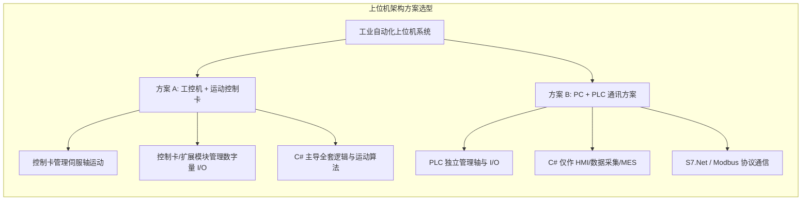

# 工业控制与上位机开发：PLC 通讯 (S7.Net) 与运动控制卡 (固高/雷赛) 架构与 API 实战

在工业自动化上位机开发中，系统的硬件控制架构通常划分为两大独立主流方案：

1. **工控机 + 运动控制卡方案（PC-Base）**：上位机（C#/WPF/WinForms）通过 PCIe 或 EtherCAT 运动控制卡（固高、雷赛等）直接进行多轴运动规划，**设备的数字量 I/O（传感器、气缸电磁阀、指示灯）同样直接接在控制卡及扩展 I/O 板卡上**。上位机负责全套业务逻辑、时序状态机与运动算法。
2. **PC + PLC 方案**：由 PLC（西门子 S7-1200/1500 等）独立承担底层逻辑扫描、I/O 控制以及伺服运动控制。上位机仅作为 HMI 人机界面、数据采集与 MES 交互层，通过通信协议（如 **S7.Net**）与 PLC 进行数据块读写。

本文将针对这两种典型架构，分别讲解西门子 PLC 的 S7.Net 通讯机制，以及固高科技 (Googol) 和雷赛智能 (Leadshine) 运动控制卡的底层 API 使用与选型对比。

---

<details open class="in-post-toc-card border border-neutral-200/80 dark:border-neutral-700/80 rounded-xl p-4 my-4 bg-neutral-50/50 dark:bg-neutral-800/30">
<summary class="font-bold text-base cursor-pointer select-none text-neutral-800 dark:text-neutral-200 flex items-center justify-between outline-none">
📑 本文目录（点击收起 / 展开）
</summary>

<div class="max-h-72 overflow-y-auto mt-3 pt-2 border-t border-neutral-200/60 dark:border-neutral-700/60 hide-scrollbar">

## 目录

- [一、工业自动化上位机控制架构对比](#一工业自动化上位机控制架构对比)
- [二、S7netplus (S7.Net) 协议通讯实战 (适用于 PC + PLC 架构)](#二s7netplus-s7net-协议通讯实战-适用于-pc--plc-架构)
  - [2.1 核心连接 API 与异步通信](#21-核心连接-api-与异步通信)
  - [2.2 大块数据读取与内存切片解析](#22-大块数据读取与内存切片解析)
- [三、固高科技 (Googol) 运动控制卡实战 (适用于 PC + 控制卡架构)](#三固高科技-googol-运动控制卡实战-适用于-pc--控制卡架构)
  - [3.1 初始化、配置加载与伺服使能](#31-初始化配置加载与伺服使能)
  - [3.2 Jog 点动模式](#32-jog-点动模式)
  - [3.3 Trap 梯形点位定位](#33-trap-梯形点位定位)
  - [3.4 PT 模式 (Position-Time)](#34-pt-模式-position-time)
  - [3.5 多轴插补模式 (Crd / LnXY)](#35-多轴插补模式-crd--lnxy)
  - [3.6 控制卡板载 I/O 读写控制](#36-控制卡板载-io-读写控制)
- [四、雷赛智能 (Leadshine) 运动控制卡实战 (适用于 PC + 控制卡架构)](#四雷赛智能-leadshine-运动控制卡实战-适用于-pc--控制卡架构)
  - [4.1 核心初始化与引脚配置](#41-核心初始化与引脚配置)
  - [4.2 P-Move 定位与 S 曲线柔化](#42-p-move-定位与-s-曲线柔化)
  - [4.3 Position Compare 硬件飞拍比较输出](#43-position-compare-硬件飞拍比较输出)
- [五、控制卡选型对比：固高 vs 雷赛](#五控制卡选型对比固高-vs-雷赛)
  - [5.1 底层架构与插补引擎对比](#51-底层架构与插补引擎对比)
  - [5.2 场景选型建议](#52-场景选型建议)
- [六、工程开发规范与安全设计](#六工程开发规范与安全设计)

</div>
</details>

## 一、工业自动化上位机控制架构对比

在设计上位机控制系统前，首先需根据设备定位明确控制架构：



1. **方案 A（控制卡架构）**：不依赖 PLC。所有电机轴与传感器/气缸数字量 I/O 均接在控制卡及扩展板卡上，C# 直接调用控制卡 DLL 执行控制。
2. **方案 B（PLC 架构）**：不依赖控制卡 DLL。PLC 独立负责全车间的逻辑扫描、轴运动与 I/O；C# 仅作为上位人机界面，通过 S7.Net 等网络协议与 PLC 的 DB 块进行数据同步。

---

## 二、S7netplus (S7.Net) 协议通讯实战 (适用于 PC + PLC 架构)

**S7netplus** 是基于 C# 开发的开源西门子 PLC 通讯库，通过 TCP 端口 102 直接访问西门子 S7 协议，适用于上位机与 S7-1200 / S7-1500 / S7-300 / S7-200 Smart 进行网络通信。

### 2.1 核心连接 API 与异步通信

在 UI 初始化或后台服务中，通信连接应采用异步方式打开，避免由于网络超时导致界面主线程挂起。

* **构造函数原型**：`public Plc(CpuType cpu, string ip, short rack, short slot)`
  * `cpu`：CPU 类型枚举（`S71200`, `S71500`, `S7300`, `S7200Smart`）。
  * `ip`：PLC 局域网 IP 地址。
  * `rack`：机架号（通常为 `0`）。
  * `slot`：插槽号（S7-1200/1500 通常为 `1`，S7-300 为 `2`）。
* **异步连接**：`await plc.OpenAsync()`

#### 异步连接代码示例：

```csharp
using S7.Net;
using System;
using System.Threading.Tasks;
using System.Windows;

public partial class MainWindow : Window
{
    private Plc _siemensPlc;

    public MainWindow()
    {
        InitializeComponent();
        this.Loaded += MainWindow_Loaded; 
    }

    private async void MainWindow_Loaded(object sender, RoutedEventArgs e)
    {
        lblStatus.Text = "正在连接 PLC...";
        
        // 实例化 S7-1200 PLC 对象
        _siemensPlc = new Plc(CpuType.S71200, "192.168.0.10", 0, 1);

        try
        {
            await _siemensPlc.OpenAsync();
            
            if (_siemensPlc.IsConnected)
            {
                lblStatus.Text = "PLC 连接成功！";
                StartPollingData();
            }
        }
        catch (Exception ex)
        {
            lblStatus.Text = $"连接异常: {ex.Message}";
        }
    }
}
```

> **提示（博途配置）**：使用 S7-1200/1500 时，必须在博图项目中勾选 **“允许从远程伙伴使用 PUT/GET 通信访问”**，且待读取的 DB 块需**取消勾选“优化的块访问”**。

### 2.2 大块数据读取与内存切片解析

在大数据量监控场景下，应避免频繁调用单点读取方法 `plc.Read("DB1...")`，而应采用 `ReadBytes` 一次性读取连续数据块，随后在 C# 内存中切片解析，以降低网络交互频次。

* **读取方法**：`ReadBytes(DataType dataType, int db, int startByteAdr, int count)`
  * `dataType`：数据区类型（如 `DataType.DataBlock`）。
  * `db`：DB 块编号。
  * `startByteAdr`：起始字节偏移量。
  * `count`：连续读取的字节总数。

#### 批量读取与内存解析示例：

```csharp
using S7.Net;
using S7.Net.Types;
using System.Linq;
using System.Threading.Tasks;

private void StartPollingData()
{
    Task.Run(async () =>
    {
        while (_siemensPlc != null && _siemensPlc.IsConnected)
        {
            try
            {
                // 一次性读取 DB10 中从 0 字节开始的 100 字节数据
                byte[] buffer = await Task.Run(() => _siemensPlc.ReadBytes(DataType.DataBlock, 10, 0, 100));

                // 1. 读取 Bool 位：DB10.DBX0.2（第 0 字节的第 2 位）
                bool isSystemRunning = buffer[0].SelectBit(2); 

                // 2. 读取 Int16 短整型：DB10.DBW2（从第 2 字节开始的连续 2 字节，进行字节序转换）
                short airPressure = Int.FromByteArray(buffer.Skip(2).Take(2).ToArray());

                // 3. 读取 Real 浮点数：DB10.DBD4（从第 4 字节开始的连续 4 字节）
                float temperature = Real.FromByteArray(buffer.Skip(4).Take(4).ToArray());

                // 更新 UI 界面
                Application.Current.Dispatcher.Invoke(() => 
                {
                    chkRunning.IsChecked = isSystemRunning;
                    txtPressure.Text = $"{airPressure} Mpa";
                    txtTemp.Text = $"{temperature:F2} ℃";
                });
            }
            catch (Exception ex)
            {
                // 通信异常逻辑
            }

            // 周期休眠，释放 CPU
            await Task.Delay(100); 
        }
    });
}
```

---

## 三、固高科技 (Googol) 运动控制卡实战 (适用于 PC + 控制卡架构)

固高运动控制卡在工业非标设备领域应用广泛，底层 C++ DLL 为 `gts.dll`。API 方法返回 `short` 状态码（`0` 代表成功）。在控制卡架构下，**运动轴与数字 I/O 均由固高卡直接管理**。

### 3.1 初始化、配置加载与伺服使能

固高卡通过底层配置文件（`.cfg`，由固高辅助工具生成）初始化加减速、脉冲模式及限位属性。

* `GT_Open(short channel, short param)`：打开控制卡通道。
* `GT_Reset()`：复位 DSP 控制芯片。
* `GT_LoadConfig(string pFile)`：加载配置文件。
* `GT_ClrSts(short axis, short count)`：清除指定轴的状态报警。
* `GT_AxisOn(short axis)`：使能伺服轴（Servo On）。

#### 初始化代码示例：

```csharp
using gts;

public bool InitGoogolCard()
{
    // 1. 打开 0 号控制卡
    short rtn = mc.GT_Open(0, 1);
    if (rtn != 0) return false;

    // 2. 复位板卡
    mc.GT_Reset();

    // 3. 加载配置文件
    rtn = mc.GT_LoadConfig("GTS_Config.cfg");
    if (rtn != 0) return false;

    // 4. 清除轴报警并开启伺服使能（以 3 个物理轴为例）
    for (short axis = 1; axis <= 3; axis++)
    {
        mc.GT_ClrSts(axis, 1);
        mc.GT_AxisOn(axis);
    }

    return true;
}
```

### 3.2 Jog 点动模式

用于手动调试面板上的按轴手动点动控制：按下移动，松开或失焦时平滑停止。

* `GT_PrfJog(short axis)`：将指定轴设为 Jog 规划模式。
* `GT_SetJogPrm(short axis, ref TJogPrm prm)`：设置点动加减速及 S 曲线平滑系数。
* `GT_SetVel(short axis, double vel)`：设置目标速度与方向（正数为正向，负数为反向）。
* `GT_Update(int mask)`：刷新并生效运动指令，`mask` 为轴选择掩码位。

```csharp
// 启动点动
public void StartJog(short axis, double speed)
{
    mc.GT_PrfJog(axis);
    
    mc.TJogPrm jogPrm;
    mc.GT_GetJogPrm(axis, out jogPrm);
    jogPrm.acc = 0.5;
    jogPrm.dec = 0.5;
    jogPrm.smooth = 0.2;
    mc.GT_SetJogPrm(axis, ref jogPrm);

    mc.GT_SetVel(axis, speed);
    mc.GT_Update(1 << (axis - 1));
}

// 停止点动
public void StopJog(short axis)
{
    mc.GT_SetVel(axis, 0);
    mc.GT_Update(1 << (axis - 1));
}
```

### 3.3 Trap 梯形点位定位

用于自动流程中最基础的单轴绝对点位或相对点位移动。

* `GT_PrfTrap(short axis)`：设置为梯形点位模式。
* `GT_SetTrapPrm(short axis, ref TTrapPrm prm)`：配置 `acc`（加速度）、`dec`（减速度）及 `smoothTime`（平滑时间）。
* `GT_SetPos(short axis, int pos)`：设置目标位置脉冲值。
* `GT_SetVel(short axis, double vel)`：设置巡航速度。

```csharp
public void MoveAbsolute(short axis, int targetPos, double speed)
{
    mc.GT_PrfTrap(axis);

    mc.TTrapPrm trapPrm;
    mc.GT_GetTrapPrm(axis, out trapPrm);
    trapPrm.acc = 1.0;
    trapPrm.dec = 1.0;
    trapPrm.smoothTime = 25; // 25ms S 型拐点平滑
    mc.GT_SetTrapPrm(axis, ref trapPrm);

    mc.GT_SetPos(axis, targetPos);
    mc.GT_SetVel(axis, speed);
    mc.GT_Update(1 << (axis - 1));
}
```

### 3.4 PT 模式 (Position-Time)

用于追剪、飞锯或需要自定义复杂非线性轨迹运动的场景。通过向底层 FIFO 压入 `(位移增量, 时间)` 点集实现精准的时间-位置轨迹规划。

```csharp
public void StartPtMotion(short axis, double[] posDeltas, short intervalMs)
{
    mc.GT_PtClear(axis);
    mc.GT_PrfPt(axis, 1);

    foreach (var delta in posDeltas)
    {
        short space;
        mc.GT_PtSpace(axis, out space);
        if (space > 0)
        {
            mc.GT_PtData(axis, delta, intervalMs, mc.PT_MODE_STATIC);
        }
    }

    mc.GT_PtStart(1 << (axis - 1), 0);
}
```

### 3.5 多轴插补模式 (Crd / LnXY)

在点胶、涂胶或合成直线/圆弧轨迹场景中，固高通过坐标系映射（`Crd`）将多个物理轴进行多维合成插补。

```csharp
public void InterpolatedLine2D(int xTarget, int yTarget, double synVel)
{
    // 1. 配置 1 号坐标系：维数为 2，X 绑定轴 1，Y 绑定轴 2
    mc.TCrdPrm crdPrm = new mc.TCrdPrm
    {
        dimension = 2,
        profile = new short[] { 1, 2, 0, 0, 0, 0, 0, 0 }
    };
    mc.GT_SetCrdPrm(1, ref crdPrm);
    mc.GT_CrdClear(1, 0);

    // 2. 写入插补直线段，终点速度设为 0（到达后停车）
    mc.GT_LnXY(1, xTarget, yTarget, synVel, 1.0, 0, 0);

    // 3. 启动插补
    mc.GT_CrdStart(1, 0);
}
```

### 3.6 控制卡板载 I/O 读写控制

在 PC-Base 控制卡方案中，气缸、传感器等数字量直接连接在控制卡的通用 I/O 接口上：

```csharp
// 读取控制卡板载数字量输入 (DI)
public bool ReadDiSignal(short diIndex)
{
    int diValue;
    mc.GT_GetDi(mc.MC_LIMIT_POSITIVE, out diValue); // 获取指定类型的 DI 状态
    return (diValue & (1 << diIndex)) != 0;
}

// 控制控制卡板载数字量输出 (DO)
public void WriteDoSignal(short doIndex, bool value)
{
    if (value)
    {
        mc.GT_SetDoBit(mc.MC_GPO, doIndex, 0); // 低电平有效或根据硬件定义
    }
    else
    {
        mc.GT_SetDoBit(mc.MC_GPO, doIndex, 1);
    }
}
```

---

## 四、雷赛智能 (Leadshine) 运动控制卡实战 (适用于 PC + 控制卡架构)

雷赛控制卡（如 DMC 系列）广泛应用于 3C 自动化与视觉检测设备中，底层 C# 封装类为 `LTDMC.dll`，函数命名以 `dmc_` 开头。

### 4.1 核心初始化与引脚配置

```csharp
using csLTDMC;

public bool InitLeadshineCard()
{
    // 初始化控制卡
    short cardCount = LTDMC.dmc_board_init();
    if (cardCount <= 0) return false;

    ushort cardNo = 0;
    for (ushort axis = 0; axis < 4; axis++)
    {
        // 开启伺服使能
        LTDMC.dmc_write_sevon_pin(cardNo, axis, 1);
        // 设置脉冲方向模式（1 代表 脉冲+方向）
        LTDMC.dmc_set_pulse_outmode(cardNo, axis, 1);
    }
    return true;
}
```

### 4.2 P-Move 定位与 S 曲线柔化

```csharp
public void MoveAxis(ushort axis, int targetPos, double maxSpeed)
{
    ushort card = 0;
    
    // 1. 设置梯形基础参数：起始速度、最大速度、加速时间、减速时间
    LTDMC.dmc_set_profile(card, axis, 500, maxSpeed, 0.2, 0.2);
    
    // 2. 设置 S 曲线平滑过渡时间（0.05 秒）
    LTDMC.dmc_set_s_profile(card, axis, 0, 0.05);

    // 3. 执行绝对位置运动（1 代表绝对坐标模式）
    LTDMC.dmc_pmove(card, axis, targetPos, 1);
}
```

### 4.3 Position Compare 硬件飞拍比较输出

雷赛控制卡集成了硬件比较器，当轴运动经过预设的编码器脉冲点位时，板载硬件芯片直接向外部相机触发高速硬件脉冲信号，无需上位机软件轮询参与。

```csharp
public void SetupFlyCapture(ushort axis, int[] comparePositions)
{
    ushort card = 0;
    ushort cmpChannel = 0;

    // 1. 清除比较器历史点位
    LTDMC.dmc_compare_clear_points(card, cmpChannel);
    // 2. 配置比较器绑定轴
    LTDMC.dmc_compare_set_config(card, cmpChannel, 1, axis, 0, 0);

    // 3. 添加飞拍比较点
    foreach (var pos in comparePositions)
    {
        LTDMC.dmc_compare_add_point(card, cmpChannel, pos, 0, 1, 0);
    }

    // 4. 启动比较器
    LTDMC.dmc_compare_start(card, cmpChannel);
}
```

---

## 五、控制卡选型对比：固高 vs 雷赛

### 5.1 底层架构与插补引擎对比

| 对比维度 | 固高 (Googol) | 雷赛 (Leadshine) |
|---|---|---|
| **底层硬件** | 自研 DSP 处理器，运算能力强 | ARM + FPGA 架构 |
| **插补引擎** | 支持硬件 FIFO 缓冲区连续插补（段间速度平滑过渡） | 支持点到点定位与基础插补，连续插补需显式配置前瞻模式 |
| **硬件配置方式** | 强依赖外部 `.cfg` 配置文件 | 支持纯 API 代码配置硬件引脚 |
| **多轴硬件同步** | 通过 `GT_Update(mask)` 位掩码实现多轴零时差同步 | 逐轴下发指令，存在微秒级循环下发差异 |

### 5.2 场景选型建议

1. **选择固高 (Googol) 的场景**：
   * 激光切割、激光焊接、点胶/涂胶等需要**高精度连续空间轨迹插补**的设备。
   * 龙门双驱、多轴严格同步等对多轴同步性要求苛刻的机构。
2. **选择雷赛 (Leadshine) 的场景**：
   * SMT 贴片、视觉分拣、AOI 检测等以**点到点定位 + 硬件飞拍触发**为主的高通量设备。
   * 项目交付周期短、需要快速通过纯 API 进行调参的自动化单机。

---

## 六、工程开发规范与安全设计

1. **界面与通信解耦**：
   无论采用 PLC 方案还是控制卡方案，UI 线程严禁直接调用阻塞式通信或运动等待 API。必须通过后台独立线程或 Task 状态机管理通信与时序。
2. **循环轮询休眠**：
   在后台轮询线程（如读取 `IsConnected`、`GT_GetDi` 或等待轴到位）中，必须加入合理的休眠时间（如 `Task.Delay(10)` 或 `Thread.Sleep(5)`），避免无限死循环耗尽 CPU 资源。
3. **物理安全急停回路**：
   软件急停与限位保护仅作为第一层逻辑屏障。工业设备必须配置独立的硬件急停回路，通过物理急停按钮切断伺服驱动器与执行元件的主供电回路，确保机械安全。